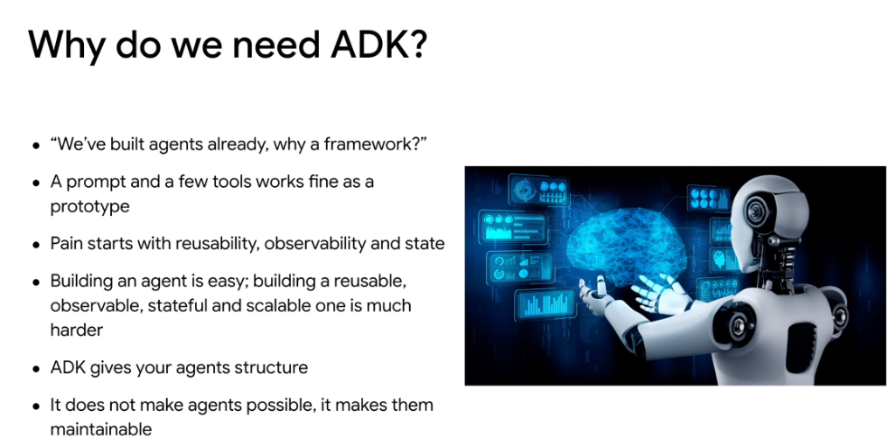
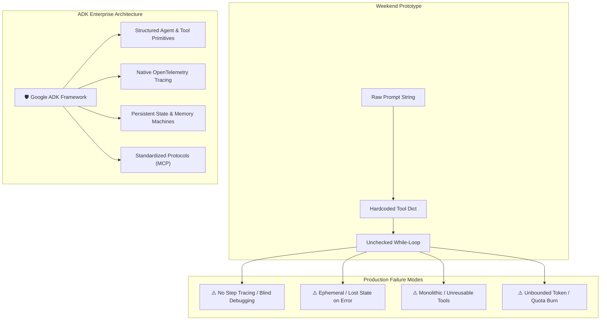

# Why Do We Need ADK? (Agent Development Kit)

## Overview

A common question among developers is: *“We’ve built agents already with plain API calls, why do we need a framework?”*

While assembling a quick prototype using a raw prompt string and a couple of function calls is straightforward, engineering an enterprise-grade agent that is maintainable, observable, and resilient in production requires formal software engineering structures.

> **"ADK does not make agents possible—it makes them maintainable."**

---

## The Prototype Trap vs. Production Reality

---

## The Four Core Pain Points ADK Solves

### 1. Reusability & Composability
* **Without ADK**: Every project re-invents tool formatting, prompt parsing, and argument deserialization in one-off scripts.
* **With ADK**: Standardized `Agent` and `Tool` interfaces allow teams to share modular agents as importable components across repositories.

### 2. Observability & Distributed Tracing
* **Without ADK**: LLM calls and tool executions are opaque black boxes. When an agent loops or picks the wrong tool, debugging requires manual print-statement spelunking.
* **With ADK**: Built-in step-by-step tracing, latency breakdown across model vs. tool execution, and native integration with Cloud Trace / OpenTelemetry.

### 3. State Management & Lifecycle
* **Without ADK**: Context state is held in ephemeral Python dictionaries. A network blip or unhandled tool exception crashes the entire session, losing all progress.
* **With ADK**: Decoupled state machines, structured session checkpoints, and robust resume-on-failure capabilities.

### 4. Enterprise Scalability & Guardrails
* **Without ADK**: No circuit-breakers, loop tripwires, or standardized concurrency control.
* **With ADK**: Configurable max-iteration limits, rate limiting, and structured validation gates.

---

## Raw Scripts vs. Google ADK

| Capability | Raw Script / Ad-Hoc Code | Google ADK Architecture |
| :--- | :--- | :--- |
| **Agent Definition** | Custom parsing loops | Declarative `Agent(name, model, tools, instruction)` |
| **Tool Interface** | Bespoke JSON schemas & dictionaries | Standardized tool bindings with Model Context Protocol (MCP) |
| **Observability** | Custom `print()` statements | Built-in distributed tracing, span metrics, and payload logging |
| **State Persistence** | Ephemeral in-memory variables | Pluggable state stores with session hydration and checkpointing |
| **Error Handling** | Unhandled crash on API error | Resilient retry strategies, circuit breakers, and HITL hooks |
