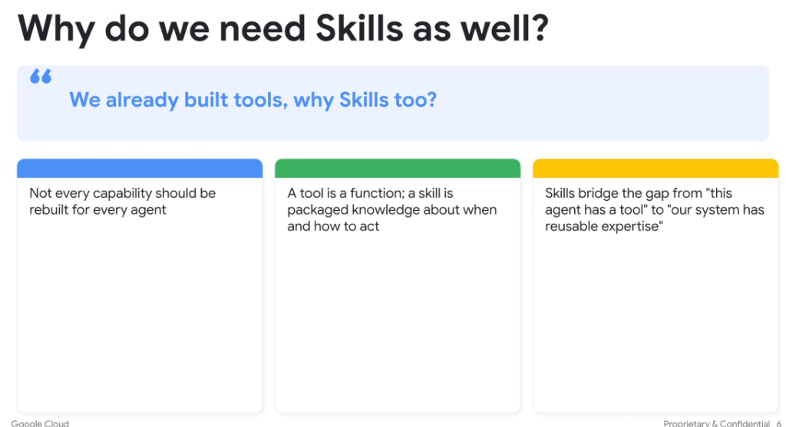
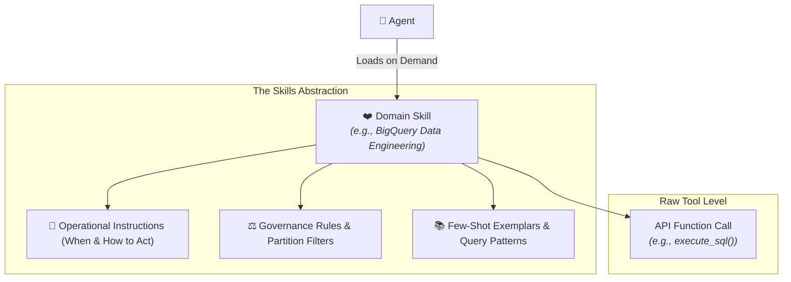

# Why Do We Need Skills As Well? (Tools vs. Skills)

## Overview

Developers often ask: *“We already built tools (APIs and function calls), why do we need Skills too?”*

While a **Tool** gives an agent the raw programmatic ability to execute an action, a **Skill** encapsulates the domain expertise, operational guidelines, and procedural knowledge of **when, why, and how** to use those tools effectively.

---

## The Three Core Pillars of Skills

### 1. Reusability Across the Organization
> **"Not every capability should be rebuilt for every agent."**
* Instead of every developer re-writing prompt instructions and parameter formatting for the same database or API, a Skill packages that capability into a single, importable unit.

### 2. Knowledge Combined with Action
> **"A tool is a function; a skill is packaged knowledge about when and how to act."**
* Having a hammer does not make one a carpenter. A raw API function (`tool`) requires surrounding instructions, error-handling heuristics, and safety constraints (`skill`) to execute successfully.

### 3. Transforming Tools into Enterprise Expertise
> **"Skills bridge the gap from 'this agent has a tool' to 'our system has reusable expertise'."**
* Shifts organizational AI development from brittle, ad-hoc tool bindings to a standardized catalog of organizational capabilities.

---

## Direct Comparison: Tool vs. Skill

| Dimension | Tool | Skill |
| :--- | :--- | :--- |
| **Fundamental Nature** | An executable function / API endpoint | A packaged domain capability |
| **Core Question** | *"What action can be taken?"* | *"When, why, and how should actions be taken?"* |
| **Contents** | Function signature, JSON parameter schema | Instructions (`SKILL.md`), scripts, domain rules, tools, exemplars |
| **Scope** | Atomic, low-level execution | High-level business / technical workflow |
| **Token Impact** | Always loaded if attached to agent | Dynamically loaded on demand only when needed |
| **Example** | `run_bigquery_query(sql: str)` | `bigquery_analyst` (schema guides, cost optimization, query rules) |
