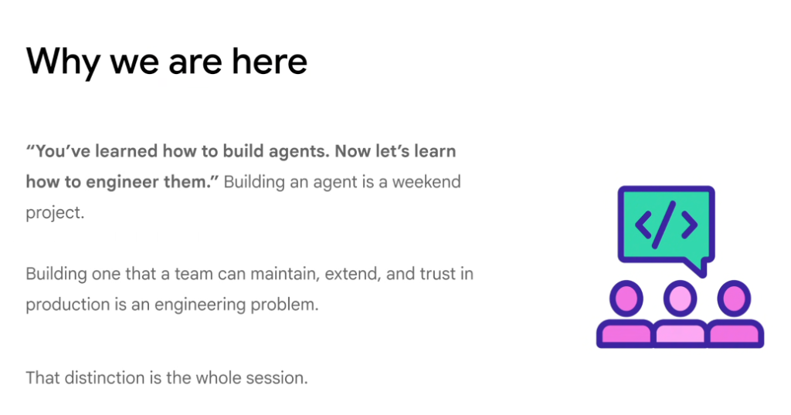
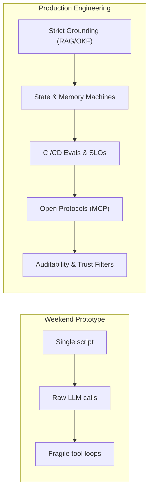

# Why We Are Here: From Building Agents to Engineering Them

## The Core Thesis

> **"You’ve learned how to build agents. Now let’s learn how to engineer them."**
> 
> *Building an agent is a weekend project.*
> *Building one that a team can maintain, extend, and trust in production is an engineering problem.*
> 
> **That distinction is the whole session.**

---

## Prototype vs. Production Engineering

| Dimension | Weekend Project / Toy Demo | Production Engineering Discipline |
| :--- | :--- | :--- |
| **Grounding** | Parametric weights + unverified prompts | Strict closed-book RAG & Open Knowledge Formats (OKF) |
| **Reliability** | Non-deterministic "it works on my machine" | Regression evals in CI/CD, golden benchmarks, schema validation |
| **Stability** | Hardcoded bespoke tool scripts | Standardized protocols (MCP), circuit breakers, retry backoffs |
| **Operations** | Opaque terminal outputs | Distributed tracing (OpenTelemetry), token budgeting, SLO alerts |
| **Governance** | Unchecked automated mutations | Human-in-the-Loop gates, explicit provenance & freshness TTLs |

---

## Elevate Knowledge Curriculum

For the complete Day 1 curriculum index, see [Day 1 Curriculum Index](README.md), and for the 5-day event roadmap, see the [Master Elevate Curriculum Index](../README.md).

### Foundations & Engineering Modules
* [Why Do We Need ADK?](why_do_we_need_adk.md): Reusability, observability, state persistence, and maintainability.
* [First of All: SDK ≠ ADK](sdk_vs_adk.md): Low-level model connectivity vs. high-level agentic orchestration.
* [Google ADK: The 4 Core Architectural Pillars](adk_core_architecture_pillars.md): Tools, State, Workflows, and Skills.
* [ADK Agent: Complete Anatomical Reference](adk_agent_architecture_overview.md): Models, instructions, tools, memory, and subagents.
* [ADK Tools & The Decision Space Dilemma](adk_tools.md): Tool capabilities, context inflation risks, and why Skills solve decision space bloat.
* [Model Context Protocol (MCP)](model_context_protocol_mcp.md): Connecting agents to external information and services via open standard protocols.
* [MCP: Client-Server Execution Flow & Lifecycle](mcp_client_server_execution_flow.md): Tool discovery (`tools/list`), invocation (`tools/call`), and backend execution routing.
* [MCP: Deployment Topologies (Stdio vs. SSE)](model_context_protocol_deployment.md): Local subprocess IPC vs. distributed streaming remote services.
* [Google ADK: Plugging MCP into Your Agent](plugging_mcp_into_your_agent.md): Combining native Python functions and MCP toolsets in `LlmAgent`.
* [Architectural Decision: Local Function or MCP?](local_function_or_mcp.md): Decision framework for in-repo custom functions vs. reusable MCP services.
* [ADK State Management & Cross-Step Memory](adk_state.md): Structured state persistence, blackboard coordination, and multi-turn hydration.
* [ADK Workflows & Execution Coordination](adk_workflows.md): Controlling execution flow, sequencing, and ready-made coordination patterns.
* [ADK Workflows: Sequential, Parallel, and Hierarchical](adk_workflow_patterns_sequential_parallel_hierarchical.md): Multi-agent topologies, trade-offs, and routing architectures.
* [ADK Advanced Graph-Based Workflows](adk_advanced_graph_workflows.md): Modeling agents, tools, and deterministic code as graph nodes.
* [Why Do We Need Skills As Well?](why_do_we_need_skills.md): Tools vs. Skills and transforming raw functions into reusable domain expertise.
* [What is a Skill? (The 5 Foundational Principles)](what_is_a_skill.md): Build once, reuse, keep prompts small, maintain separately, and complete capability bundling.
* [Skills: Progressive Disclosure & Context Economics](progressive_disclosure_skills.md): L1 Metadata, L2 Instructions, and L3 Resources 3-tier loading model.
* [Without Skills: The Duplication & Maintenance Anti-Pattern](without_skills_monolithic_duplication.md): The copy-paste prompt trap, token bloat, and configuration drift.
* [With Skills: Reusable Capabilities & Governance](with_skills_modular_architecture.md): Shared policy, validation, and summary skills for consistent behavior.
* [Common Skill Patterns](common_skill_patterns.md): Inline, File-Based, External, and Meta Skill architectures.
* [File-Based Skill Demo & Implementation](adk_file_based_skill_demo.md): Practical directory layout, `SKILL.md` specification, and Python ADK bindings.
* [Developer Tooling: Without vs. With google-agents-cli](google_agents_cli_without_vs_with.md): Automated scaffolding, boilerplate reduction, and local testing.
* [Google Agents CLI: Core Commands & Lifecycle](google_agents_cli_commands.md): Setup, scaffold, eval generate/grade, deploy, and publish gemini-enterprise.
* [Google Agents CLI: Agent Scaffolding Templates](agents_cli_agent_templates.md): Pre-configured architectures for `adk`, `adk_a2a`, and `agentic_rag`.
* [Antigravity UI: The Task List & Observability](antigravity_task_list.md): Real-time autonomous task checklist and execution state observability.
* [Antigravity Artifacts: The Implementation Plan](antigravity_implementation_plan.md): Pre-execution architectural contract, change specifications, and interactive Proceed gates.
* [Antigravity Artifacts: The Walkthrough](antigravity_walkthrough.md): Post-task verification evidence, UI captures, and code summary reports.
* [Antigravity Config & Context Management Primitives](antigravity_config_context_primitives.md): Context files, skills, tools, MCP servers, hooks, and subagents.
* [Antigravity Customizations: Rules & Governance](antigravity_rules.md): Global directives vs Workspace rules, PEP 8 code styles, and architecture invariants.
* [When to Use Which: Rules vs. Workflows vs. Skills](when_to_use_which_rules_workflows_skills.md): Conceptual differences, trigger mechanisms, and decision matrix.
* [Antigravity vs. JetSki: CE Compliance & Demo Boundaries](antigravity_vs_jetski_ce_guidelines.md): Strict separation between customer-facing demos and internal productivity.
* [Agent Ecosystem: Internal (JetSki) vs. External (Antigravity) Taxonomy](jetski_to_antigravity_naming_map.md): 1:1 mapping of components across CLI, Hub 2.0, SDK, Cider, and Harness.
* [Architecture Policy: External vs. Internal Code Sharing](external_vs_internal_code_sharing_policy.md): Data flows across Argolis, GTM GitHub, Customer sharing, and Google3.
