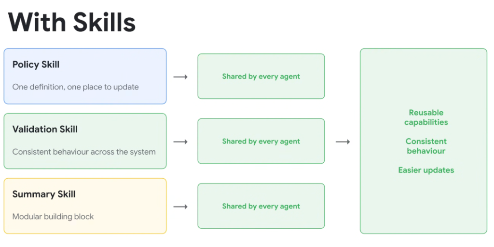
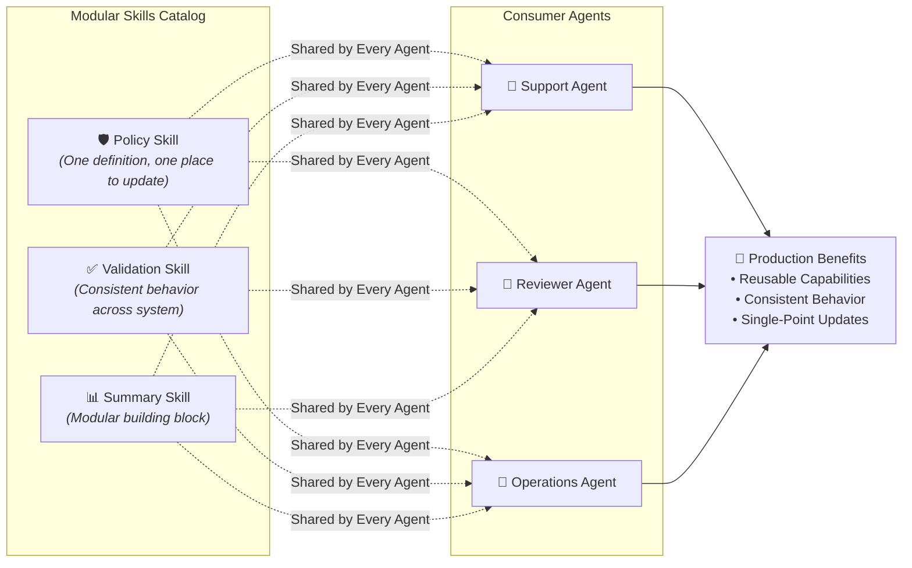

# With Skills: Reusable Capabilities & Centralized Governance

## Overview

By introducing a dedicated **Skills Layer**, agent architectures transition from fragile, copy-pasted prompts to a clean, modular ecosystem of shared capabilities. Specialized agents import shared skills on demand, guaranteeing organizational consistency and radically simplifying maintenance.

---

## The Shared Skills Architecture

---

## Three Exemplar Shared Skills

### 1. Policy Skill
* **Core Value**: **One definition, one place to update.**
* **Role**: Houses organizational governance, PII masking rules, security compliance constraints, and role-based access checks.
* **Benefit**: When legal or security updates a policy, modifying this single skill instantly aligns every agent across the enterprise.

### 2. Validation Skill
* **Core Value**: **Consistent behaviour across the system.**
* **Role**: Standardizes input/output schema validation, SQL syntax checking, and tool parameter verification.
* **Benefit**: Guarantees that every agent applies identical validation rigor, eliminating edge-case parsing bugs.

### 3. Summary Skill
* **Core Value**: **Modular building block.**
* **Role**: Encapsulates executive summarization templates, action-item extractors, and markdown formatting standards.
* **Benefit**: Produces uniform, beautifully structured briefings regardless of which specific agent generated them.

---

## The Triad of Production Benefits

### 1. Reusable Capabilities
* Eliminates boilerplate duplication across repositories.
* New agents can be assembled in minutes by composing existing domain skills.

### 2. Consistent Behaviour
* Removes prompt phrasing discrepancies.
* Guarantees that all agents apply the exact same compliance rules, tool selection heuristics, and error boundaries.

### 3. Easier Updates (GitOps / CI/CD)
* Decouples prompt engineering and business logic from agent runtime code.
* Enables atomic versioning, automated regression testing, and instant cross-system rollouts.

---

## Architectural Comparison: Without Skills vs. With Skills

| Dimension | Without Skills (Monolithic Prompts) | With Skills (Modular Architecture) |
| :--- | :--- | :--- |
| **Code Duplication** | High (copy-pasted across $N$ agent files) | Zero (defined once, referenced everywhere) |
| **System Behavior** | Inconsistent & prone to prompt drift | Deterministic & strictly uniform |
| **Update Velocity** | Slow & error-prone (manual multi-file edits) | Fast & automated (single Git commit updates all agents) |
| **Token Efficiency** | Bloated baseline prompts | Lean baseline prompts via progressive disclosure |
| **Testability** | Hard to isolate failures in giant prompts | High unit-testability per independent skill |
