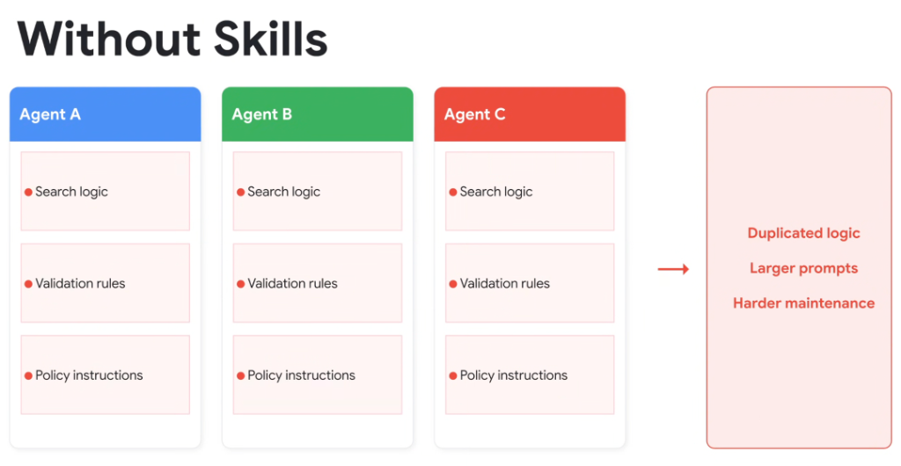

# Without Skills: The Duplication & Maintenance Anti-Pattern



## Overview

When building multi-agent systems without a formal **Skills** abstraction, development teams fall into the **Copy-Paste Prompt Trap**. Core capabilities—such as enterprise search logic, data validation rules, and security policy instructions—are duplicated across every individual agent prompt.

---

## The Architecture Anti-Pattern

```mermaid
graph LR
    subgraph Agent A
        A1["Search logic"]
        A2["Validation rules"]
        A3["Policy instructions"]
    end

    subgraph Agent B
        B1["Search logic"]
        B2["Validation rules"]
        B3["Policy instructions"]
    end

    subgraph Agent C
        C1["Search logic"]
        C2["Validation rules"]
        C3["Policy instructions"]
    end

    Agent A & Agent B & Agent C --> Trap["🚨 The Maintenance Trap<br/>• Duplicated Logic<br/>• Larger Prompts (Token Bloat)<br/>• Fragile, Desynchronized Maintenance"]
```

---

## The Three Critical Failure Modes

### 1. Duplicated Logic & Fragmented Implementations
* Every team or developer writes their own bespoke version of common workflows (e.g., how to query the customer database, how to format Jira tickets, how to sanitize PII).
* Minor variances in prompt phrasing lead to subtle, inconsistent agent behaviors across identical domains.

### 2. Larger Prompts & Token Bloat
* Each agent's baseline system prompt must contain the entire body of search heuristics, schema validation rules, and compliance policies.
* **Result**: Hundreds of unnecessary tokens injected into every turn, driving up operational inference costs and increasing Time-to-First-Token (TTFT) latency.

### 3. High Maintenance Overhead & Configuration Drift
* When an enterprise policy, API endpoint, or validation rule updates:
  * Engineers must manually find and edit dozens of independent prompt files across multiple repositories.
  * Inevitably, certain agents are missed, creating **Configuration Drift** where Agent A operates on v2 policies while Agent B still enforces deprecated v1 rules.

---

## Impact Matrix: Without Skills

| Architectural Area | Without Skills (Monolithic Copy-Paste) | Production Impact |
| :--- | :--- | :--- |
| **Code Duplication** | $N$ identical prompt blocks across $N$ agents | High engineering friction & wasted effort |
| **Prompt Size** | Massive monolithic prompts on every turn | High token cost & slower inference latency |
| **Policy Updates** | Manual multi-file edits across repositories | High risk of desynchronization & security loopholes |
| **Testing & Evals** | Evals must be duplicated per agent | Fragmented benchmarking and weak regression coverage |
