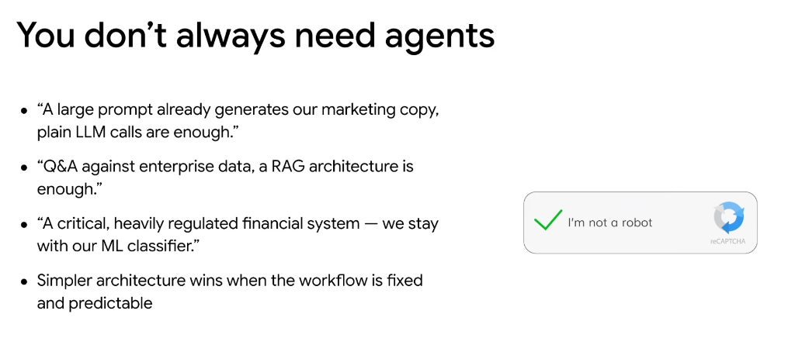

# You Don't Always Need Agents

## Core Architectural Principle

> **Simpler architecture wins when the workflow is fixed and predictable.**

Introducing autonomous agent loops adds latency, cost, and non-determinism. When requirements can be satisfied with deterministic systems or linear pipelines, prefer simpler architectures.

---

## When Simpler Alternatives Are Better

### 1. Plain LLM Calls
* **Scenario**: Marketing copy, content drafting, summarization, simple transformations.
* **Quote**: *"A large prompt already generates our marketing copy, plain LLM calls are enough."*
* **Why**: Direct one-shot or few-shot inference is fast, reliable, and avoids unnecessary tool-loop overhead.

### 2. Standard Retrieval-Augmented Generation (RAG)
* **Scenario**: Enterprise Q&A, knowledge base search, documentation lookup.
* **Quote**: *"Q&A against enterprise data, a RAG architecture is enough."*
* **Why**: A fixed retrieve-and-generate pipeline satisfies static semantic search without requiring dynamic multi-step agent reasoning.

### 3. Classical ML Classifiers & Deterministic Systems
* **Scenario**: Heavily regulated financial transactions, fraud detection, compliance scoring.
* **Quote**: *"A critical, heavily regulated financial system — we stay with our ML classifier."*
* **Why**: Regulated systems require deterministic explainability, strict latency SLAs, reproducible outcomes, and audited safety boundaries that generative agent loops cannot guarantee.

---

## Architecture Selection Guide

| Paradigm | Best For | Typical Latency / Complexity |
| :--- | :--- | :--- |
| **Traditional ML / Rules** | Fixed classification, regulated financial compliance, strict SLAs | Lowest (milliseconds, fully deterministic) |
| **Direct LLM Calls** | Structured output, generation, text transformation | Low (single roundtrip) |
| **Standard RAG** | Document search, knowledge base Q&A | Moderate (retrieval + 1 LLM call) |
| **Autonomous Agents** | Ambiguous multi-step problems, dynamic tool orchestration | High (multi-step loops, non-deterministic) |
