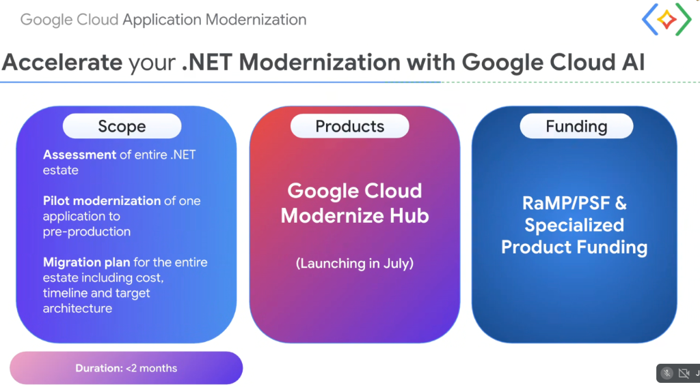
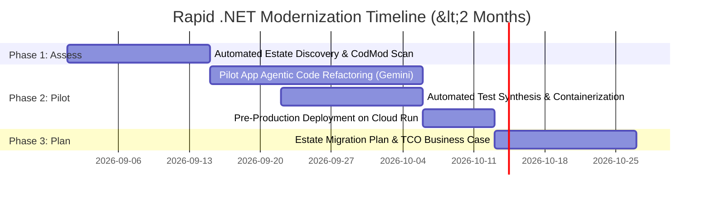

# Customer Acceleration: .NET Modernization Engagement Model & Funding Programs



## Overview

To help enterprise customers break free from legacy Windows Server and .NET Framework technical debt without multi-year consulting delays, Google Cloud offers a rapid **$<2\text{ Months}$ .NET Modernization Acceleration Engagement**.

The program combines a tightly bounded **Scope**, console-native **Product Tooling** (**Google Cloud Modernize Hub**), and dedicated Google Cloud **Funding Programs** (**RaMP / PSF**) to deliver proven pre-production results and an estate-wide migration roadmap.

---

## The 3 Acceleration Pillars

```mermaid
graph LR
    subgraph 🎯 1. Engagement Scope
        S1["📊 <b>Estate Assessment</b><br/>Scan entire .NET portfolio via CodMod"]
        S2["⚡ <b>Pilot Modernization</b><br/>Refactor 1 app to pre-production on Cloud Run"]
        S3["🗺️ <b>Estate Migration Plan</b><br/>Full TCO, timeline & target architecture"]
    end

    subgraph 🛠️ 2. Products
        P["🌟 <b>Google Cloud Modernize Hub</b><br/>• Console-native discovery<br/>• Automated assessment pipelines<br/>• <i>(Launching in July)</i>"]
    end

    subgraph 💰 3. Funding & Subsidies
        F1["🎁 <b>RaMP</b><br/>Rapid Migration Program credits"]
        F2["🤝 <b>PSF & Specialized Funding</b><br/>Partner Services Funds & Product subsidies"]
    end

    S1 & S2 & S3 --- P
    P --- F1 & F2
    F1 & F2 ==> Outcome["🚀 <b>Delivered in &lt;2 Months</b>"]
```

---

## Detailed Breakdown of the 3 Pillars

### 1. Scope (Delivered in $<2$ Months)
* **Assessment of Entire .NET Estate**: Automated scanning of all on-premises and cloud-hosted .NET applications using **CodMod** to identify hidden GAC dependencies, deprecated APIs, and compatibility scores.
* **Pilot Modernization**: End-to-end refactoring of one representative, business-critical application (.NET Framework/WCF $\rightarrow$ .NET 8 on Linux containers) deployed to a **pre-production** environment on **Cloud Run** or **GKE**.
* **Estate Migration Plan**: A comprehensive, executive-ready roadmap detailing total cost of ownership (TCO) savings, Windows OS licensing reductions, timeline, risk matrix, and target landing zone architecture.

---

### 2. Products
* **Google Cloud Modernize Hub (Launching in July)**:
  * Unified Google Cloud Console interface for portfolio discovery, code upload, and automated assessment.
  * Direct integration with **Gemini CLI** and **.NET Agent Skills** for automated code transformation and unit test synthesis.
  * Guided deployment companions for containerizing workloads onto Cloud Run and GKE.

---

### 3. Funding Programs
* **RaMP (Rapid Migration Program)**: Google Cloud's premier holistic migration framework offering migration tooling, financial incentives, and dual-run cost offsets.
* **PSF (Partner Services Fund)**: Direct Google funding to subsidize certified Migration Partner Systems Integrators (GSIs) and specialized consulting engineers.
* **Specialized Product Funding**: Targeted consumption and engineering incentives for adopting **Cloud Run**, **GKE**, and **AlloyDB / Cloud SQL for PostgreSQL**.

---

## The 8-Week Acceleration Execution Roadmap



---

## Engagement Summary Matrix

| Pillar | Components | Key Deliverable | Customer Value |
| :--- | :--- | :--- | :--- |
| **Scope** | Assessment, Pilot, Migration Plan | Pre-production pilot app + Estate Plan | Verifiable proof of concept in $<60$ days |
| **Products** | Google Cloud Modernize Hub | Console assessment & Agent Skills | Self-service, automated code transformation |
| **Funding** | RaMP, PSF, Product Funding | Google-funded partner & cloud credits | Minimizes upfront financial friction and migration costs |
