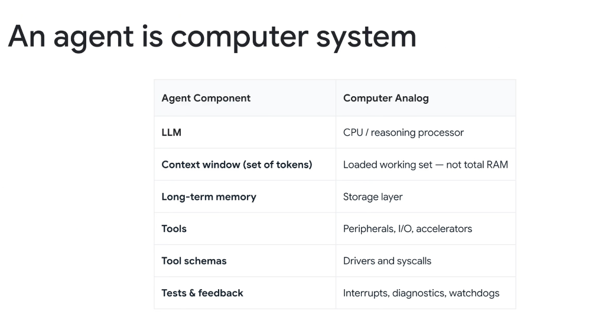

# Systems Architecture: An Agent Is a Computer System



## Overview

To build deterministic, fault-tolerant enterprise software, engineers must transition from treating AI as a conversational conversationalist to designing it as a **complete computer architecture**.

An AI Agent is not a chatbot—**an agent is a computer system**. Every component in modern computer architecture (Von Neumann model) has an exact, direct analog in an autonomous agent harness.

---

## The Computer Architecture vs. Agent Architecture Mapping

```mermaid
graph TD
    subgraph 🖥️ Traditional Computer Architecture
        CPU["⚡ <b>CPU / Processor</b><br/>Executes instructions & arithmetic"]
        RAM["🧠 <b>Active RAM / Working Set</b><br/>Loaded cache lines & volatile memory"]
        SSD["💾 <b>Storage Layer (SSD / HDD)</b><br/>Persistent filesystem & database"]
        IO["🔌 <b>Peripherals & I/O</b><br/>Network cards, disks, GPUs"]
        Syscall["📜 <b>Device Drivers & Syscalls</b><br/>Standardized ABI/API interfaces"]
        Interrupt["🚨 <b>Interrupts & Watchdogs</b><br/>Hardware faults & diagnostic traps"]
    end

    subgraph 🤖 AI Agent Architecture
        LLM["⚡ <b>LLM (Gemini 3.1)</b><br/>Reasoning engine & token inference"]
        Context["🧠 <b>Context Window Tokens</b><br/>Loaded working set P (not total storage)"]
        Memory["💾 <b>Long-Term Memory / OKF</b><br/>Persistent files, PLAN.md, Memory Bank"]
        Tools["🔌 <b>Tools (Terminal, File, Search)</b><br/>APIs, CLI binaries, MCP servers"]
        Schemas["📜 <b>Tool Schemas (MCP)</b><br/>JSON parameter schemas & contracts"]
        Feedback["🚨 <b>Tests & Feedback (verify.py)</b><br/>Compiler errors, test suites, lints"]
    end

    CPU <===> LLM
    RAM <===> Context
    SSD <===> Memory
    IO <===> Tools
    Syscall <===> Schemas
    Interrupt <===> Feedback
```

---

## Detailed Systems Analog Breakdown

### 1. LLM $\longleftrightarrow$ CPU / Reasoning Processor
* **Computer Role**: The central processing unit executing logic instructions and managing control flow.
* **Agent Role**: The foundation model (e.g. Gemini 2.0 / 3.1) that consumes input tokens, reasons across dependencies, and emits tool-call instructions.

---

### 2. Context Window $\longleftrightarrow$ Loaded Working Set (Active RAM / Cache)
* **Computer Role**: The physical RAM pages currently mapped into CPU registers and caches.
* **Agent Role**: The prompt-visible working set ($P$). It is **not** the entire hard drive; cramming excessive tokens causes cache thrashing and **Context Rot**.

---

### 3. Long-Term Memory $\longleftrightarrow$ Persistent Storage Layer (SSD / NVMe)
* **Computer Role**: Non-volatile storage where operating system binaries, applications, and user files reside.
* **Agent Role**: External filesystem artifacts (`.gemini/...`), `PLAN.md`, Open Knowledge Format (OKF) concept repos, and SQLite/Firestore memory stores.

---

### 4. Tools $\longleftrightarrow$ Peripherals, I/O & Hardware Accelerators
* **Computer Role**: NICs, disk controllers, external displays, and hardware accelerators.
* **Agent Role**: Executable tools (`run_command`, `view_file`, `write_to_file`, `search_web`, `call_mcp_tool`) that give the agent sensory input and external actuation power.

---

### 5. Tool Schemas $\longleftrightarrow$ Device Drivers & System Calls (Syscalls)
* **Computer Role**: Standard POSIX syscall APIs and kernel driver contracts that translate abstract calls into hardware instructions.
* **Agent Role**: Declarative JSON schemas and **Model Context Protocol (MCP)** specifications defining strict parameter types and validation rules.

---

### 6. Tests & Feedback $\longleftrightarrow$ Interrupts, Diagnostics & Watchdog Timers
* **Computer Role**: CPU interrupt service routines (ISRs) and watchdog timers that trap segmentation faults, I/O timeouts, and bus errors.
* **Agent Role**: Automated test scripts (`pytest`, `verify.py`), compiler diagnostics, and linter exit codes that force the agent to catch runtime bugs and self-correct.

---

## The Computer Analog Reference Matrix

| Agent Component | Computer Analog | Primary Operational Function |
| :--- | :--- | :--- |
| **LLM** | CPU / Reasoning Processor | Logical reasoning, token decoding, and control-flow dispatching |
| **Context Window (Tokens)** | Loaded Working Set (RAM/Cache) | Immediate working state (must be protected from cache thrashing) |
| **Long-Term Memory** | Storage Layer (NVMe / DB) | Durable state persistence across turns, sessions, and reboots |
| **Tools** | Peripherals, I/O, Accelerators | External environment sensing and code actuation |
| **Tool Schemas** | Device Drivers and Syscalls | Structured parameter interfaces and MCP schema contracts |
| **Tests & Feedback** | Interrupts, Diagnostics, Watchdogs | Runtime error trapping, automated test validation, and self-healing |
