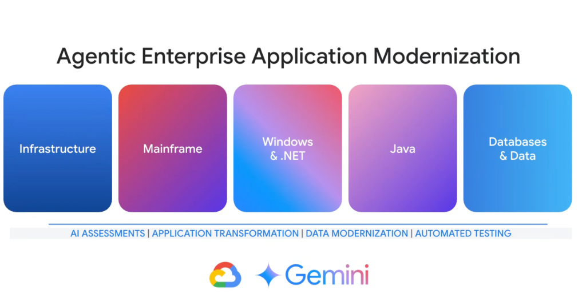

# Enterprise Workload Tracks: Agentic Enterprise Application Modernization



## Overview

Google Cloud's **Agentic Enterprise Application Modernization** framework leverages Gemini-powered autonomous coding agents to de-risk, accelerate, and automate the modernization of complex enterprise workloads across **5 specialized technical tracks** and **4 horizontal execution stages**:

```text
AI ASSESSMENTS  │  APPLICATION TRANSFORMATION  │  DATA MODERNIZATION  │  AUTOMATED TESTING
```

---

## Modernization Architecture: 5 Tracks $\times$ 4 Horizontal Stages

```mermaid
graph TD
    subgraph 🏗️ The 5 Enterprise Workload Tracks
        T1["☁️ <b>1. Infrastructure</b><br/>VMware/Bare-Metal -> GKE & Cloud Run IaC"]
        T2["🏛️ <b>2. Mainframe</b><br/>COBOL/JCL/CICS -> Java/Go Cloud Services"]
        T3["🪟 <b>3. Windows & .NET</b><br/>.NET Framework/IIS -> .NET 8 Linux Containers"]
        T4["☕ <b>4. Java</b><br/>Java EE/WebLogic -> Spring Boot 3 & Quarkus"]
        T5["🗄️ <b>5. Databases & Data</b><br/>Oracle/SQL Server -> AlloyDB, Spanner, BigQuery"]
    end

    subgraph 🔄 The 4 Horizontal Agentic Stages
        S1["🔍 <b>AI Assessments</b><br/>Codebase mapping & dependency graphs"]
        S2["⚡ <b>Application Transformation</b><br/>Autonomous refactoring & API synthesis"]
        S3["📊 <b>Data Modernization</b><br/>Schema conversion & real-time replication"]
        S4["🧪 <b>Automated Testing</b><br/>Regression suites & dual-run validation"]
    end

    T1 & T2 & T3 & T4 & T5 ==> S1
    S1 ==> S2 ==> S3 ==> S4
    S4 ==> Target["🚀 <b>Modernized, Cloud-Native, Agent-Ready Enterprise</b>"]
```

---

## Detailed Breakdown of the 5 Workload Tracks

### 1. Infrastructure Track
* **Legacy Challenge**: Fragile on-prem virtualization (VMware), manual server configuration, and sprawling unversioned shell scripts.
* **Agentic Modernization**:
  * Automated synthesis of production **Terraform / OpenTofu** modules.
  * Workload containerization for **Google Kubernetes Engine (GKE)** and **Cloud Run**.
  * Automated landing zone and VPC networking setup.

---

### 2. Mainframe Track
* **Legacy Challenge**: Decades-old COBOL, PL/I, JCL job streams, CICS transaction monitors, and hierarchical VSAM datasets.
* **Agentic Modernization**:
  * Autonomous analysis of massive legacy code repositories to extract core business rules.
  * Decomposing monolithic transaction routines into modular Java or Go microservices.
  * Dual-run automated testing to prove functional parity before mainframe retirement.

---

### 3. Windows & .NET Track
* **Legacy Challenge**: Expensive Windows Server licensing, monolithic .NET Framework 3.5/4.x apps, and legacy WCF services bound to IIS.
* **Agentic Modernization**:
  * Porting legacy .NET Framework applications to **.NET 8 / .NET Core** running on lightweight Linux containers.
  * Migrating legacy WCF endpoints to modern REST or gRPC contracts.
  * Drastic reduction in Windows OS licensing overhead.

---

### 4. Java Track
* **Legacy Challenge**: Bloated Java EE monoliths running on proprietary application servers (WebLogic, WebSphere, JBoss) pinned to outdated Java 8/11.
* **Agentic Modernization**:
  * Upgrading codebases to modern **Java 17 / 21 LTS**.
  * Refactoring heavy Enterprise Java beans into cloud-native **Spring Boot 3** or **Quarkus** microservices.
  * Automated generation of comprehensive JUnit 5 and Mockito test suites.

---

### 5. Databases & Data Track
* **Legacy Challenge**: Proprietary commercial databases (Oracle, MS SQL Server, DB2, Teradata) with complex stored procedures and vendor lock-in.
* **Agentic Modernization**:
  * Automated schema conversion to **AlloyDB for PostgreSQL**, **Cloud Spanner**, or **Cloud SQL**.
  * Refactoring complex PL/SQL and T-SQL stored procedures into modular application services.
  * Streaming transactional data into **BigQuery** for enterprise AI analytics.

---

## The 4 Horizontal Execution Stages

1. **AI Assessments**: Ingesting legacy codebases to produce architectural dependency maps, complexity scores, and refactoring roadmaps.
2. **Application Transformation**: Using Antigravity coding agents to execute TDD refactoring, library upgrades, and containerization.
3. **Data Modernization**: Converting database schemas, validating data types, and setting up change-data-capture (CDC) pipelines.
4. **Automated Testing**: Synthesizing unit tests, integration mocks, and dual-run parity validation to guarantee zero regressions.

---

## Workload Modernization Matrix

| Track | Primary Legacy Target | Target Cloud State | Core Gemini Agent Role |
| :--- | :--- | :--- | :--- |
| **Infrastructure** | VMware VMs, manual shell scripts | GKE, Cloud Run, Terraform IaC | Generates declarative IaC modules & CI/CD pipelines |
| **Mainframe** | COBOL, JCL, CICS, VSAM | Java/Go microservices on GKE | Extracts business rules & compiles to modern microservices |
| **Windows & .NET** | .NET Framework 4.x, IIS, WCF | .NET 8 on Linux / Cloud Run | Refactors WCF to gRPC & ports code to Linux containers |
| **Java** | Java EE, WebLogic, WebSphere | Java 21, Spring Boot 3, Quarkus | Automates framework upgrades & synthesizes JUnit suites |
| **Databases** | Oracle PL/SQL, SQL Server | AlloyDB, Spanner, BigQuery | Converts schemas, rewrites stored procedures, validates data |
