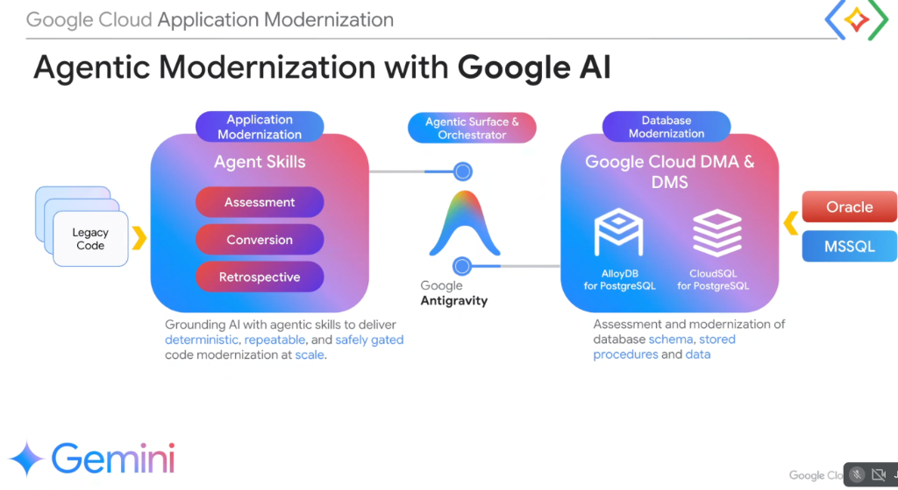

# Agentic Modernization: Google Antigravity as the Unified Enterprise Orchestrator



## Overview

Enterprise modernization cannot treat application logic and database state as isolated silos. Changing backend code requires synchronized database schema migrations, and rewriting stored procedures demands updated application ORM models.

**Google Antigravity** acts as the central **Agentic Surface & Orchestrator**, bridging **Application Modernization** (powered by progressive Agent Skills) and **Database Modernization** (powered by DMA and DMS) to deliver **deterministic**, **repeatable**, and **safely gated** enterprise modernization at scale.

---

## Unified Modernization Architecture

```mermaid
graph TD
    subgraph 📦 1. Application Modernization (Agent Skills)
        App_In["📁 <b>Legacy Source Code</b><br/>Java EE, .NET, COBOL, C++"]
        
        subgraph 🔄 The 3 Agent Skill Phases
            S1["🔍 <b>Assessment</b><br/>Dependency mapping & blocker audits"]
            S2["⚡ <b>Conversion</b><br/>Autonomous code refactoring & API synthesis"]
            S3["📋 <b>Retrospective</b><br/>Verification, code review & test auditing"]
        end
        
        App_In ==> S1 ==> S2 ==> S3
    end

    subgraph 🌟 Central Orchestrator
        AG["🌈 <b>Google Antigravity</b><br/><b>Agentic Surface & Orchestrator</b><br/>• Unified multi-agent coordination<br/>• Progressive Disclosure skills<br/>• Invariants & safety verification gates"]
    end

    subgraph 🗄️ 2. Database Modernization (DMA & DMS)
        DB_In["🏛️ <b>Oracle & MSSQL Databases</b><br/>Schemas, Stored Procedures & Data"]
        
        subgraph 🛠️ Database Engines
            DMA["Google Cloud DMA (Assessment)"]
            DMS["Google Cloud DMS (CDC Replication)"]
        end
        
        subgraph ☁️ Modern PostgreSQL Destinations
            Alloy["🔷 <b>AlloyDB for PostgreSQL</b>"]
            CSQL["🟩 <b>Cloud SQL for PostgreSQL</b>"]
        end
        
        DB_In ==> DMA & DMS ==> Alloy & CSQL
    end

    S3 <== "Synchronized Code & API Contracts" ==> AG
    AG <== "Synchronized Schema & SP Conversions" ==> DMA & DMS
```

---

## The 3 Phases of Agentic Application Modernization

```text
┌─────────────────────────────────────────────────────────────────────────────────┐
│  1. ASSESSMENT                                                                  │
│     Autonomous inspection of legacy repositories, mapping dependency trees,     │
│     identifying deprecated frameworks, and scoring migration complexity.        │
│                                                                                 │
│  2. CONVERSION                                                                  │
│     Autonomous refactoring guided by Antigravity Skills (e.g. WCF -> gRPC,      │
│     COBOL -> Java 21, Java EE -> Spring Boot 3) adhering to strict TDD.         │
│                                                                                 │
│  3. RETROSPECTIVE                                                               │
│     Automated post-conversion quality reviews, regression test validation,      │
│     performance benchmarking, and architectural knowledge capture.             │
└─────────────────────────────────────────────────────────────────────────────────┘
```

---

## The Role of Google Antigravity as Orchestrator

1. **Deterministic & Repeatable**: Grounding Gemini foundation models with formal **Agent Skills** (`SKILL.md`) and operational invariants (`AGENTS.md`) eliminates random hallucination and standardizes code patterns across thousands of repositories.
2. **Safely Gated Workflows**: Enforces human-in-the-loop validation checkpoints before merging code or executing live database schema mutations.
3. **Cross-Tier Synchronization**: Ensures that when a database stored procedure is refactored into a microservice, the corresponding backend application data access layer is updated simultaneously.

---

## Unified Modernization Capabilities Matrix

| Architectural Vector | Application Modernization | Database Modernization | Antigravity Orchestrator Integration |
| :--- | :--- | :--- | :--- |
| **Legacy Ingestion** | Monolithic Java, .NET, COBOL, C++ | Oracle PL/SQL, MS SQL Server T-SQL | Multi-modal repo ingestion & context steering |
| **Assessment Tooling** | Mainframe Assessment Tool, CodMod | Database Migration Assessment (DMA) | Aggregates findings into unified `PLAN.md` |
| **Transformation Engine**| Gemini CLI + Progressive Agent Skills | Database Migration Service (DMS) + AI SP Conversion | Coordinates TDD refactoring & schema deployment |
| **Target Cloud State** | Cloud Run, GKE, Serverless Microservices | AlloyDB for PostgreSQL, Cloud SQL | Unified deployment & multi-zone validation |
| **Quality Verification** | Automated unit tests & Critique AI review | Google Dual Run & live data parity comparison | Enforces verification-before-completion gates |
