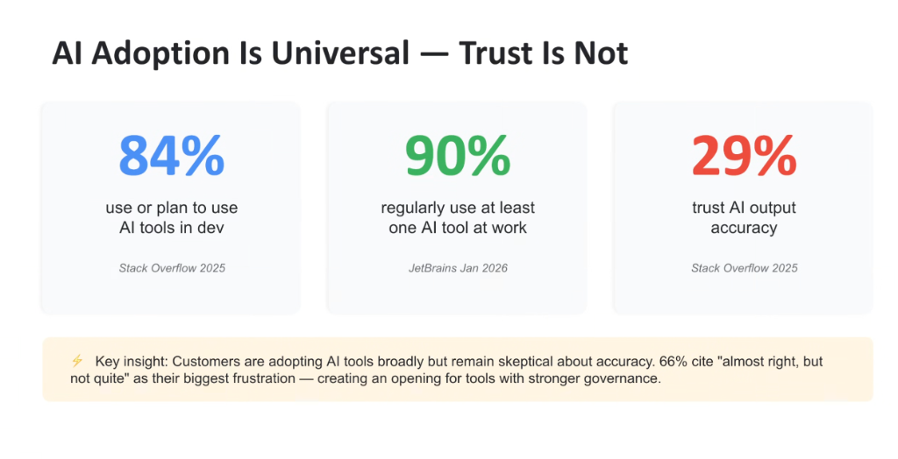
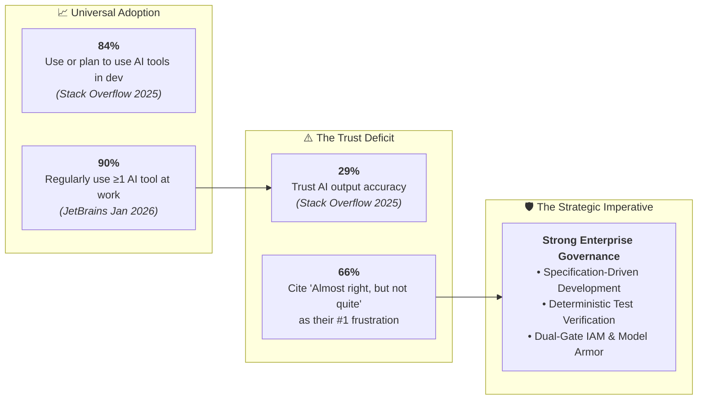
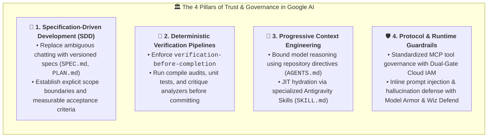

# The AI Trust Gap: Universal Adoption vs. Low Output Confidence

## Overview

The enterprise developer landscape is experiencing a profound architectural paradox: **AI adoption is nearly universal, yet developer trust in AI accuracy remains critically low**.

Empirical data across industry benchmarks reveals that while over **90%** of software engineers regularly use AI in their daily workflows, **less than one-third (29%)** trust the accuracy of AI outputs. The dominant friction—cited by **66% of developers**—is the frustration of code that is *"almost right, but not quite"*.

---

## Empirical Benchmark Data

---

## The Root Causes of the Trust Deficit

### 1. The "Almost Right, But Not Quite" Tax
* **Subtle Logic & Concurrency Flaws**: Generative models produce syntactically polished code that passes visual inspection but contains hidden race conditions, off-by-one errors, or unhandled edge cases.
* **Reviewer Fatigue & Verification Overhead**: Debugging subtly flawed AI output often incurs higher cognitive load and time investment than authoring code from first principles.

---

### 2. Context Blindness & Hallucinated APIs
* **Out-of-Date or Generic Assumptions**: Unconstrained models hallucinate deprecated library methods, non-existent cloud endpoints, or invalid SDK parameters.
* **Lack of Organizational Grounding**: Conventional conversational tools operate blind to repository-specific coding standards, internal frameworks, and security invariants.

---

## How Google Bridges the Trust Gap: The 4 Pillars of Governed AI

---

## Industry Trust & Adoption Benchmark Matrix

| Metric Dimension | Benchmark Value | Source | Architectural Implication |
| :--- | :--- | :--- | :--- |
| **Dev Tool Adoption** | **84%** | Stack Overflow 2025 | AI tooling is standard baseline infrastructure in modern engineering. |
| **Workplace Usage** | **90%** | JetBrains Jan 2026 | Engineers actively seek generative assistance for routine tasks. |
| **Output Trust Level** | **29%** | Stack Overflow 2025 | **Severe trust deficit**; raw generation without verification fails enterprise standards. |
| **Primary Friction Point** | **66%** | Developer Surveys | *"Almost right, but not quite"* creates immense cognitive verification drag. |
| **Market Opportunity** | **Strong Governance** | Google Elevate Strategy | Enterprise winners provide rigorous testing harnesses, MCP guardrails, and SDD. |
