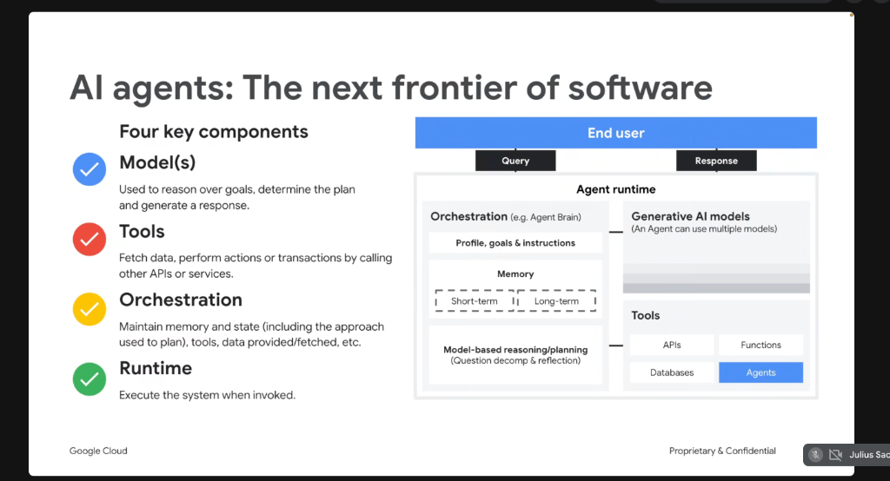
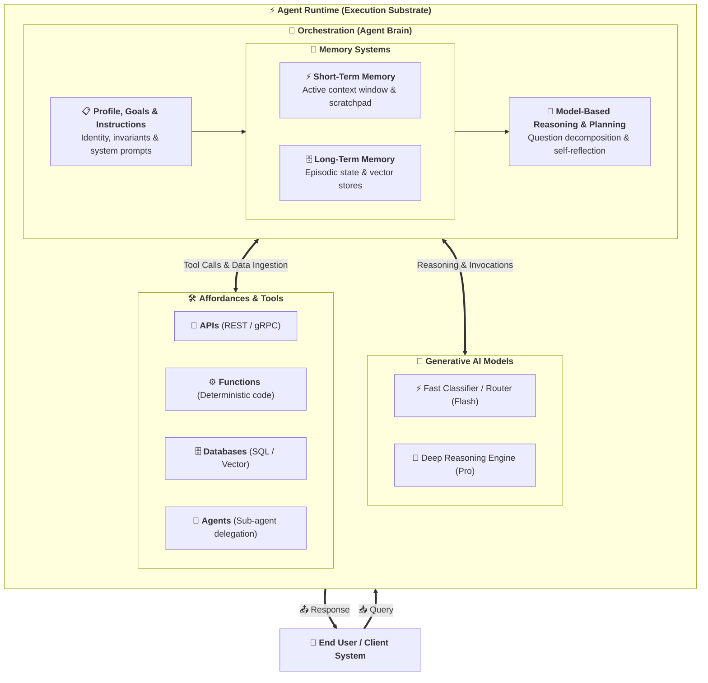

# AI Agents: The Next Frontier of Software & The Four Key Components

## Overview

AI Agents represent the next foundational frontier in software architecture—transitioning software from deterministic, hand-coded algorithmic scripts to autonomous, goal-directed systems capable of reasoning, planning, and interacting dynamically with external environments.

An enterprise-grade AI Agent is composed of **Four Key Components**: **Model(s)**, **Tools**, **Orchestration (The Agent Brain)**, and the **Runtime**.

---

## The AI Agent Runtime Architecture

---

## Deep Dive: The Four Key Components

### 1. Model(s) (The Cognitive Engine)
* **Role**: Used to reason over goals, decompose multi-step tasks, evaluate tool results, and synthesize final responses.
* **Multi-Model Orchestration**: An advanced agent is not bound to a single model. It can dynamically route tasks:
  * **Lightweight / Low-Latency Models** (e.g. Gemini Flash) for fast classification, routing, and tool parameter extraction.
  * **Deep Reasoning Foundation Models** (e.g. Gemini Pro / DeepThink) for complex root-cause analysis, planning, and code synthesis.

---

### 2. Tools (The Affordance & Action Layer)
* **Role**: Enable the agent to sense external environment states, fetch dynamic data, and execute transactions across four primary categories:
  * **APIs**: Invoking external enterprise web services (REST, gRPC, GraphQL).
  * **Functions**: Executing local deterministic code (Python, Go, Bash scripts).
  * **Databases**: Querying structured relational data (Cloud SQL, AlloyDB, BigQuery) or unstructured vector embeddings.
  * **Agents**: Delegating specialized sub-tasks to subordinate or peer agents (Multi-Agent Swarms).

---

### 3. Orchestration (The Agent Brain & Governance)
* **Role**: Maintains state, steers planning loops, and arbitrates memory and tool execution.
* **Core Sub-Systems**:
  * **Profile, Goals & Instructions**: Defines system identity, domain boundaries, operational directives, and security invariants (`AGENTS.md`).
  * **Memory**:
    * **Short-Term Memory**: Session conversation history, active scratchpad, and ephemeral tool outputs.
    * **Long-Term Memory**: Persistent episodic memory across sessions, user preferences, and knowledge graphs.
  * **Model-Based Reasoning & Planning**: Question decomposition, ReAct (Reason + Act) execution loops, backtracking, and self-reflection.

---

### 4. Runtime (The Execution Substrate)
* **Role**: Executes the entire agent system when invoked by an end user or event trigger.
* **Responsibilities**: Manages query ingress and response egress, thread isolation, sandbox security boundaries, authorization tokens, telemetry/trace logging, and state persistence.

---

## Architectural Component Matrix

| Component | Primary Function | Key Sub-Modules | Google Cloud Implementation |
| :--- | :--- | :--- | :--- |
| **Model(s)** | Reasoning & planning engine | LLMs, Multi-model routers | Gemini 1.5 Flash / Pro, Vertex AI Model Garden |
| **Tools** | Environmental sensing & actions | APIs, Functions, DBs, Sub-Agents | Model Context Protocol (MCP), ADK Toolkits, Cloud Run Functions |
| **Orchestration** | State, memory, and reasoning loops | Profile, Short/Long-Term Memory, Planning | Google Antigravity, Google ADK, Agent Brain |
| **Runtime** | Execution environment & invocation | Sandbox, Session management, Telemetry | Agent Runtime, Cloud Run, GKE, `agy` CLI |
