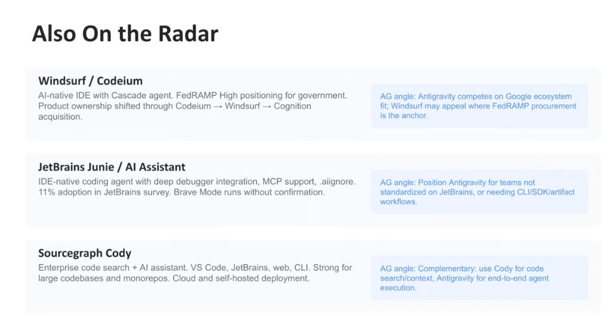
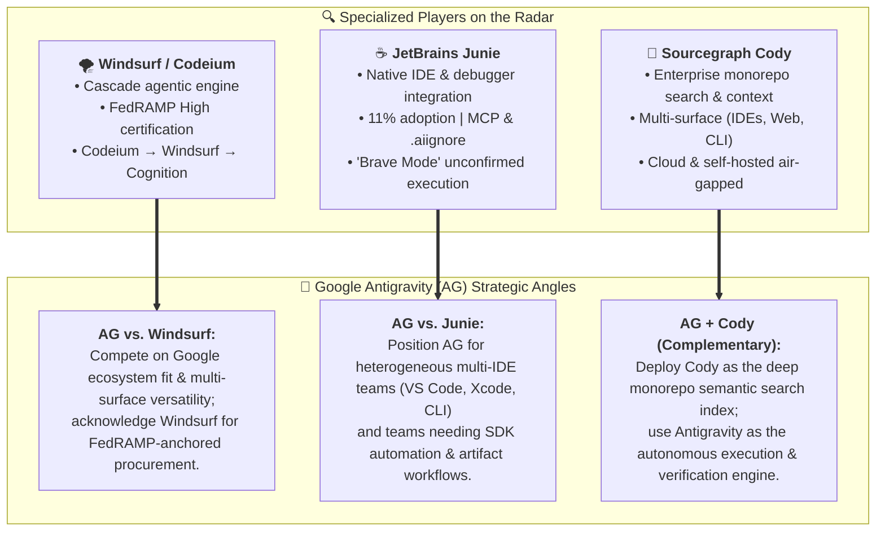

# Specialized AI Coding Players on the Radar: Windsurf, Junie & Cody

## Overview

Beyond the premier consumer and commercial frontrunners, three specialized enterprise AI developer platforms occupy critical strategic niches:

1. **Windsurf / Codeium** (Government compliance & Cascade agent)
2. **JetBrains Junie / AI Assistant** (IDE-native debugging & AST integration)
3. **Sourcegraph Cody** (Enterprise monorepo code search & context indexing)

This note details their architectures, competitive positioning, and the strategic **"Antigravity (AG) Angle"** for Google Cloud Customer Engineers during enterprise evaluations.

---

## Strategic Positioning & Architectural Decision Framework

---

## Detailed Player Breakdown & Antigravity Strategy

### 1. Windsurf / Codeium (*Government Compliance & The Cascade Agent*)
* **Architecture & Heritage**: AI-native IDE powered by the **Cascade** agentic loop. Product ownership shifted from Codeium $\rightarrow$ Windsurf $\rightarrow$ Cognition acquisition.
* **Key Capabilities**:
  * **Cascade Agent**: Deep context tracking and autonomous multi-file refactoring within the IDE.
  * **FedRAMP High Authorization**: Built specifically to meet stringent public sector, aerospace, and defense compliance mandates.
* **Strategic Antigravity Angle**:
  * **Competitive Positioning**: Antigravity competes on complete Google Cloud ecosystem integration, cross-surface versatility (CLI `agy`, VS Code, JetBrains, Visual Studio, Xcode), and Gemini 3.1 2M+ token horizons.
  * **Procurement Dynamic**: Windsurf remains strong in deals where FedRAMP High procurement authorization is the non-negotiable procurement anchor.

---

### 2. JetBrains Junie / AI Assistant (*IDE-Native Debugger & AST Integration*)
* **Architecture & Heritage**: Deeply integrated native AI assistant built directly into the JetBrains suite (IntelliJ IDEA, PyCharm, CLion, WebStorm). Captures **11% work adoption** in JetBrains benchmarks.
* **Key Capabilities**:
  * **Debugger & AST Integration**: Direct access to JVM runtime state, active variable values, stack traces, and local debuggers.
  * **Model Context Protocol (MCP) & `.aiignore`**: Standardized tool calling and sensitive file exclusion.
  * **Brave Mode**: Allows autonomous agent execution and bash commands without requiring step-by-step human confirmation prompts.
* **Strategic Antigravity Angle**:
  * **Competitive Positioning**: Position Antigravity for engineering organizations not exclusively standardized on JetBrains (e.g. polyglot teams running VS Code, Visual Studio, Xcode, Linux terminals), or teams requiring terminal CLI automation (`agy`), SDK pipelines, structured Markdown artifacts, and multi-subagent coordination.

---

### 3. Sourcegraph Cody (*Enterprise Code Search & Monorepo Indexing*)
* **Architecture & Heritage**: Enterprise-grade code search and AI context platform supporting VS Code, JetBrains, Web UI, and CLI. Deployable via multi-tenant cloud or self-hosted air-gapped on-premises clusters.
* **Key Capabilities**:
  * **Massive Monorepo Indexing**: Precise semantic embeddings, AST symbol graphs, and multi-repository cross-referencing across petabyte-scale codebases.
  * **Multi-LLM Backend**: Flexible routing across leading frontier models.
* **Strategic Antigravity Angle (Complementary Synergy)**:
  * **Co-Existence Strategy**: Cody and Antigravity are highly complementary rather than adversarial.
  * **Best-of-Breed Architecture**: Enterprise customers can utilize Sourcegraph Cody as the **deep code intelligence and context retrieval layer**, while deploying Google Antigravity as the **autonomous agentic execution engine** that authors specs, executes tool calls, runs tests, and completes complex development branches.

---

## Specialized Players Landscape & Engagement Matrix

| Platform | Core Strength | Deployment Model | Ideal Customer Profile | Antigravity CE Positioning |
| :--- | :--- | :--- | :--- | :--- |
| **Windsurf** | FedRAMP High & Cascade Agent | Managed Cloud | Public sector, defense, regulated gov | Compete on Google ecosystem; yield on strict FedRAMP mandate |
| **JetBrains Junie** | Native debugger & JVM AST integration | Cloud / On-prem | Pure JetBrains Java/Kotlin shops | Position for multi-IDE estates, terminal CLI &amp; subagents |
| **Sourcegraph Cody** | Massive multi-repo code search | Cloud &amp; Self-Hosted | Massive enterprise monorepos | **Complementary:** Cody for search context $\rightarrow$ AG for agent execution |
