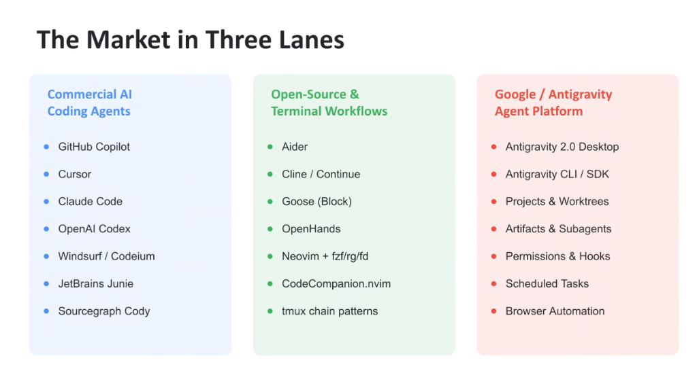
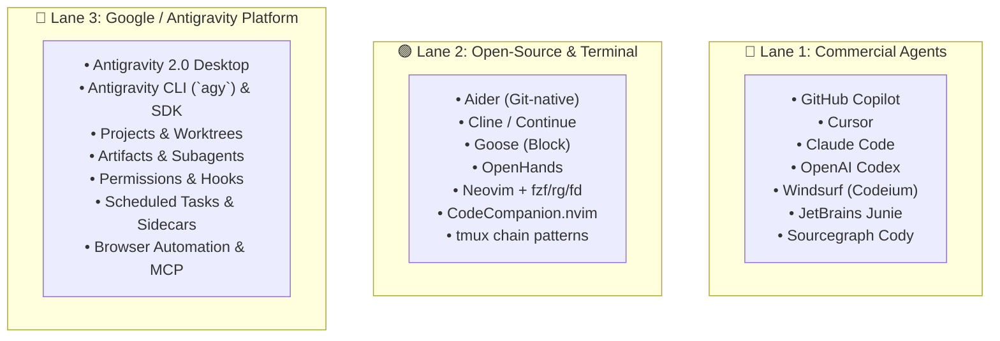

# The AI Coding Market in Three Lanes: Commercial, Open-Source & Antigravity

## Overview

The developer AI tool ecosystem is organized across **Three Strategic Lanes**, each representing distinct operational philosophies, developer surfaces, and deployment architectures:

1. **Lane 1: Commercial AI Coding Agents** (Proprietary, SaaS-tied developer products)
2. **Lane 2: Open-Source & Terminal Workflows** (Community-driven, BYOK, hacker-centric tooling)
3. **Lane 3: Google / Antigravity Agent Platform** (The full-stack, enterprise-grade unified agent platform)

---

## The Three Market Lanes Architecture

---

## Detailed Analysis of the Three Lanes

### Lane 1: Commercial AI Coding Agents
* **Target Audience**: Mainstream software developers seeking out-of-the-box, turn-key IDE or CLI productivity.
* **Key Implementations**:
  * **GitHub Copilot**: The incumbent autocomplete and chat assistant.
  * **Cursor**: The leading dedicated AI-first VS Code fork.
  * **Claude Code**: Terminal-native autonomous CLI agent by Anthropic.
  * **Windsurf (Codeium)** & **Sourcegraph Cody**: Commercial IDE and code-search assistants.
  * **JetBrains Junie**: Deeply integrated native JetBrains assistant.
* **Architectural Profile**: Proprietary agent loops, subscription-based cloud inference, centralized management, but often constrained to single-model lock-in or isolated developer silos.

---

### Lane 2: Open-Source & Terminal Workflows
* **Target Audience**: Power users, terminal purists, and systems engineers who demand local control, "Bring Your Own Key" (BYOK) model choice, and scriptable customization.
* **Key Implementations**:
  * **Aider**: Groundbreaking git-native terminal CLI that automatically constructs repository maps and formats commits.
  * **Cline / Continue**: Popular open-source VS Code extensions supporting multiple local/cloud LLMs.
  * **Goose (Block)** & **OpenHands**: Open-source autonomous developer agents.
  * **Neovim Ecosystem**: `CodeCompanion.nvim` and custom bindings integrating `fzf`, `ripgrep`, and `fd` with LLM endpoints via tmux session chains.
* **Architectural Profile**: Maximum hackability, zero vendor lock-in, and local privacy; however, lacks enterprise IAM/governance, unified multi-agent coordination, and automated cloud compliance.

---

### Lane 3: Google / Antigravity Agent Platform
* **Target Audience**: Enterprise software engineering teams, platform engineers, and AI architects requiring full-lifecycle, verifiable agent orchestration.
* **Core Architectural Differentiators**:
  1. **Dual Surface (Desktop & CLI/SDK)**: Run visual multi-agent workflows in Antigravity 2.0 or headless terminal pipelines via `agy` and the Antigravity SDK.
  2. **Projects & Worktrees**: Native git worktree isolation allowing autonomous subagents to branch, test, and refactor codebases without polluting the developer's working directory.
  3. **Artifacts & Subagent Swarms**: Specialized agent roles (Architect, Implementer, Reviewer, Verifier) generating versioned artifacts with progressive disclosure.
  4. **Permissions & Runtime Hooks**: Fine-grained security prompts, sandboxing, and deterministic lifecycle hooks intercepting tool calls.
  5. **Scheduled Tasks & Sidecars**: Background scheduled cron jobs and continuous sidecar daemons (`agentapi`) that autonomously triage repositories and monitor builds.
  6. **Deep Google Ecosystem Integration**: Native MCP server mesh, Gemini 3.1 2M+ context window, Model Armor, and Wiz AI-APP security governance.

---

## 3-Lane Comparative Evaluation Matrix

| Capability Dimension | Commercial Agents (Lane 1) | Open-Source Terminal (Lane 2) | Google Antigravity Platform (Lane 3) |
| :--- | :--- | :--- | :--- |
| **Primary Surfaces** | Single IDE fork or standalone CLI | Terminal / Neovim / VS Code extension | **Desktop 2.0, CLI (`agy`), IDE Extensions, SDK** |
| **Model Engine** | Vendor-locked or limited options | BYOK (Ollama, Anthropic, OpenAI) | **Gemini 3.1 co-optimized + Multi-Model routing** |
| **Workspace Isolation**| Basic file edit locks | Manual git branching | **Native Worktrees & isolated CitC workspaces** |
| **Agent Topology** | Single-agent chat or composer | Scripted chains / CLI loops | **Structured Subagents (Architect, Reviewer, Verifier)** |
| **Extensibility** | Minimal / proprietary plugins | Open-source prompt hacking | **Declarative Skills (`SKILL.md`) & MCP Servers** |
| **Background Ops** | None (interactive only) | Cron scripts / tmux daemons | **Native Scheduled Tasks & Agent API Sidecars** |
| **Enterprise Security**| Basic SOC2 / SaaS ToS | Developer responsibility | **Dual-Gate Cloud IAM, WIF, Model Armor, Wiz AI-APP** |
