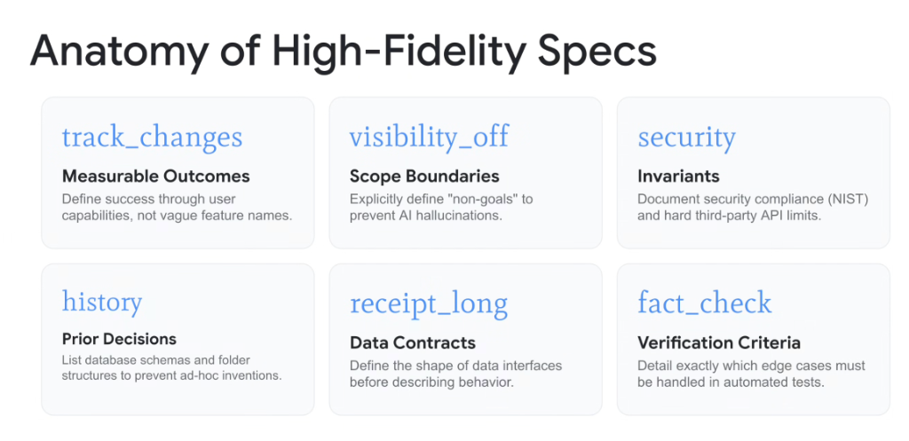

# Specification Engineering: The Anatomy of High-Fidelity Specs



## Overview

In **Specification-Driven Development (SDD)**, the quality and determinism of generated software is directly bounded by the precision of the specification. Vague user stories produce **PR Slop**; high-fidelity specifications compile deterministically into production-grade systems.

A high-fidelity specification (`SPEC.md`) is structured across **six non-negotiable architectural dimensions**: **Measurable Outcomes**, **Scope Boundaries**, **Invariants**, **Prior Decisions**, **Data Contracts**, and **Verification Criteria**.

---

## The 6 Pillars of High-Fidelity Specifications

```mermaid
graph TD
    subgraph 🎯 Functional Objectives & Scope
        P1["🎯 <b>1. Measurable Outcomes (track_changes)</b><br/>Define success by user capabilities, not vague feature names"]
        P2["🚫 <b>2. Scope Boundaries (visibility_off)</b><br/>Explicitly define 'Non-Goals' to prevent hallucinations"]
    end

    subgraph 🛡️ Guardrails & Foundations
        P3["🔒 <b>3. Invariants (security)</b><br/>Security compliance (NIST) & hard API rate limits"]
        P4["📜 <b>4. Prior Decisions (history)</b><br/>Ground in existing DB schemas & directory trees"]
    end

    subgraph 🧪 Interfaces & Testing
        P5["📑 <b>5. Data Contracts (receipt_long)</b><br/>Define data shapes (JSON/Proto) before logic"]
        P6["✅ <b>6. Verification Criteria (fact_check)</b><br/>Detail exact edge cases asserted in automated tests"]
    end

    P1 & P2 & P3 & P4 & P5 & P6 ==> Spec["📜 <b>High-Fidelity Specification (SPEC.md)</b>"]
```

---

## Detailed Breakdown of the 6 Dimensions

### 1. Measurable Outcomes (`track_changes`)
* **Core Rule**: Define success through concrete user capabilities and verifiable system states, not abstract marketing buzzwords.
* **Anti-Pattern**: *"Build a fast and scalable data parser."*
* **High-Fidelity Spec**: *"The user can upload a 50MB CSV via `POST /api/upload` and query aggregated row counts filtered by ISO-8601 timestamps with $<200\text{ms}$ latency."*

---

### 2. Scope Boundaries & Non-Goals (`visibility_off`)
* **Core Rule**: Explicitly define what the system **will NOT do** to prevent the LLM from inventing features (*speculative hallucinations*).
* **High-Fidelity Spec**:
  ```markdown
  ### Non-Goals
  * Do NOT implement WebSocket streaming; HTTP batch endpoints only.
  * Do NOT create user authentication; rely on existing GCP IAM header tokens.
  * Do NOT support legacy XML payloads.
  ```

---

### 3. Invariants & Security Perimeters (`security`)
* **Core Rule**: Document non-negotiable security rules, compliance baselines (NIST, FedRAMP), and hard third-party API quotas.
* **High-Fidelity Spec**:
  * Never log raw PII or authentication tokens to stdout.
  * Enforce maximum 10 requests/sec with exponential backoff on external APIs.
  * Require TLS 1.3 encryption on all egress connections.

---

### 4. Prior Decisions & Ground Truth (`history`)
* **Core Rule**: Ground the agent in existing repository topology, database schemas, and approved library dependencies.
* **High-Fidelity Spec**:
  * Use the existing database model defined in `internal/db/schema.sql`.
  * Reuse existing error formatting helper in `pkg/errors/api_error.go`.
  * Do not introduce third-party JSON libraries; use standard `encoding/json`.

---

### 5. Data Contracts (`receipt_long`)
* **Core Rule**: Define the exact shape, typing, and schema of data interfaces *before* describing procedural logic.
* **High-Fidelity Spec**:
  ```typescript
  interface IngestRequest {
    readonly tenantId: string; // UUIDv4 format
    readonly payload: Array<{
      readonly eventId: string;
      readonly timestamp: number; // Unix epoch milliseconds
      readonly properties: Record<string, unknown>;
    }>;
  }
  ```

---

### 6. Verification Criteria (`fact_check`)
* **Core Rule**: Detail the exact edge cases, failure states, and regression tests that must pass before the change is considered complete.
* **High-Fidelity Spec**:
  * Test case 1: Valid payload returns HTTP 200 with receipt UUID.
  * Test case 2: Corrupted timestamp returns HTTP 400 with `INVALID_TIMESTAMP` error code.
  * Test case 3: Upstream database timeout triggers 3 retries and returns HTTP 504.

---

## High-Fidelity Specs Reference Matrix

| Dimension | Identifier | Core Objective | Primary Risk Prevented |
| :--- | :--- | :--- | :--- |
| **Measurable Outcomes** | `track_changes` | Define verifiable end-state capabilities | Vague implementations & unmet user expectations |
| **Scope Boundaries** | `visibility_off` | Define explicit "Non-Goals" | Scope creep & hallucinated ad-hoc features |
| **Invariants** | `security` | Enforce compliance (NIST) & API limits | Security vulnerabilities & quota exhaustion |
| **Prior Decisions** | `history` | Ground in active schemas & file paths | Architectural drift & duplicate utilities |
| **Data Contracts** | `receipt_long` | Strict typing before procedural logic | Schema mismatch & serialization runtime bugs |
| **Verification Criteria**| `fact_check` | Explicit edge-case test definitions | Untested error branches & 3am on-call pages |
