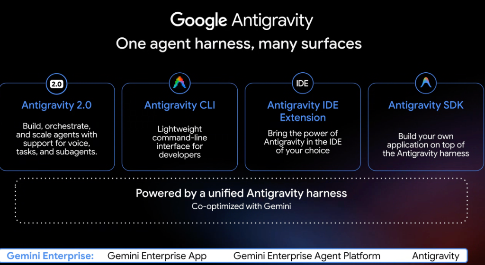
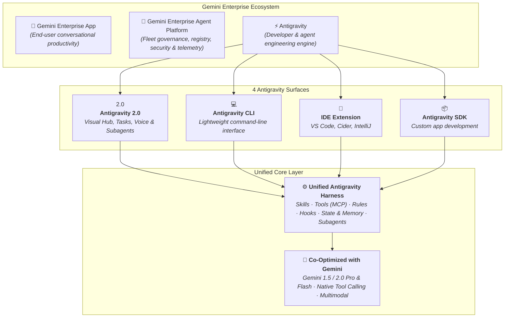

# Google Antigravity: One Agent Harness, Many Surfaces

## Overview

**Google Antigravity** is built around a single, unified agent harness co-optimized with the Gemini family of models. Rather than fragmenting tooling across disconnected runtimes, the core Antigravity harness powers multiple developer and enterprise surfaces—from terminal CLI tools and IDE extensions to full visual hubs and custom SDK applications.

Under the broader **Gemini Enterprise** umbrella, Antigravity serves as the core engineering and execution engine alongside the **Gemini Enterprise App** and the **Gemini Enterprise Agent Platform**.

---

## Architectural Interaction & Surface Map

---

## The 4 Antigravity Surfaces Detailed

### 1. Antigravity 2.0 (Visual Agent Hub)
* **Description**: A comprehensive visual environment to build, orchestrate, and scale autonomous agents.
* **Key Capabilities**:
  * **Voice & Multimodal Interaction**: Real-time duplex audio/voice support for seamless pair programming and collaborative problem solving.
  * **Visual Task Checklist**: Dynamic, real-time observability of the agent's internal reasoning, task breakdown, and execution status.
  * **Subagent Orchestration**: Built-in multi-agent swarms (`architect`, `implementer`, `reviewer`, `verifier`) with context isolation.
  * **Artifacts Engine**: Interactive implementation plans, markdown walkthroughs, diff viewers, and live web preview panes.

### 2. Antigravity CLI (Developer Terminal)
* **Description**: A lightweight, scriptable command-line interface designed for fast developer terminal loops.
* **Key Capabilities**:
  * **Headless Automation**: Run agentic tasks, refactoring runs, and code reviews directly from shell scripts or CI/CD pipelines.
  * **Zero Friction**: Instant initialization in any local directory without heavy GUI overhead.
  * **Scriptable Workflows**: Pipe terminal outputs, Git diffs, and compiler errors directly into agent sessions.

### 3. Antigravity IDE Extension (In-Editor Companion)
* **Description**: Brings the full intelligence and toolset of Antigravity into the developer's primary editing environment (VS Code, JetBrains IntelliJ, Cider, Cloud Workstations).
* **Key Capabilities**:
  * **Contextual Codebase Awareness**: Direct integration with active files, open tabs, diagnostics, and cursor position.
  * **Inline Mutations & Gutter Actions**: Trigger refactors, unit test generation, and bug fixes directly from editor gutter markers.
  * **Local File Parity**: Seamless integration with local formatters, linters, and language servers.

### 4. Antigravity SDK (Custom Application Engine)
* **Description**: A programmatic library enabling software engineering teams to embed the Antigravity harness into their own proprietary applications.
* **Key Capabilities**:
  * **Embeddable Harness**: Integrate agentic reasoning, memory machines, tool orchestration, and Skill loading into bespoke enterprise software.
  * **Custom Transports & Frontends**: Connect custom web portals, internal tools, or Slack/Chat bots to the Antigravity agent runtime.

---

## Surfaces Comparison Matrix

| Dimension | Antigravity 2.0 | Antigravity CLI | Antigravity IDE Extension | Antigravity SDK |
| :--- | :--- | :--- | :--- | :--- |
| **Primary Audience** | Power developers, agent architects | Terminal-centric devs, DevOps, CI/CD | Daily software engineers, full-stack devs | Platform teams, custom app developers |
| **Interface Style** | Full visual GUI + Voice + Artifacts | Headless / TUI (Text User Interface) | In-editor side panel & inline gutter actions | Programmatic code API (Python / TypeScript) |
| **Multi-Agent Swarms** | Native visual task tree & delegation | CLI-dispatched subagent pipelines | Contextual subagent delegation | Programmatically defined agent swarms |
| **Core Strength** | Deep multi-step reasoning & visual UX | Speed, scriptability, and CI/CD pipelines | Zero context switching while coding | Total customizability & embedding |

---

## Gemini Enterprise Ecosystem Mapping

The slide establishes the alignment across Google's enterprise GenAI platform:

1. **Gemini Enterprise App**: End-user web and mobile application for conversational search, document synthesis, and Workspace productivity.
2. **Gemini Enterprise Agent Platform**: Centralized control plane for enterprise agent registration, governance, IAM security boundaries, policy enforcement, and audit telemetry.
3. **Antigravity**: The high-performance agent harness and engineering toolkit powering the entire builder and developer lifecycle.
