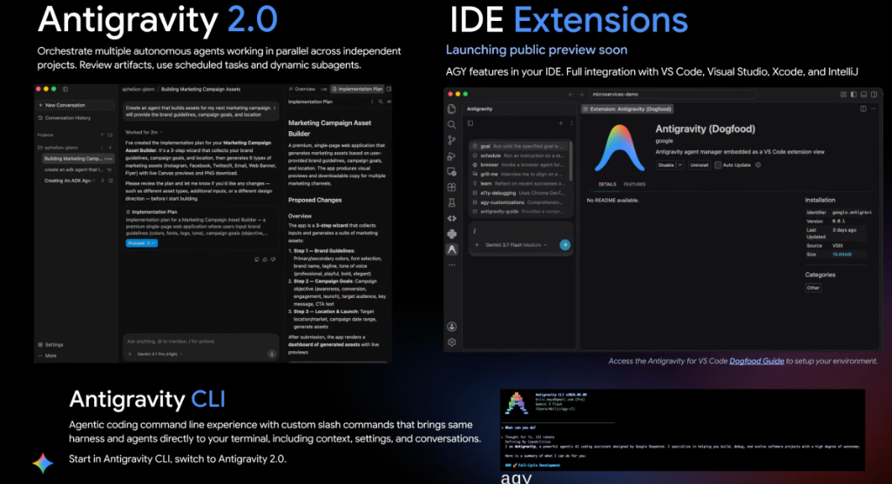
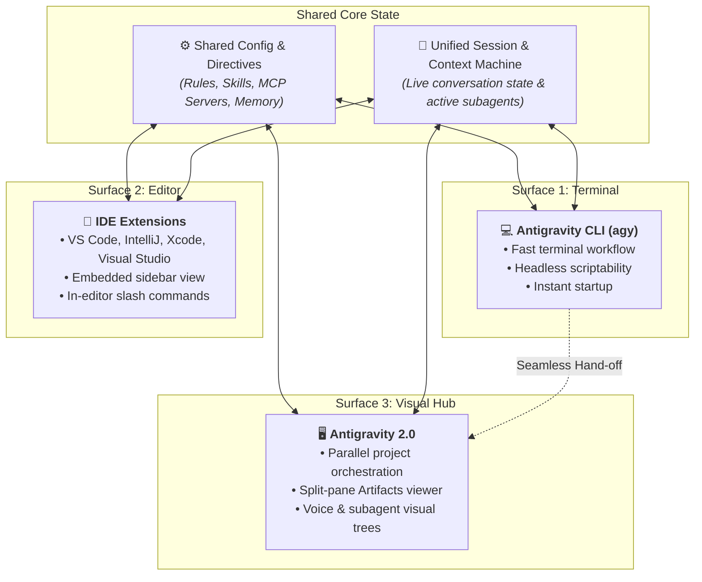

# Google Antigravity Surfaces: Antigravity 2.0, IDE Extensions & CLI

## Overview

**Google Antigravity** provides developers with a seamless continuum of developer surfaces—from the terminal to full visual workspaces. Regardless of where work begins, the underlying Antigravity harness maintains shared context, memory, rules, skills, MCP tools, and active conversation state. Developers can fluidly **"Start in Antigravity CLI, switch to Antigravity 2.0"**, or work entirely inside their favorite IDE.

---

## Unified Experience & Seamless Surface Interoperability

---

## The Three Primary Surfaces Detailed

### 1. Antigravity 2.0 (Visual Multi-Agent Hub)
* **Core Value**: Orchestrate multiple autonomous agents working in parallel across independent projects.
* **Key Capabilities**:
  * **Parallel Project Management**: Switch between independent agent workspaces (`aphelion-glenn`, `marketing-campaign-builder`) with dedicated conversation histories.
  * **Split-Pane Artifacts Viewer**: Render rich Markdown documents, interactive Implementation Plans, Mermaid diagrams, and code diffs in a dedicated right-hand auxiliary pane.
  * **Human-in-the-Loop Proceed Gates**: Interactive confirmation buttons (e.g. `Proceed`) allowing humans to approve plans before file mutations occur.
  * **Multimodal & High Reasoning**: Powered by flagship models (e.g. `Gemini 3.1 Pro High`) with built-in voice input for natural conversational pair programming.

---

### 2. IDE Extensions (In-Editor Experience)
* **Core Value**: Full Antigravity intelligence embedded directly into the developer's primary coding environment.
* **Supported IDEs**: **VS Code**, **Visual Studio**, **Xcode**, and **JetBrains IntelliJ** (launching in public preview).
* **Key Capabilities**:
  * **Embedded Agent Manager View**: Dedicated side panel providing full chat, file awareness, and live execution tracing without leaving the editor.
  * **Rich Slash Command Suite**:
    * `/goal`: Run long-running autonomous tasks until completion.
    * `/schedule`: Schedule instructions on recurring cron or timer intervals.
    * `/browser`: Invoke browser agents for web exploration and UI verification.
    * `/grill-me`: Interactive interview mode to harden specifications before building.
    * `/learn`: Persist learnings and user corrections to project configuration.
    * `/a11y-debugging`: Automated accessibility audits and screen-reader testing.
    * `/agy-customizations`: Inspect and configure skills, rules, and hooks.
  * **Model Selection**: Switch flexibly between models (e.g., `Gemini 3.7 Flash Medium`) tailored for speed or deep reasoning.

---

### 3. Antigravity CLI (`agy` Terminal Experience)
* **Core Value**: Agentic coding command-line experience bringing the full harness directly to the terminal.
* **Key Capabilities**:
  * **Direct Terminal Execution**: Launch ad-hoc tasks, refactoring runs, and code reviews using the `agy` command.
  * **Full Command & Context Parity**: Ingests project rules, context files (`GEMINI.md`), and custom slash commands identically to the visual hub.
  * **Seamless Workspace Handoff**: Start an investigation or draft code in `agy`, and immediately inspect the resulting visual artifacts, diffs, and execution traces in **Antigravity 2.0**.

---

## Surface Comparison Matrix

| Feature / Capability | Antigravity CLI (`agy`) | Antigravity IDE Extension | Antigravity 2.0 Hub |
| :--- | :--- | :--- | :--- |
| **Primary Environment** | MacOS / Linux Terminal | VS Code, IntelliJ, Xcode, Visual Studio | Dedicated Desktop / Web Hub |
| **Artifacts Pane** | Text / Markdown in stdout | In-editor webview tab | Dedicated split-pane viewer with live actions |
| **Human-in-the-Loop Gates** | Interactive terminal prompts (`y/n`) | In-editor modal prompts | Visual interactive buttons (`Proceed`) |
| **Voice / Audio Input** | No (Terminal text / piping) | No (Text / Keybindings) | Yes (Full duplex voice interaction) |
| **Multi-Project Orchestration** | Session-per-shell tab | Single IDE workspace scope | Multi-project parallel management |
| **Best For** | Fast scripts, CI/CD, quick fixes | Daily inline coding & debugging | Complex multi-file features & agent swarms |
