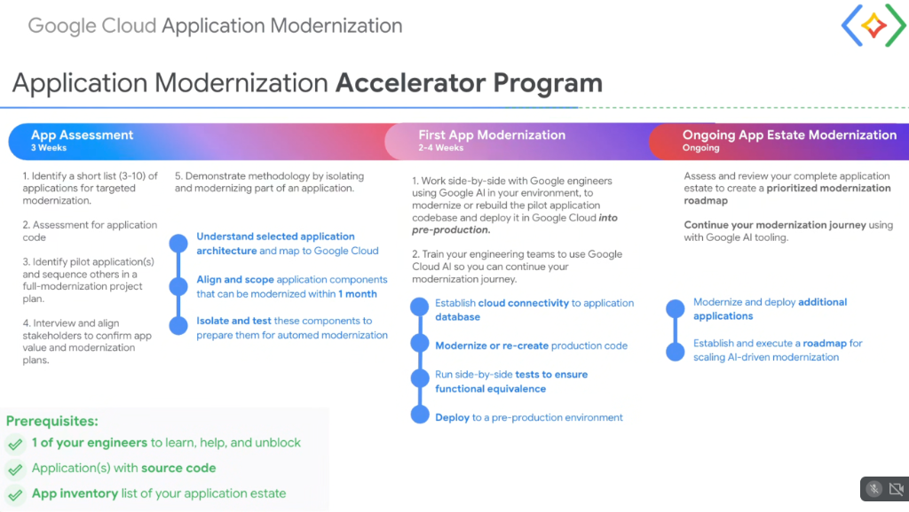

# Customer Execution: Application Modernization Accelerator Program



## Overview

The **Google Cloud Application Modernization Accelerator Program** is an accelerated, hands-on customer engagement model designed to take enterprise applications from legacy code to a verified, **pre-production cloud deployment in 3–7 weeks**.

Rather than relying on lengthy third-party consulting engagements, the program pairs Google engineers with customer engineers to modernize an initial pilot workload using **Google AI / Antigravity**, while upskilling internal teams to autonomously scale the modernization across their entire application portfolio.

---

## The 3-Phase Accelerator Program Lifecycle

```mermaid
graph LR
    subgraph 🔍 Phase 1: App Assessment (3 Weeks)
        P1_1["1. Shortlist 3-10 candidate apps"]
        P1_2["2. Automated code assessment (CodMod/MAT)"]
        P1_3["3. Scope pilot app for &lt;1 month modernization"]
        P1_4["4. Stakeholder alignment & sub-component demo"]
        P1_1 --> P1_2 --> P1_3 --> P1_4
    end

    subgraph ⚡ Phase 2: First App Modernization (2-4 Weeks)
        P2_1["1. Connect to application database"]
        P2_2["2. Modernize/recreate code via Gemini & Antigravity"]
        P2_3["3. Side-by-side tests for functional equivalence"]
        P2_4["4. Deploy to pre-production (Cloud Run / GKE)"]
        P2_1 --> P2_2 --> P2_3 --> P2_4
    end

    subgraph 📈 Phase 3: Ongoing Estate Modernization (Scale)
        P3_1["1. Estate-wide prioritized roadmap"]
        P3_2["2. Modernize & deploy additional apps"]
        P3_3["3. Scale AI-driven modernization internally"]
        P3_1 --> P3_2 --> P3_3
    end

    P1_4 ==> P2_1
    P2_4 ==> P3_1
```

---

## Detailed Phase Breakdown

### Phase 1: App Assessment (Duration: 3 Weeks)
* **Objective**: Evaluate portfolio suitability, map architecture, and select the optimal pilot application.
* **Key Activities**:
  1. Identify a shortlist of **3–10 applications** for targeted modernization.
  2. Execute automated code assessments using Google Cloud modernization CLI tools.
  3. Select the primary **pilot application** and sequence remaining workloads into a master plan.
  4. Interview technical and business stakeholders to validate ROI, business value, and cutover criteria.
  5. Demonstrate the modernization methodology by isolating and refactoring a small sub-component.
* **Architecture Milestone**: Understand application topology, scope components that can be modernized within **1 month**, and isolate/test interfaces.

---

### Phase 2: First App Modernization (Duration: 2–4 Weeks)
* **Objective**: Deliver a working, modernized pilot application in a Google Cloud pre-production environment.
* **Key Activities**:
  1. **Side-by-Side Co-Engineering**: Google engineers work directly alongside customer engineers using Google AI / Antigravity in the customer's development environment.
  2. **Internal Team Upskilling**: Train customer developers to use Gemini CLI, Agent Skills, and automated test generators.
* **Technical Milestones**:
  * **Database Connectivity**: Establish secure VPC connectivity and replication to cloud databases (Cloud SQL / AlloyDB).
  * **Code Modernization**: Refactor or regenerate production code into cloud-native microservices.
  * **Equivalence Testing**: Run side-by-side regression tests (or Dual Run) to guarantee functional parity.
  * **Pre-Production Deployment**: Package OCI containers and deploy to **Cloud Run** or **GKE**.

---

### Phase 3: Ongoing App Estate Modernization (Ongoing Scale)
* **Objective**: Scale AI-driven application modernization across the entire enterprise portfolio.
* **Key Activities**:
  * Review the complete application estate to establish a **prioritized modernization roadmap**.
  * Modernize and deploy additional workloads in iterative sprints using internal champions.
  * Embed Google AI tooling into internal developer platforms (IDPs) and CI/CD pipelines.

---

## Program Prerequisites

To ensure rapid execution and zero delays, the program requires a minimal baseline:

```text
┌─────────────────────────────────────────────────────────────────────────────────┐
│  PREREQUISITES CHECKLIST                                                        │
│                                                                                 │
│  [x] 1 Dedicated Customer Engineer                                              │
│      To learn Google AI workflows, pair-program, and unblock access.            │
│                                                                                 │
│  [x] Application(s) with Source Code Access                                     │
│      Git repositories, build manifests, and schema definitions.                │
│                                                                                 │
│  [x] Application Inventory List                                                 │
│      High-level inventory of the enterprise application estate.                 │
└─────────────────────────────────────────────────────────────────────────────────┘
```

---

## Accelerator Program Summary Matrix

| Phase | Duration | Primary Focus | Key Deliverables |
| :--- | :--- | :--- | :--- |
| **1. App Assessment** | **3 Weeks** | Discovery, scoping, and stakeholder alignment | Assessment report, pilot selection, and sub-component demo |
| **2. First App Modernization** | **2–4 Weeks** | Co-engineering, refactoring, and deployment | Modernized pilot app running in pre-production + team training |
| **3. Ongoing Estate Scale** | **Ongoing** | Portfolio-wide expansion | Multi-year prioritized migration roadmap & scaled execution |
