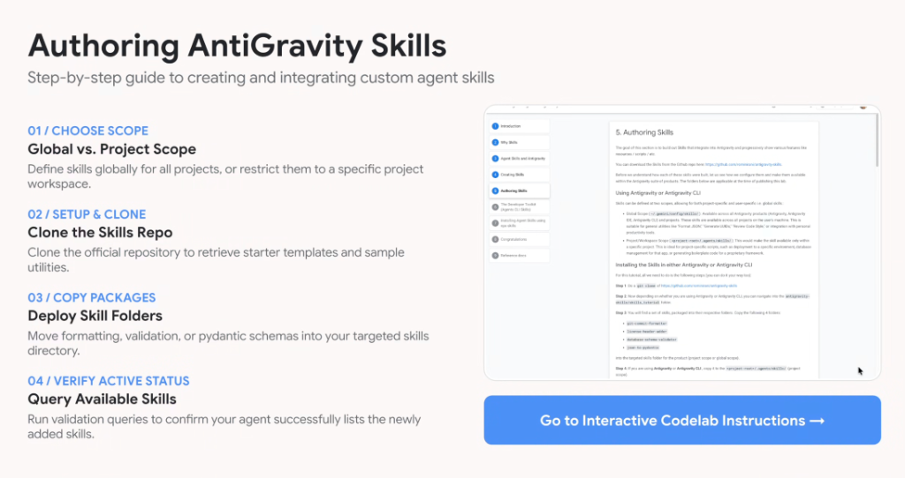
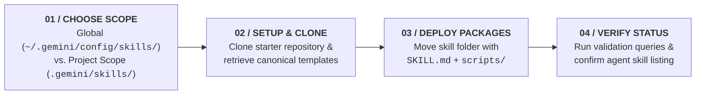
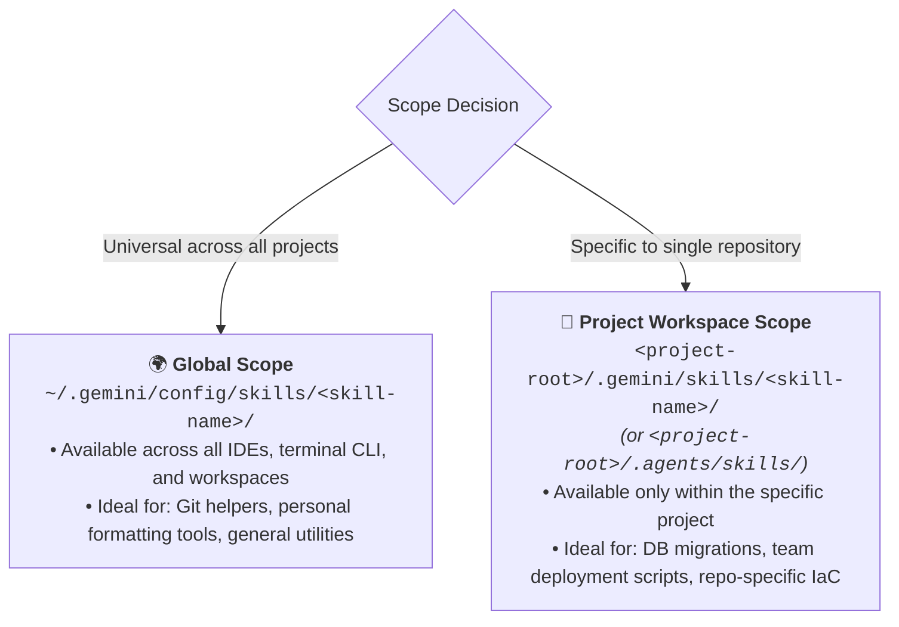

# Authoring Antigravity Skills: Complete 4-Step Integration Guide



## Overview

Creating and deploying custom agent skills in **Google Antigravity** and **Antigravity CLI** follows a streamlined 4-step authoring workflow: **Choose Scope**, **Setup & Clone**, **Deploy Packages**, and **Verify Active Status**.

This guide covers directory scoping, template configuration, deployment paths, and runtime discovery verification.

---

## The 4-Step Skill Authoring Lifecycle



---

## Step 01: Choose Scope (Global vs. Project Scope)

Before authoring a skill, determine whether its capability should be universally available across your machine or restricted to a single repository:



### Scope Comparison Matrix

| Dimension | Global Scope | Project Workspace Scope |
| :--- | :--- | :--- |
| **Path Location** | `~/.gemini/config/skills/<skill-name>/` | `<project-root>/.gemini/skills/<skill-name>/` |
| **Availability** | All projects and terminals on developer machine | Restricted strictly to the active workspace |
| **Source Control** | Developer's personal dotfiles / home directory | Committed directly into the project repository |
| **Typical Use Cases** | `git-commit-formatter`, `license-header-adder` | `database-schema-validator`, `json-to-pydantic` |

---

## Step 02: Setup & Clone (Starter Templates)

Clone the official Antigravity starter skills repository to retrieve canonical templates and utilities:

```bash
# Clone the skills starter repository
git clone https://github.com/rominirani/antigravity-skills.git /tmp/antigravity-skills
```

### Canonical Starter Skills Included
* **`git-commit-formatter`**: Standardizes conventional commit messages and branch naming.
* **`license-header-adder`**: Automatically injects Apache 2.0 or corporate copyright headers.
* **`database-schema-validator`**: Audits SQL DDL statements for primary keys and indexes.
* **`json-to-pydantic`**: Converts JSON payloads into Python Pydantic v2 data models.

---

## Step 03: Deploy Skill Folders

Copy your tailored skill folder into your chosen scope directory:

```bash
# Option A: Deploy to Global Scope
cp -r /tmp/antigravity-skills/json-to-pydantic ~/.gemini/config/skills/

# Option B: Deploy to Project Workspace Scope
mkdir -p .gemini/skills
cp -r /tmp/antigravity-skills/database-schema-validator .gemini/skills/
```

### Required File Structure
Ensure the folder contains at least the mandatory `SKILL.md` file matching the folder name:

```text
.gemini/skills/json-to-pydantic/
├── SKILL.md                 # Required: YAML frontmatter + Markdown instructions
└── scripts/                 # Optional: Executable generator scripts
    └── generate_models.py
```

---

## Step 04: Verify Active Status

Verify that Antigravity has discovered and indexed your new skill:

1. **Via CLI / Chat Slash Commands**:
   * Inspect loaded skills by running `/agy-customizations` or asking the agent: *"List available skills"*.
2. **Via Test Prompting**:
   * Issue a test prompt matching the skill's frontmatter trigger:
     > *"Convert this JSON payload into a Pydantic model."*
3. **Confirm Dynamic Ingestion**:
   * Verify the agent activates the skill and applies the specific instructions and scripts without errors.

---

## Quick-Start Authoring Checklist

- [ ] **Folder Name Parity**: Folder name matches `name:` in YAML frontmatter exactly.
- [ ] **Trigger Formula**: `description:` contains both *what it does* and *explicit "Use when..." phrases*.
- [ ] **Executable Isolation**: All deterministic code placed in `scripts/` (excluded from prompt context).
- [ ] **Scope Selection**: Placed in `~/.gemini/config/skills/` (global) or `.gemini/skills/` (project).
- [ ] **Discovery Verified**: Confirmed via `/agy-customizations` or interactive prompt testing.
