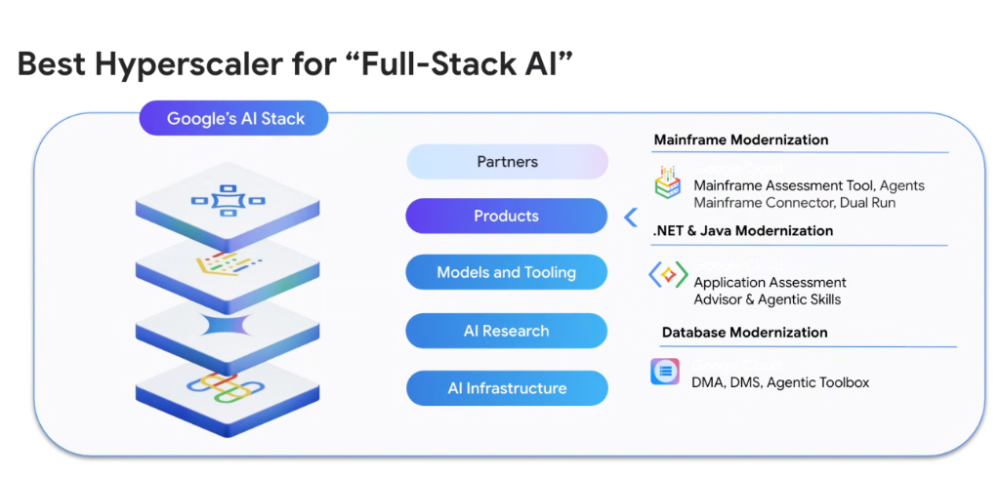
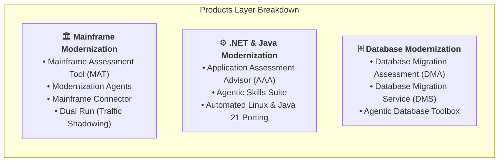

# Google Cloud as the Best Hyperscaler for "Full-Stack AI" Modernization



## Overview

Google Cloud stands out as the industry's leading hyperscaler for **"Full-Stack AI"** because of its vertical integration across silicon, research, foundation models, developer tooling, and enterprise modernization products.

Rather than offering disconnected AI APIs, Google Cloud links its complete stack directly into purpose-built **Modernization Products** that de-risk and automate enterprise transformations.

---

## Google's 5-Layer "Full-Stack AI" Architecture

```mermaid
graph TD
    subgraph 🌐 Google's AI Stack Layers
        L1["🤝 <b>1. Partners</b><br/>Global Systems Integrators (GSIs), ISVs, Migration Specialists"]
        L2["📦 <b>2. Products (Highlighted Modernization Layer)</b><br/>Mainframe · .NET & Java · Database Modernization Engines"]
        L3["🛠️ <b>3. Models and Tooling</b><br/>Gemini 3.1 · Antigravity Harness · Vertex AI · MCP"]
        L4["🧠 <b>4. AI Research</b><br/>Google DeepMind · Long-Context Attention · Agent Swarms"]
        L5["⚡ <b>5. AI Infrastructure</b><br/>Custom TPU v5p/v6e Pods · Titanium Offload · Planetary Network"]
    end

    L5 ==> L4 ==> L3 ==> L2 ==> L1
```

---

## The "Products" Layer: Enterprise Modernization Engines

The **Products** layer translates Google's underlying AI research and Gemini models into production-ready enterprise modernization suites:



---

## Deep Dive into the 3 Modernization Product Suites

### 1. Mainframe Modernization Suite
* **Core Product Components**:
  * **Mainframe Assessment Tool (MAT)**: Scans millions of lines of COBOL, PL/I, and JCL to map transactional dependencies and assess migration complexity.
  * **Modernization Agents**: Autonomous Gemini agents that deconstruct monolithic transaction routines into clean Java or Go microservices.
  * **Mainframe Connector**: High-throughput bidirectional connector for streaming mainframe data into BigQuery and Cloud Storage.
  * **Dual Run**: Zero-risk migration technology that runs mainframe and cloud services simultaneously on live production traffic, verifying 100% data parity before cutover.

---

### 2. .NET & Java Modernization Suite
* **Core Product Components**:
  * **Application Assessment Advisor (AAA)**: Ingests on-prem .NET and Java application portfolios, identifies unsupported APIs, and generates automated modernization roadmaps.
  * **Agentic Skills**: Specialized Progressive Disclosure skills that instruct coding agents on porting .NET Framework to **.NET 8 Linux containers** and upgrading legacy Java EE to **Spring Boot 3 / Java 21**.
  * **Automated Test Synthesis**: Generates end-to-end regression suites and unit fixtures to guarantee functional equivalence.

---

### 3. Database Modernization Suite
* **Core Product Components**:
  * **Database Migration Assessment (DMA)**: Evaluates Oracle, MS SQL Server, and DB2 schemas, flagging incompatible stored procedures and proprietary extensions.
  * **Database Migration Service (DMS)**: Provides serverless, high-performance continuous replication (CDC) to minimize cutover downtime.
  * **Agentic Database Toolbox**: Gemini-driven refactoring tools that automatically convert complex PL/SQL and T-SQL routines into cloud-native SQL or application services for **AlloyDB**, **Cloud Spanner**, and **Cloud SQL**.

---

## Full-Stack Modernization Products Summary Matrix

| Modernization Domain | Key Google Cloud Products | Target Cloud Workloads | Key Business Impact |
| :--- | :--- | :--- | :--- |
| **Mainframe** | Mainframe Assessment Tool, Modernization Agents, Mainframe Connector, Dual Run | Java/Go services on GKE, Cloud Storage | Eliminates MIPS costs; enables zero-risk Dual Run cutover |
| **.NET & Java** | Application Assessment Advisor (AAA), Agentic Skills | .NET 8 on Cloud Run, Spring Boot 3 on GKE | Removes Windows OS licensing; modernizes to Java 21 LTS |
| **Databases** | DMA, DMS, Agentic Database Toolbox | AlloyDB for PostgreSQL, Cloud Spanner, Cloud SQL | Breaks proprietary database lock-in; enables real-time AI analytics |
