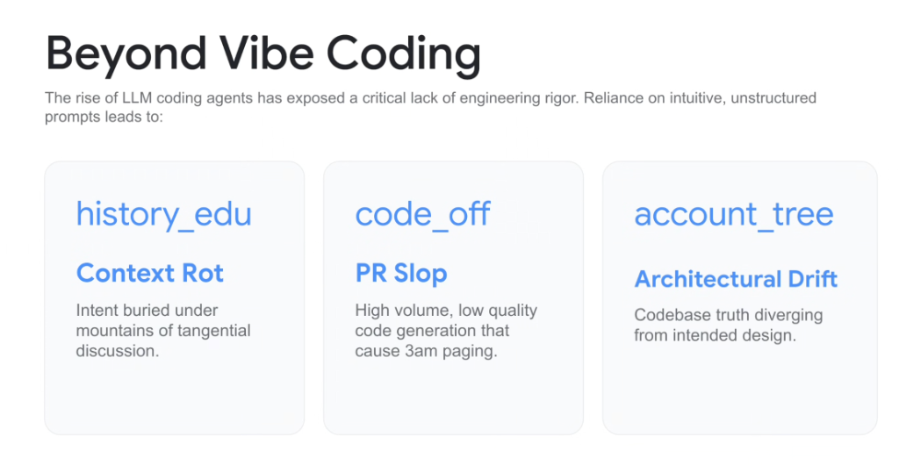

# Beyond "Vibe Coding": The 3 Fatal Pathologies of Unstructured Agentic Coding



## Overview

The rapid adoption of LLM coding assistants has popularized **"Vibe Coding"**—an intuitive, conversational development style where engineers rely on vague, unstructured natural language prompts without formal engineering rigor.

While "vibe coding" provides a short-term illusion of rapid prototyping, it fundamentally breaks down in enterprise software development, producing three catastrophic failure modes: **Context Rot**, **PR Slop**, and **Architectural Drift**.

> **"The rise of LLM coding agents has exposed a critical lack of engineering rigor. Reliance on intuitive, unstructured prompts leads to Context Rot, PR Slop, and Architectural Drift."**

---

## The Vibe Coding Collapse vs. Rigorous Agent Engineering

```mermaid
graph TD
    subgraph ❌ The Vibe Coding Anti-Pattern
        Vibe["🎲 <b>Intuitive / Vibe Prompting</b><br/><i>(Unstructured conversational chatting)</i>"]
        Vibe --> P1["📉 <b>Context Rot (history_edu)</b><br/>Intent buried in chat transcripts"]
        Vibe --> P2["💩 <b>PR Slop (code_off)</b><br/>High volume, low quality -> 3am pages"]
        Vibe --> P3["🌪️ <b>Architectural Drift (account_tree)</b><br/>Code diverges from system design"]
    end

    subgraph ✅ The Elevate Engineering Rigor Framework
        Rigor["📐 <b>Disciplined Agent Engineering</b>"]
        Rigor --> S1["📜 <b>Progressive Disclosure & OKF</b><br/>Clean context & path-as-identity"]
        Rigor --> S2["🧪 <b>TDD & Pytest Golden Evals</b><br/>Automated regression benchmarks"]
        Rigor --> S3["🏗️ <b>Multi-Agent Swarm Governance</b><br/>Architect · Implementer · Reviewer"]
    end
```

---

## The 3 Fatal Pathologies Detailed

### 1. Context Rot (`history_edu`)
* **Core Pathology**: **"Intent buried under mountains of tangential discussion."**
* **How It Happens**: As multi-turn chat sessions lengthen, critical architectural constraints, schema definitions, and business rules become diluted by debugging back-and-forths, polite pleasantries, and intermediate compiler error logs.
* **Operational Impact**:
  * The model suffers from attention degradation and forgets early instructions.
  * Re-introduces bugs that were solved earlier in the conversation.
  * Token consumption explodes on every turn without adding actionable value.
* **Engineering Remedy**: Replace long chat threads with **Progressive Disclosure Skills** and **Structured Artifact Documents** (e.g. `implementation_plan.md`).

---

### 2. PR Slop (`code_off`)
* **Core Pathology**: **"High volume, low quality code generation that causes 3am paging."**
* **How It Happens**: Unconstrained LLMs excel at generating hundreds of lines of plausible-looking syntax that lacks robustness—missing null checks, unhandled timeout exceptions, zero retry backoffs, and absent unit tests.
* **Operational Impact**:
  * Reviewers are overwhelmed by massive changelists with subtle edge-case bugs.
  * Production outages, memory leaks, and middle-of-the-night on-call escalations.
* **Engineering Remedy**: Enforce **Test-Driven Development (TDD)**, automated pre-commit evaluation suites (`EVAL.txtpb`), and dedicated **Reviewer Skills** (`critique-code-reviewer`).

---

### 3. Architectural Drift (`account_tree`)
* **Core Pathology**: **"Codebase truth diverging from intended design."**
* **How It Happens**: Each ad-hoc prompt solves an immediate localized symptom without understanding the broader system topology. Over time, the codebase sprouts duplicate utilities, conflicting database access patterns, and broken microservice contracts.
* **Operational Impact**:
  * Unmaintainable spaghetti codebases where no single engineer or agent understands system state.
  * High refactoring friction and cascading breaking changes.
* **Engineering Remedy**: Ground agents in an **Open Knowledge Format (OKF)** repository structure, maintain immutable Architectural Decision Records (ADRs), and use specialized **Architect Subagents**.

---

## Comparison Matrix: Vibe Coding vs. Agent Engineering Rigor

| Dimension | "Vibe Coding" | Disciplined Agent Engineering |
| :--- | :--- | :--- |
| **Prompt Style** | Conversational, rambling, ad-hoc | Structured, declarative, specification-driven |
| **Context Management** | Infinite scrolling chat transcripts | Progressive Disclosure (3-level tiering: When, How, What) |
| **Code Verification** | *"Looks good, ship it"* (Eyeballing) | TDD Red-Green-Refactor + Automated Golden Evals |
| **Architecture** | Organic, unmanaged drift | Strict OKF bundle taxonomies and immutable plans |
| **Production Outcome** | 3am on-call pages & technical debt | Deterministic, maintainable, regression-tested services |
