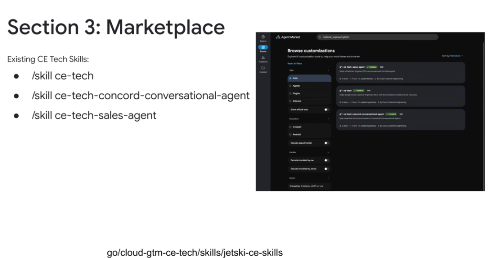
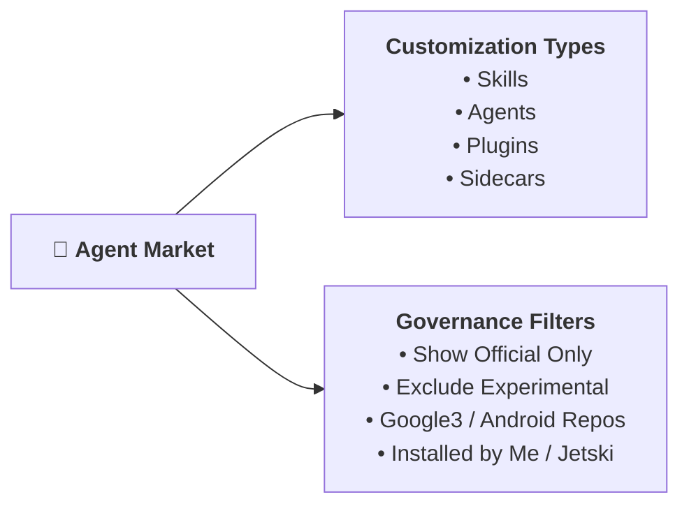

# Customer Engineering Agent Ecosystem: CE Tech Skills & Marketplace Integration



## Overview

Within Google's internal **Agent Market**, the **Cloud Customer Engineering** organization maintains a dedicated suite of official skills (`go/cloud-gtm-ce-tech/skills/jetski-ce-skills`). These skills empower Google Cloud Customer Engineers (CEs) to interface seamlessly with internal documentation, account analytics engines (Concord BQ), and sales coordination agents.

---

## Customer Engineering Agent Workflow Architecture

```mermaid
graph TD
    CE["👨‍💼 <b>Google Cloud Customer Engineer (CE)</b><br/><i>(Antigravity 2.0 / IDE / CLI)</i>"]
    
    subgraph CE Tech Skills Suite (Marketplace)
        S1["📘 <b>/skill ce-tech</b><br/><code>g*//ce-tech</code><br/>Internal docs & tool resources"]
        S2["📊 <b>/skill ce-tech-concord-conversational-agent</b><br/><code>g*//ce-tech-concord-conversational-agent</code><br/>Concord BigQuery analytics bridge"]
        S3["🤝 <b>/skill ce-tech-sales-agent</b><br/><code>g*//ce-tech-sales-agent</code><br/>Sales & GTM agent communication"]
    end

    subgraph Internal Systems & Backend Agents
        Docs["📚 Internal Solution Docs & Tolls"]
        Concord["🤖 Concord BQ Conversational Agent<br/><i>(Account telemetry & usage metrics)</i>"]
        SalesAgent["🤖 AI Sales Agent<br/><i>(Pipeline & opportunity tracking)</i>"]
    end

    CE --> S1 & S2 & S3
    S1 --> Docs
    S2 --> Concord
    S3 --> SalesAgent
```

---

## The 3 Official CE Tech Skills Detailed

### 1. `ce-tech` (General CE Technical Assistant)
* **Marketplace ID**: `g*//ce-tech`
* **Invocation**: `/skill ce-tech`
* **Publisher**: Cloud Customer Engineering
* **Core Purpose**: Helps Google Cloud Customer Engineers with internal technical documentation, architecture patterns, customer runbooks, and internal tool resources.
* **Key Use Cases**: Finding reference architectures, validating product feature availability, and locating internal escalation paths.

---

### 2. `ce-tech-concord-conversational-agent` (Concord BQ Analytics Bridge)
* **Marketplace ID**: `g*//ce-tech-concord-conversational-agent`
* **Invocation**: `/skill ce-tech-concord-conversational-agent`
* **Publisher**: Cloud Customer Engineering
* **Core Purpose**: Streamlines structured communication to Concord BigQuery Conversational Agents.
* **Key Use Cases**: Querying customer BigQuery consumption metrics, infrastructure utilization, and automated telemetry insights without drafting raw SQL.

---

### 3. `ce-tech-sales-agent` (Sales & GTM Collaboration)
* **Marketplace ID**: `g*//ce-tech-sales-agent`
* **Invocation**: `/skill ce-tech-sales-agent`
* **Publisher**: Cloud Customer Engineering
* **Core Purpose**: Assists Customer Engineers in communicating and synchronizing data with the automated Sales Agent.
* **Key Use Cases**: Coordinating deal sizing, opportunity notes, customer technical requirements, and GTM strategy alignment.

---

## Marketplace Filtering & Customization Types

The Agent Market browser supports multidimensional filtering to help engineers discover verified tools:



### Marketplace Filter Options
* **Type Filtering**: Toggle between **Skills** (instruction bundles), **Agents** (subagents), **Plugins** (MCP tool extensions), and **Sidecars** (background daemons).
* **Official Verification**: Filter by `Show official only` to restrict results to vetted packages from verified organizations (e.g. *Cloud Customer Engineering*).
* **Repository Source**: Filter by codebase origin (`Google3` vs `Android`).
* **Installation State**: View customizations installed locally by the user or pre-provisioned automatically by Jetski/Antigravity.

---

## Summary Matrix

| Skill Command | Marketplace Identifier | Managed By | Primary Function |
| :--- | :--- | :--- | :--- |
| `/skill ce-tech` | `g*//ce-tech` | Cloud Customer Engineering | Documentation, internal tool guides, and solution resources |
| `/skill ce-tech-concord-conversational-agent` | `g*//ce-tech-concord-conversational-agent` | Cloud Customer Engineering | Concord BigQuery analytics agent communication bridge |
| `/skill ce-tech-sales-agent` | `g*//ce-tech-sales-agent` | Cloud Customer Engineering | Interfacing with the automated AI Sales Agent for deal coordination |
