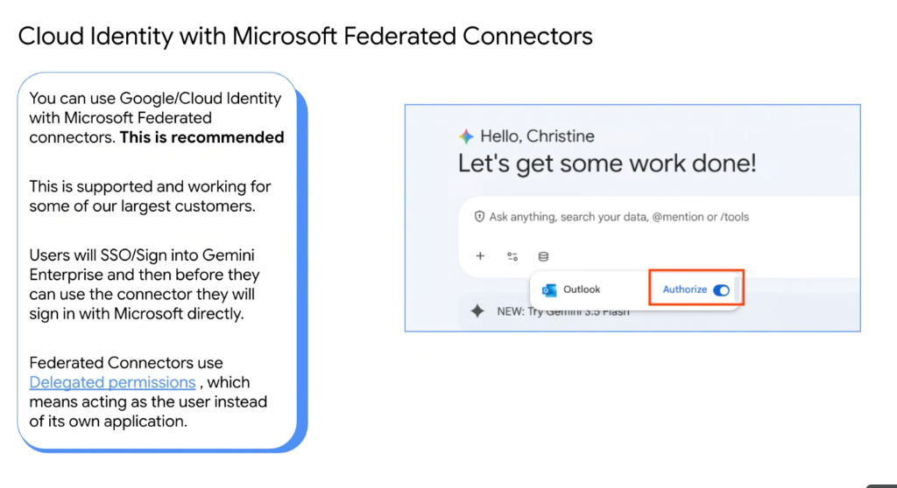
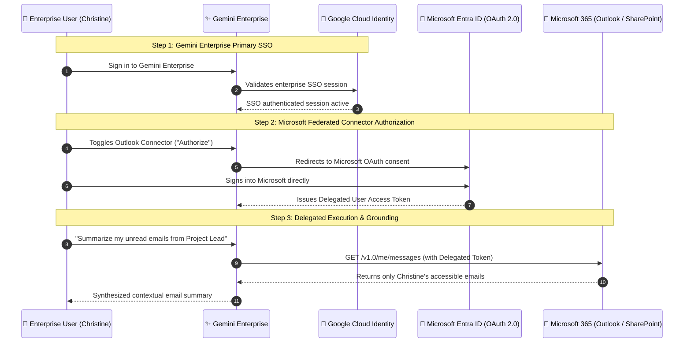

# Cloud Identity with Microsoft Federated Connectors

## Overview

Enterprise organizations frequently operate in dual-ecosystem environments—leveraging **Google Cloud** for AI, data analytics, and application infrastructure while utilizing **Microsoft 365** (Outlook, OneDrive, SharePoint, Teams) for enterprise collaboration.

**Google Cloud Identity paired with Microsoft Federated Connectors** provides the officially recommended architecture for integrating Microsoft data sources into **Gemini Enterprise** with zero security compromises.

---

## 2-Step Authentication & Authorization Architecture

---

## Technical Mechanics: Delegated Permissions

### 1. What are Delegated Permissions?
* **Definition**: Federated connectors operate using **Delegated Permissions** rather than Application/Service-level permissions.
* **Security Model**: The connector acts strictly **on behalf of the signed-in user**.
* **Zero Privilege Escalation**: Gemini Enterprise can only retrieve, search, or summarize data that the specific user already has explicit permission to access in Microsoft 365. If a file or email is restricted in SharePoint/Outlook, Gemini is cryptographically blind to it.

---

### 2. User Experience Flow
1. **SSO Sign-in**: The user accesses Gemini Enterprise via their standard Cloud Identity login.
2. **Interactive Connector Toggle**: When preparing to query Microsoft data, the user enables the connector (e.g. **Outlook**, **SharePoint**, **OneDrive**) by toggling **"Authorize"**.
3. **Direct Microsoft Authentication**: An interactive OAuth consent popup authenticates directly against Microsoft Entra ID, granting scoped access to `/me/` endpoints.
4. **Contextual Grounding**: Gemini uses the resulting delegated token to ground prompts, search email threads, and reference corporate documents.

---

## Delegated Permissions vs. Application Permissions

| Security Dimension | 👤 Delegated Permissions (Recommended) | 🤖 Application Permissions (Anti-pattern) |
| :--- | :--- | :--- |
| **Execution Identity** | Acts **as the user** (`/me/messages`, `/me/drive`) | Acts as the whole application / service account |
| **Access Scope** | Constrained to user's personal ACLs | Tenant-wide read access across all corporate data |
| **Data Leakage Risk** | **Zero cross-user leakage risk** | High risk (agent could expose another user's emails)|
| **User Consent** | Interactive OAuth popup per user | Global admin consent granted once |
| **Audit Trail** | Microsoft audit logs identify individual user | Audit logs only show generic application ID |
