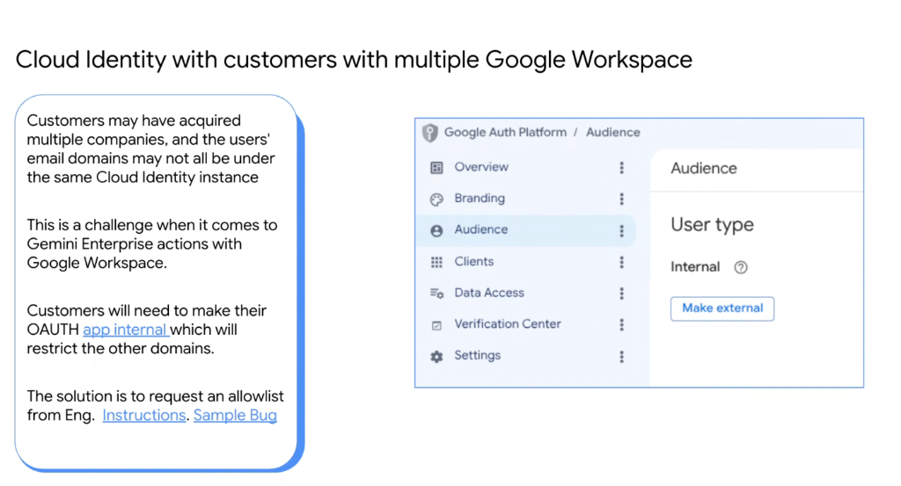
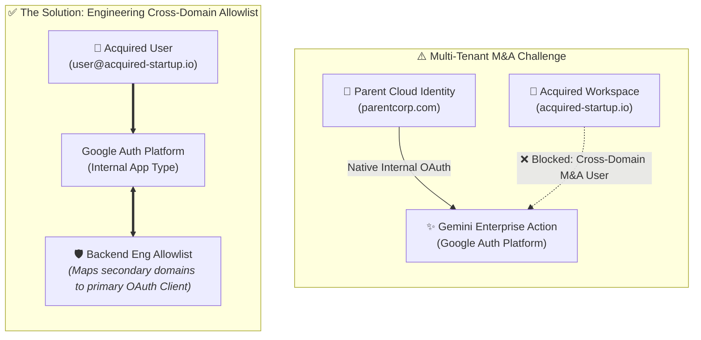

# Cloud Identity with Multiple Google Workspace Tenants (M&A Scenarios)

## Overview

In large enterprises and conglomerate holding companies, Mergers & Acquisitions (M&A) frequently result in **multiple distinct Google Workspace instances** and disparate user email domains (e.g., `@parentcorp.com`, `@acquired-startup.io`, `@subsidiary.org`) that do not reside within the same primary **Cloud Identity** organization instance.

This architecture introduces specific challenges when configuring **Gemini Enterprise actions with Google Workspace**, particularly regarding OAuth consent screens and cross-domain user authorization.

---

## The Core Architectural Dilemma: Internal vs. External OAuth

---

## The Technical Conflict

### 1. The Internal OAuth Restriction
* **Internal User Type**: On the Google Auth Platform / Google Cloud Console, configuring the OAuth consent screen as **"Internal"** restricts token issuance strictly to authenticated users within the same Cloud Identity organization tenant.
* **The Failure Mode**: Users from acquired entities whose email domains belong to separate Google Workspace tenants are rejected during the OAuth consent flow (`403 org_internal` error).

---

### 2. Why "External" User Type is Not the Solution
* **Compliance & Verification Bottleneck**: Switching the OAuth app type to **"External"** allows multi-domain access, but:
  * Triggers Google's strict **Verification Center** audit for sensitive/restricted Workspace scopes (e.g., `drive.readonly`, `gmail.readonly`).
  * Displays alarming **"This app isn't verified"** warning screens to employees.
  * Violates corporate security policies prohibiting external exposure of internal agent tools.

---

## The Recommended Enterprise Solution: Engineering Allowlist

To maintain an **Internal** security posture while enabling cross-organization employees to execute Gemini Enterprise actions, Google provides a backend **Cross-Domain Allowlisting** mechanism:

1. **Keep OAuth App "Internal"**: Maintain the Google Auth Platform app audience as **Internal** under the primary Google Cloud Organization.
2. **File Engineering Allowlist Request**:
   * Submit an internal request (via Google Cloud Support or account engineering ticket).
   * Specify:
     * **Primary GCP Project ID** and **OAuth 2.0 Client IDs**.
     * **Target Subsidiary Domain Names** (e.g. `acquired-startup.io`, `subsidiary.com`).
     * Primary organization Customer ID.
3. **Outcome**: The backend identity fabric extends the internal trust boundary to the allowlisted domains, granting seamless, warning-free single sign-on and tool execution for all corporate entities.

---

## Configuration Comparison Matrix

| Configuration Approach | User Experience | Security & Compliance | M&A Support |
| :--- | :--- | :--- | :--- |
| **Standard "Internal"** | Seamless for parent domain | Enterprise-compliant, zero external exposure | ❌ Rejects users from acquired entities |
| **Switched to "External"** | Shows "Unverified App" warnings | Requires CASA tier-2/3 audit, security hazard | ⚠️ High friction / Non-compliant |
| **"Internal" + Eng Allowlist** | **Seamless across all company domains** | **Strict enterprise trust boundary preserved** | **✅ Fully Supported (Recommended)** |
