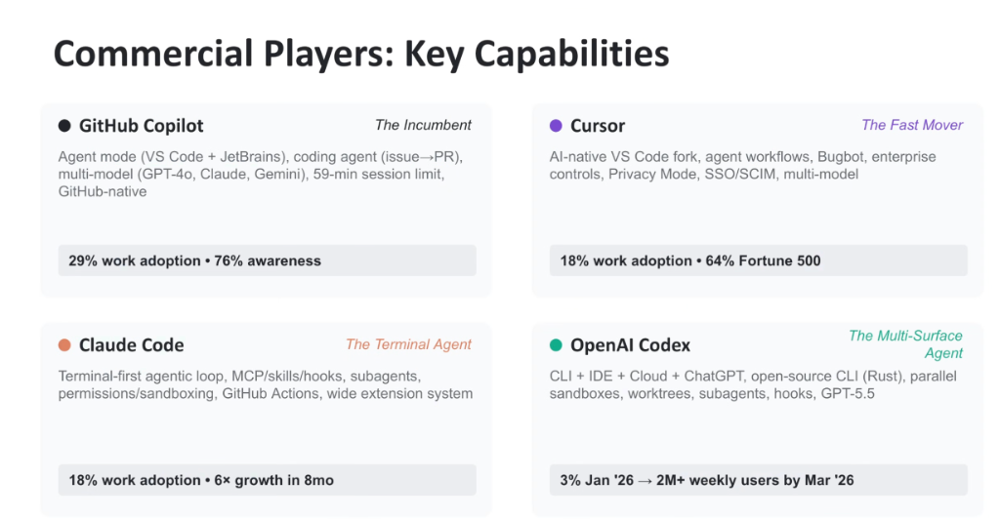
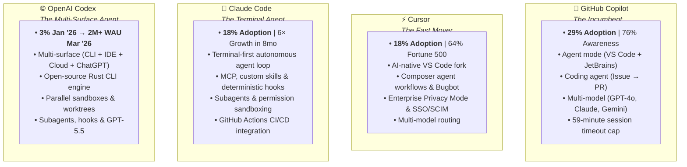

# Commercial AI Coding Players: Capabilities & Competitive Dynamics

## Overview

The commercial developer AI market is anchored by **Four Major Players**, each occupying a distinct architectural niche and operational archetype:

1. **GitHub Copilot** (*The Incumbent*): GitHub-native autocomplete and PR agent.
2. **Cursor** (*The Fast Mover*): AI-native VS Code fork with deep IDE workflows.
3. **Claude Code** (*The Terminal Agent*): Autonomous CLI agent loop with MCP and skills.
4. **OpenAI Codex** (*The Multi-Surface Agent*): Unified Rust CLI, IDE, Cloud, and ChatGPT platform.

---

## Architectural Breakdown of the 4 Commercial Players

---

## Detailed Profile of Each Player

### 1. GitHub Copilot (*The Incumbent*)
* **Market Position**: **29% Work Adoption | 76% Developer Awareness**.
* **Key Capabilities**:
  * **Agent Mode**: Conversational and autonomous assistance across VS Code and JetBrains IDEs.
  * **Issue-to-PR Coding Agent**: Automatically ingests assigned GitHub issues, plans file changes, and opens draft Pull Requests.
  * **Multi-Model Routing**: Allows developers to switch model backends between GPT-4o, Claude 3.5/3.7, and Gemini.
* **Constraints**: Hard 59-minute session timeout; rigid reliance on GitHub platform infrastructure; lacks local command execution sandboxes.

---

### 2. Cursor (*The Fast Mover*)
* **Market Position**: **18% Work Adoption | Deployed in 64% of Fortune 500 Enterprises**.
* **Key Capabilities**:
  * **AI-First IDE Fork**: Deeply modified VS Code fork optimizing multi-file editing and prompt-to-diff application.
  * **Composer & Bugbot**: Multi-file autonomous editing surface and automated code review companion.
  * **Enterprise Compliance**: Enterprise Privacy Mode (zero code storage/training retention), SAML 2.0 SSO, and automated SCIM user lifecycle management.
* **Constraints**: Fork maintenance debt; lacks a standalone terminal CLI for headless scripting or CI/CD pipelines.

---

### 3. Claude Code (*The Terminal Agent*)
* **Market Position**: **18% Work Adoption | 6× Hypergrowth in 8 Months**.
* **Key Capabilities**:
  * **Terminal-First Autonomous Loop**: Executes multi-turn planning, bash commands, file edits, and git commits directly from the shell.
  * **Model Context Protocol (MCP) & Skills**: Dynamic tool extensibility via MCP servers, declarative `SKILL.md` bundles, and pre/post-execution hooks.
  * **Subagent Delegation & Sandboxing**: Spawns isolated worker subagents to protect context windows; granular permission approval prompt gates.
* **Constraints**: Primarily terminal-bound; lacks native visual desktop workspace management or centralized cloud telemetry.

---

### 4. OpenAI Codex (*The Multi-Surface Agent*)
* **Market Position**: **Surged from 3% in Jan 2026 to 2M+ Weekly Active Users by March 2026**.
* **Key Capabilities**:
  * **Unified Multi-Surface Architecture**: Seamless handoffs across high-performance Rust CLI, IDE plugins, Cloud execution sandboxes, and ChatGPT Web.
  * **Workspace Isolation**: Parallel virtual sandboxes and native Git worktree branching to prevent working directory collision.
  * **Next-Gen Frontier Reasoning**: Powered by GPT-5.5 with subagent hierarchies and execution hooks.
* **Constraints**: Tightly coupled to OpenAI proprietary API services and cloud billing.

---

## 4-Player Architectural Comparison Matrix

| Dimension | GitHub Copilot | Cursor | Claude Code | OpenAI Codex | Google Antigravity (Elevate Differentiator) |
| :--- | :--- | :--- | :--- | :--- | :--- |
| **Market Role** | The Incumbent | The Fast Mover | The Terminal Agent | The Multi-Surface Agent | **The Unified Enterprise Platform** |
| **Adoption Metric** | 29% adoption | 18% (64% F500) | 18% (6× in 8mo) | 2M+ weekly active | **6% in 2 mo (Fastest debut velocity)** |
| **Core Surfaces** | IDE Extensions | Custom IDE Fork | Terminal CLI | CLI + IDE + Cloud + Web | **Desktop 2.0 + CLI (`agy`) + IDEs + SDK** |
| **Model Strategy** | Multi-model routing | Multi-model routing | Anthropic Claude | OpenAI GPT-5.5 | **Gemini 3.1 Co-Optimization + Multi-Model** |
| **Extensibility** | GitHub Extensions | Rules for AI | MCP, Skills, Hooks | Hooks, Sandboxes | **Skills (`SKILL.md`), Managed MCP, Sidecars** |
| **Isolation** | None (in-place edits)| Local diff staging | Subagent shock absorbers| Worktrees & Sandboxes| **Native Git Worktrees, CitC & Subagents** |
| **Enterprise Security**| GitHub Enterprise IAM| SSO/SCIM, Privacy | Granular shell prompts | Cloud Sandboxes | **Dual-Gate Cloud IAM, Model Armor, Wiz AI-APP**|
