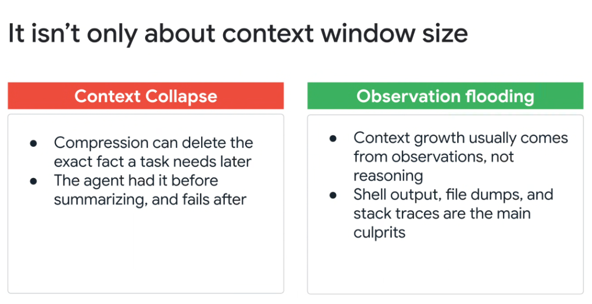

# Dual Hazards of Context Management: Context Collapse vs. Observation Flooding



## Overview

Expanding context windows to 1M–2M+ tokens does not eliminate the need for careful context engineering. In production, unmanaged agents fall victim to two diametrically opposed architectural hazards:

1. **Context Collapse (Over-Compression)**: Over-aggressive summarization erases subtle critical facts.
2. **Observation Flooding (Under-Compression)**: Raw tool outputs, massive shell dumps, and verbose stack traces drown out the model's reasoning.

> **"It isn't only about context window size. Context growth usually comes from observations, not reasoning."**

---

## The Dual Hazards Architectural Dilemma

```mermaid
graph LR
    subgraph 🔴 Hazard 1: Context Collapse (Over-Compression)
        C1["🗜️ <b>Lossy Summarization</b><br/>• Generalizes away precise details<br/>• Deletes line numbers, flags, UUIDs<br/>• <i>'Agent had it before, fails after'</i>"]
    end

    subgraph 🟢 The High-SNR Sweet Spot
        Target["⚖️ <b>Balanced Context Density</b><br/>• Structural artifacts (<code>PLAN.md</code>)<br/>• Filtered observations (<code>-max_results</code>)<br/>• Explicit disk offloading"]
    end

    subgraph 🟢 Hazard 2: Observation Flooding (Under-Compression)
        F1["🌊 <b>Uncontrolled Tool Output</b><br/>• Shell dumps (<code>cat 2000_lines.py</code>)<br/>• 500-line stack traces & raw SQL<br/>• Drowns reasoning in noise"]
    end

    C1 <=== "Too aggressive" === Target === "Too passive" ===> F1
```

---

## Deep Breakdown of the Two Hazards

### 1. Context Collapse (Lossy Compression)
* **The Pathology**: Attempting to save token budget by asking an LLM to "summarize the conversation so far."
* **Why It Breaks**:
  * Summarization models inherently optimize for high-level narrative gist (*"We fixed the authentication logic and began testing the database endpoints"*).
  * In doing so, it erases the **exact microscopic facts** needed in subsequent steps: variable names, port numbers, auth tokens, specific test mocks, and precise line offsets.
* **The Fatal Symptom**:
  > **"The agent had it before summarizing, and fails after."**
* **Engineering Remedy**:
  * Never use lossy narrative summaries for technical state.
  * Use **Structured State Documents** (`PLAN.md`, JSON checkpoints) that preserve exact keys, paths, and status flags.

---

### 2. Observation Flooding (Token Saturation)
* **The Pathology**: Allowing raw tool executions to inject unfiltered stdout directly into the working memory.
* **Why It Breaks**:
  * **"Context growth usually comes from observations, not reasoning."**
  * A single unconstrained command (`git log`, `cat large_file.go`, `npm test` with verbose logging) can inject 50,000–200,000 tokens of boilerplate noise in a single turn.
* **The Fatal Consequences**:
  * Drowns out initial user constraints and repository rules (**Attention Dilution**).
  * Dramatically spikes Time-to-First-Token (TTFT) latency and API costs.
* **Engineering Remedy**:
  * **Driver-Level Filtering**: Wrap CLI tools with pagination (`-max_results=50`, `head -n 20`).
  * **Structured JSON Schemas**: Require tools to emit clean, typed JSON objects rather than unstructured raw terminal text.
  * **Disk Artifact Offloading**: Pipe massive logs to local files (`log.txt`) and grep for specific error lines.

---

## Comparison Matrix: Context Collapse vs. Observation Flooding

| Dimension | Context Collapse | Observation Flooding |
| :--- | :--- | :--- |
| **Root Cause** | Over-aggressive lossy summarization | Uncontrolled tool observation dumps |
| **Primary Culprits** | Naive chat compaction, vague summaries | Shell dumps, full file `cat`, raw stack traces |
| **Model Failure Mode** | Forgets specific variables, paths, and flags | Attention dilution, high latency, context saturation |
| **Observed Impact** | Regression on previously solved tasks | Hallucinated parameters, lost system instructions |
| **Engineering Antidote** | Structured persistence (`PLAN.md`, state files) | Tool filtering (`-max_results`), quiet flags, grep |
