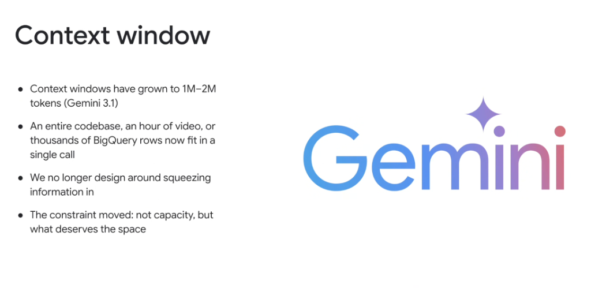
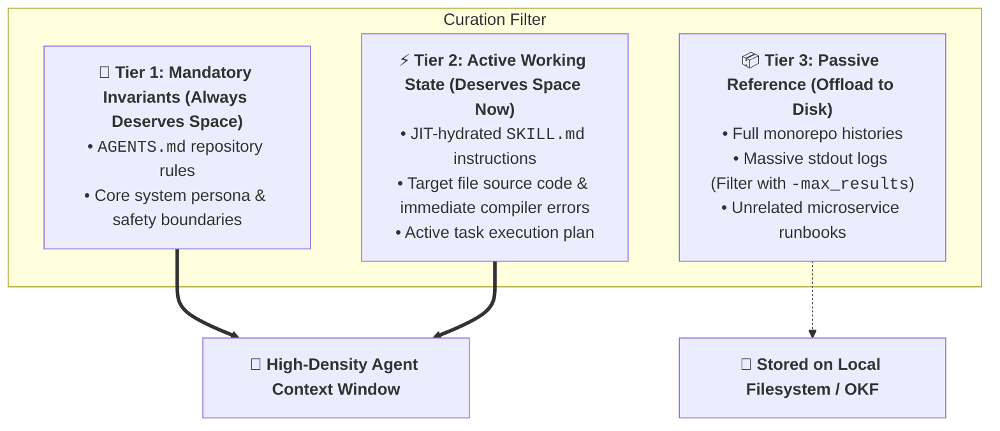

# The Context Window Revolution: From Capacity Limits to Value-Density Curation



## Overview

With the advancement of the **Gemini 3.1** model family, context windows have expanded dramatically to **1M–2M+ tokens**. An entire codebase, an hour of high-resolution video, or tens of thousands of BigQuery rows now fit comfortably in a single call.

This massive leap has fundamentally transformed agent architecture:

> **"We no longer design around squeezing information in. The constraint moved: not capacity, but what deserves the space."**

---

## The Paradigm Shift in Context Design

```mermaid
graph TD
    subgraph 🕰️ The Old Era (4k - 32k Tokens)
        Old1["🧱 <b>Capacity Constraint</b>"]
        Old2["Aggressive lossy chunking & vector slicing"]
        Old3["Focus: <i>How do we squeeze this text in?</i>"]
        Old1 --> Old2 --> Old3
    end

    subgraph 🚀 The Modern Era (1M - 2M+ Tokens - Gemini 3.1)
        New1["🌊 <b>Infinite Horizon Capacity</b>"]
        New2["High-density curation & Signal-to-Noise Ratio (SNR)"]
        New3["Focus: <b>What information truly deserves the space?</b>"]
        New1 --> New2 --> New3
    end
```

---

## Why "What Deserves the Space" is the New Constraint

Just because an agent *can* fit a million tokens into a single prompt does not mean dumping uncurated logs produces reliable software. Unfiltered token dumps create four major engineering penalties:

### 1. Attention Dilution & Reasoning Fidelity
* Even with near-perfect retrieval benchmarks (e.g. 99.7% Needle-in-a-Haystack), surrounding critical instructions with 500,000 lines of irrelevant chatter degrades nuanced multi-hop reasoning and constraint adherence.

### 2. Time-to-First-Token (TTFT) Latency
* Processing a 1.5M token prompt prefill introduces measurable latency compared to a clean, highly curated 15,000 token working memory.

### 3. Inference Cost Economics
* Ingesting 1M+ tokens on every conversational turn escalates token consumption costs by orders of magnitude compared to **Just-in-Time (JIT) Progressive Disclosure**.

### 4. Deterministic Invariant Enforcement
* Vague, noisy context encourages model drift. Clear, concise rules (`AGENTS.md`) and structured schemas ensure 100% deterministic tool usage.

---

## The "What Deserves Space" Curation Hierarchy



---

## Evolution Matrix: Old Context Design vs. Modern Agent Engineering

| Architectural Dimension | Legacy Context Design (4k–32k) | Modern Context Engineering (1M–2M+) |
| :--- | :--- | :--- |
| **Primary Bottleneck** | Physical capacity limits (Token overflow) | **Attention Focus & Value Density** |
| **Data Strategy** | Lossy text summarization & aggressive slicing | High-fidelity raw files curated dynamically |
| **Retrieval Mechanism** | Naive top-k vector cosine similarity | Hierarchical Skills + OKF Path-as-Identity |
| **Codebase Ingestion** | Snippets with missing type definitions | Entire relevant source trees and dependency graphs |
| **Guiding Design Rule** | *"Compress everything to fit"* | **"Curate strictly what deserves the space"** |
