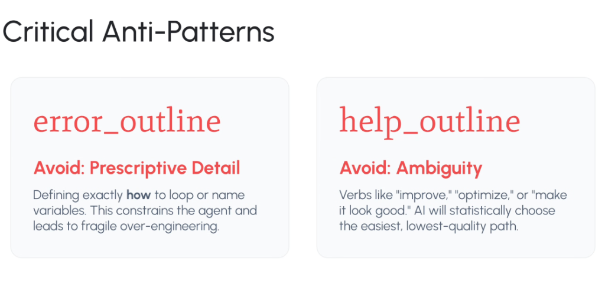

# Specification Anti-Patterns: Prescriptive Detail vs. Ambiguity



## Overview

When authoring specifications (`SPEC.md`) and directives for AI coding agents, engineers frequently veer into two opposite, equally destructive traps:

1. **Over-Prescriptive Micromanagement (`error_outline`)**: Dictating low-level loops, variable names, and algorithmic plumbing.
2. **Under-Specified Ambiguity (`help_outline`)**: Using lazy, subjective adjectives like "optimize," "improve," or "clean up."

Production agent engineering requires mastering the **Declarative Goldilocks Zone**: defining strict boundaries, invariants, and acceptance criteria without micromanaging procedural syntax.

---

## The Goldilocks Spectrum of Specification Engineering

```mermaid
graph LR
    subgraph ❌ Trap 1: Prescriptive Detail (error_outline)
        T1["🔒 <b>Over-Prescription</b><br/>• Dictating loops & variable names<br/>• Writing pseudocode in spec<br/>• <i>Result: Fragile over-engineering</i>"]
    end

    subgraph 🏆 The Declarative Goldilocks Zone
        G["⚖️ <b>High-Fidelity Specification</b><br/>• Clear data contracts & schemas<br/>• Strict invariants (NIST, latency)<br/>• Automated verification tests<br/>• <i>Result: Deterministic, idiomatic code</i>"]
    end

    subgraph ❌ Trap 2: Ambiguity (help_outline)
        T2["🌫️ <b>Ambiguity & Hand-Waving</b><br/>• 'Make it fast', 'improve tests'<br/>• Subjective adjectives<br/>• <i>Result: Lowest-quality path</i>"]
    end

    T1 <=== "Relax procedural syntax" === G === "Enforce strict contracts" ===> T2
```

---

## Deep Dive into the Two Critical Anti-Patterns

### 1. Avoid: Prescriptive Detail (`error_outline`)
* **The Anti-Pattern**: Telling the LLM *exactly how* to write line-by-line procedural code.
* **Examples of Bad Prompting / Spec**:
  * *"Loop through the array using a `while` loop with index variable `idx`, increment by 1, and copy each element into a temporary slice."*
  * *"Create a function named `do_process_data_v2` that has 4 arguments..."*
* **Why It Fails**:
  * Constrains the model's reasoning capacity and prevents it from selecting more idiomatic, high-performance patterns (e.g. built-in iterators, list comprehensions, concurrency primitives).
  * Increases token waste in the spec.
  * Produces brittle, bloated, over-engineered code.
* **The Antidote**: **Specify WHAT, not HOW.** State the input schema, the output contract, and the invariant properties.

---

### 2. Avoid: Ambiguity (`help_outline`)
* **The Anti-Pattern**: Using vague verbs and fuzzy adjectives without concrete verification criteria.
* **Examples of Bad Prompting / Spec**:
  * *"Optimize the database query."*
  * *"Improve our error handling."*
  * *"Make the frontend look modern and sleek."*
* **Why It Fails**:
  * Foundation models operate by minimizing prediction entropy. When given ambiguous instructions, the agent will **statistically choose the easiest, lowest-quality path** (e.g. wrapping a block in a generic `try/except: pass` or changing a CSS padding value by 2px) and prematurely declare success.
* **The Antidote**: **Replace adjectives with machine-verifiable numbers and assertions.**

---

## Transformation Examples: Bad vs. Goldilocks Specs

| Dimension | ❌ Prescriptive Anti-Pattern | ❌ Ambiguous Anti-Pattern | 🏆 High-Fidelity Goldilocks Spec |
| :--- | :--- | :--- | :--- |
| **Error Handling** | *"Write a `try/except IOError` block on line 45, catch `err`, print it to stderr, and return `None`."* | *"Improve error handling in the API."* | *"Wrap external RPC calls with exponential backoff (initial delay $100\text{ms}$, max 3 retries). Return HTTP 504 on persistent timeout."* |
| **Database Performance** | *"Write a raw SQL query with an INNER JOIN on `orders.user_id = users.id` and index `user_id` with B-Tree."* | *"Optimize the order fetch speed."* | *"Query `orders` table filtered by `tenant_id` and `created_at >= NOW() - 30d`. Must execute in $<50\text{ms}$ for $100\text{k}$ rows."* |
| **UI Design** | *"Set `div#header` to `background: #003366`, `margin-top: 12px`, and make font Arial 14pt bold."* | *"Make the navigation header look cleaner and more intuitive."* | *"Implement header using Design Token `surface-primary` with responsive breakpoint at $768\text{px}$ and WCAG AAA contrast ratio."* |

---

## Core Specification Authoring Invariants

1. **No Pseudocode in Specs**: If you find yourself writing code in the spec, delete it and write an acceptance test instead.
2. **Ban Subjective Adjectives**: Eliminate words like *better*, *cleaner*, *faster*, *smarter*, and *modern*.
3. **Always Include a Test Assertion**: If a requirement cannot be evaluated by a script (`verify.py`), it is underspecified.
