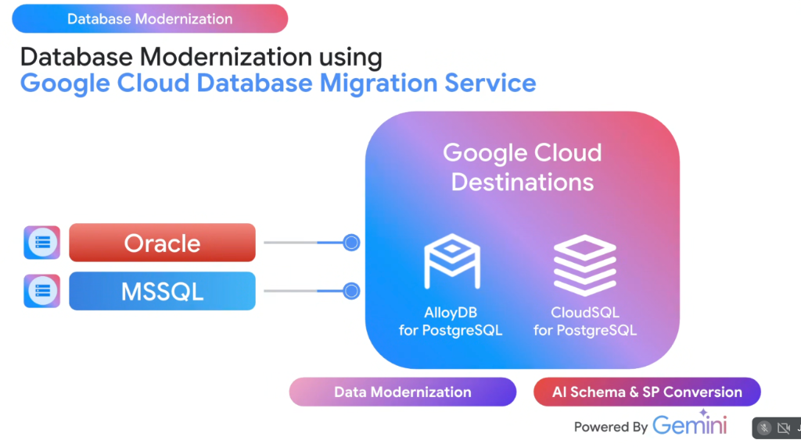

# Database Modernization: Google Cloud DMS, AlloyDB & Cloud SQL with Gemini



## Overview

Enterprise databases running on proprietary commercial engines like **Oracle** and **Microsoft SQL Server (MSSQL)** burden organizations with punitive per-core licensing fees, rigid hardware locks, and operational complexity.

Google Cloud enables seamless, heterogeneous database modernization to open-standard PostgreSQL using **Google Cloud Database Migration Service (DMS)** for continuous data replication and **Gemini** for automated **AI Schema & Stored Procedure (SP) Conversion**.

---

## Heterogeneous Database Modernization Architecture

```mermaid
graph LR
    subgraph 🏛️ Legacy Proprietary Sources
        O["🔴 <b>Oracle Database</b><br/>• PL/SQL packages & triggers<br/>• Proprietary sequences & types"]
        M["🔵 <b>Microsoft SQL Server</b><br/>• T-SQL stored procedures<br/>• Identity columns & temp tables"]
    end

    subgraph ⚡ Dual Modernization Engine (Powered by Gemini)
        DMS["🔄 <b>Data Modernization</b><br/><b>Database Migration Service (DMS)</b><br/>• Serverless continuous CDC replication<br/>• Minimal cutover downtime"]
        
        AI["🧠 <b>AI Schema & SP Conversion</b><br/><b>Gemini 3.1 AI Engine</b><br/>• PL/SQL -> PL/pgSQL rewriting<br/>• T-SQL -> PostgreSQL syntax<br/>• Automated validation & unit tests"]
    end

    subgraph ☁️ Google Cloud Destinations
        A["🔷 <b>AlloyDB for PostgreSQL</b><br/>• 4x faster transactional throughput<br/>• 100x analytical columnar engine<br/>• Integrated AlloyDB AI & pgvector"]
        
        C["🟩 <b>Cloud SQL for PostgreSQL</b><br/>• Fully managed open PostgreSQL<br/>• Automated HA failover & backups<br/>• Cost-optimized general workloads"]
    end

    O & M ==> DMS & AI
    DMS & AI ==> A & C
```

---

## Core Pillars of the Modernization Solution

### 1. Data Modernization via Database Migration Service (DMS)
* **Serverless & Native**: Operates without manual replication server setup or management overhead.
* **Continuous CDC Replication**: Captures live transaction logs from Oracle (LogMiner) and MSSQL (Change Tracking / CDC) to maintain real-time sync with Google Cloud.
* **Minimal Cutover Downtime**: Allows legacy databases to remain live in production while data streams continuously; cutover requires only a brief DNS redirect.

---

### 2. AI Schema & Stored Procedure (SP) Conversion (Powered by Gemini)
* **The Traditional Bottleneck**: Stored procedures, triggers, and proprietary functions historically accounted for $70\%$ of migration manual labor and errors.
* **The Gemini Advantage**:
  * Ingests complex Oracle **PL/SQL packages** and translates them into clean, idiomatic **PL/pgSQL**.
  * Rewrites MSSQL **T-SQL** constructs (e.g. `@@ROWCOUNT`, table variables, cross-database queries) into native PostgreSQL functions.
  * Generates automated unit and integration tests to prove mathematical and functional parity.

---

## Choosing the Target: AlloyDB vs. Cloud SQL

| Dimension | 🔷 AlloyDB for PostgreSQL | 🟩 Cloud SQL for PostgreSQL |
| :--- | :--- | :--- |
| **Primary Target** | Heavy enterprise OLTP, mixed transactional/analytical workloads | Standard web applications, microservices, and departmental DBs |
| **Performance** | **$4\times$ faster** transactional throughput than standard PG; **$100\times$ faster** queries via Columnar Engine | Standard open-source PostgreSQL performance |
| **Availability SLA** | **$99.99\%$ inclusive of maintenance** | $99.95\%$ with regional HA |
| **AI Integration** | Built-in **AlloyDB AI** with hardware-accelerated vector indexing | Standard `pgvector` extension |
| **Storage Architecture** | Disaggregated compute/storage; real-time autoscaling | Standard Persistent Disk (SSD/Balanced) |

---

## Migration Path Summary Matrix

| Source Database | Primary Friction Point | Target Google Cloud Destination | Gemini & DMS Modernization Workflow |
| :--- | :--- | :--- | :--- |
| **Oracle 11g / 12c / 19c** | Complex PL/SQL packages, RAC clustering costs | **AlloyDB for PostgreSQL** | Gemini rewrites PL/SQL to PL/pgSQL; DMS replicates CDC logs to AlloyDB |
| **MS SQL Server 2012+** | Windows Server OS licensing, T-SQL dependencies | **Cloud SQL / AlloyDB** | Gemini refactors T-SQL to PostgreSQL; DMS executes schema conversion |
| **Oracle Real Application Clusters (RAC)** | High-throughput multi-node concurrency | **AlloyDB for PostgreSQL** | AlloyDB pooling and multi-zone replication replace expensive RAC clusters |
