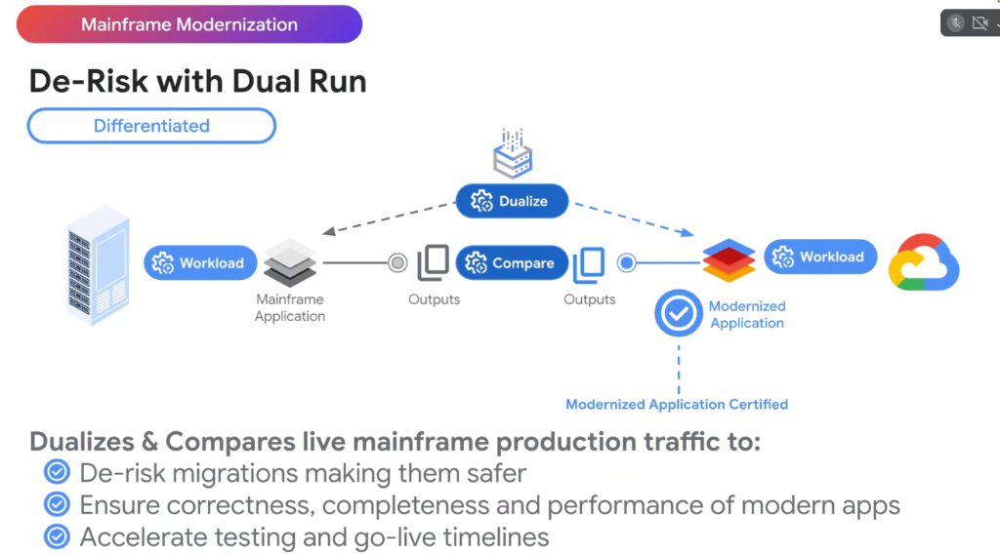

# Google Dual Run: Production Traffic Shadowing & Zero-Risk Migration Certification



## Overview

For enterprise core banking, insurance, and airline systems, a mainframe migration failure can cause catastrophic financial loss and regulatory penalties. Traditional synthetic test environments cannot capture decades of undocumented edge cases, packed decimal quirks, and timing dependencies.

**Google Dual Run** is Google Cloud's premier, differentiated technology that eliminates migration risk by **dualizing** (splitting) live production traffic, executing workloads concurrently across both the legacy mainframe and modernized Google Cloud application, and comparing outputs byte-for-byte in real time.

---

## Dual Run Architecture: Dualize $\rightarrow$ Execute $\rightarrow$ Compare $\rightarrow$ Certify

```mermaid
graph TD
    subgraph 🚦 Live Ingress Traffic
        T["⚡ <b>Live Production Workload</b>"]
    end

    subgraph 🔀 Traffic Dualizer
        D["⚙️ <b>Dualize Tap</b><br/>Zero-latency traffic replication"]
    end

    subgraph 🏛️ Legacy Production Path
        MF["🏛️ <b>Mainframe Application</b><br/>(IBM z/OS · COBOL / CICS / IMS)"]
        M_Out["📄 <b>Mainframe Outputs</b><br/>Responses & DB state mutations"]
    end

    subgraph ☁️ Modernized Google Cloud Shadow Path
        GCP["☁️ <b>Modernized Application</b><br/>(Java 21 / Go · GKE / Cloud Run)"]
        G_Out["📄 <b>Cloud Outputs</b><br/>Responses & DB state mutations"]
    end

    subgraph 🔍 Real-Time Comparison & Certification
        CMP["⚖️ <b>Dual Run Compare Engine</b><br/>• Byte-for-byte response diffing<br/>• Currency & rounding validation<br/>• Latency & throughput benchmarking"]
        
        Cert["🛡️ <b>Modernized Application Certified</b><br/>100% Parity Proven -> Safe Cutover"]
    end

    T ==> D
    D -- "Primary Path" --> MF ==> M_Out ==> CMP
    D -- "Shadow Path (Asynchronous)" --> GCP ==> G_Out ==> CMP
    CMP ==> Cert
```

---

## How Dual Run Operates: 4 Architectural Phases

### 1. Dualize (Zero-Latency Traffic Splitting)
* The **Dualizer** taps incoming network transactions at the ingress boundary (e.g. MQ queues, TCP/IP sockets, or HTTP gateways).
* The primary request proceeds immediately to the mainframe with zero introduced latency.
* A shadow copy is asynchronously streamed to the modernized Google Cloud environment.

---

### 2. Dual Execution
* **Mainframe Workload**: Serves actual end-users and writes to the production mainframe databases.
* **Modernized Cloud Workload**: Executes the refactored Java/Go microservices in a dedicated, isolated Google Cloud shadow environment with sandboxed database sinks to prevent duplicate side effects.

---

### 3. Automated Byte-for-Byte Comparison (`Compare`)
* The Dual Run **Compare Engine** captures outputs from both systems and performs deep comparative analysis:
  * **Payload Data Parity**: Checks field-by-field and byte-by-byte response matching.
  * **Precision & Rounding**: Verifies floating-point and packed decimal arithmetic to ensure financial calculations match legacy mainframe math down to the fraction of a cent.
  * **Performance & Latency**: Measures response times and throughput to ensure the cloud application meets or exceeds mainframe SLAs.

---

### 4. Modernized Application Certification
* After running Dual Run continuously across billing cycles, month-end batch runs, and peak traffic surges with **zero discrepancies**, the modernized application is officially **Certified** for automated, risk-free production cutover.

---

## The 3 Core Strategic Benefits

```text
┌─────────────────────────────────────────────────────────────────────────────────┐
│  1. DE-RISK MIGRATIONS                                                          │
│     Replaces terrifying "Big Bang" cutovers with an empirical, verified proof.   │
│                                                                                 │
│  2. ENSURE CORRECTNESS, COMPLETENESS & PERFORMANCE                              │
│     Validates 100% functional equivalence and SLA compliance against real data. │
│                                                                                 │
│  3. ACCELERATE TESTING & GO-LIVE TIMELINES                                      │
│     Bypasses months of synthetic test script creation by using live traffic.    │
└─────────────────────────────────────────────────────────────────────────────────┘
```

---

## Dual Run Feature Matrix

| Capability | Legacy Migration Approach | Google Dual Run Advantage |
| :--- | :--- | :--- |
| **Testing Workload** | Synthetic mock test cases (covers $<40\%$ of edge cases) | **100% Real Live Production Traffic** |
| **Data Validation** | Manual spot-checking & sampling | **Automated real-time byte-for-byte comparison** |
| **Cutover Strategy** | Risky "Big Bang" weekend cutover | **Continuous verified shadowing until 100% parity** |
| **Rollback Risk** | High; potential severe business disruption | **Zero; mainframe remains primary until full signoff** |
| **Timeline** | 12–24 months of manual test authoring | **Weeks of autonomous shadow validation** |
