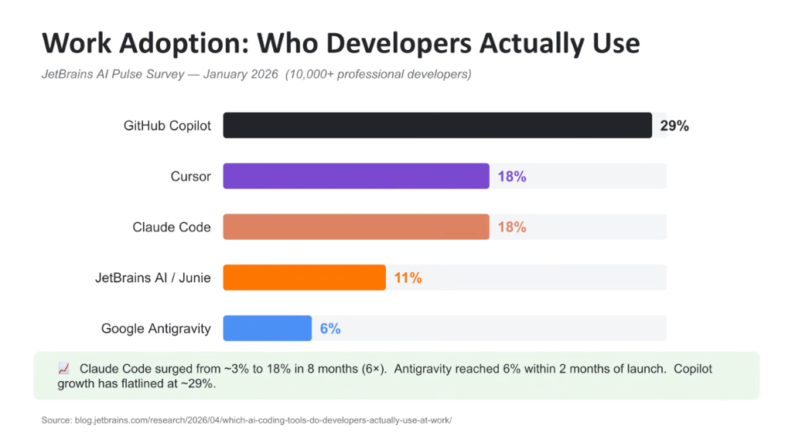
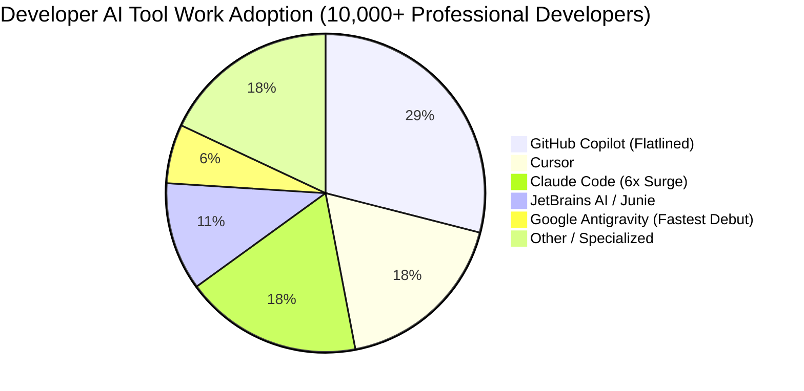

# Developer Work Adoption: Market Share & The Rise of Agentic Coding

## Overview

The developer AI tool ecosystem is undergoing a rapid architectural and commercial transition. According to the **JetBrains AI Pulse Survey (January 2026, surveying 10,000+ professional software engineers)**, market share is aggressively shifting away from first-generation inline autocomplete tools toward **autonomous agentic coding platforms**.

While **GitHub Copilot** remains the largest installed base at **29%**, its growth has flatlined, while next-generation agentic tools like **Claude Code** and **Google Antigravity** are demonstrating explosive growth trajectories.

---

## Market Share Breakdown (JetBrains AI Pulse Survey Jan 2026)

---

## Key Findings & Growth Dynamics

### 1. The Autonomous Agent Surge
* **Claude Code (18% Market Share — 6× Growth)**:
  * Surged from $\sim 3\%$ to **18% in just 8 months**, driven by developer enthusiasm for terminal-native, CLI-based autonomous agents capable of independent multi-turn execution.
* **Google Antigravity (6% Market Share — Fastest Debut)**:
  * Captured **6% market share within 2 months of initial launch**.
  * Differentiating factors driving rapid velocity:
    1. **Unified Multi-Surface Support**: Operates identically across terminal CLI (`agy`), VS Code, JetBrains IDEs, Xcode, and Visual Studio.
    2. **Gemini 3.1 Co-Optimization**: Harnessing 1M–2M+ token contexts and low-latency reasoning.
    3. **The Skills Ecosystem**: Dynamic, version-controlled capability hydration (`SKILL.md`).
    4. **Enterprise Gemini Integration**: Seamless enterprise IAM, Model Armor, and syncless authentication.

---

### 2. The Legacy Autocomplete Plateau (GitHub Copilot at 29%)
* **Flatlined Adoption**: GitHub Copilot's growth has stalled at $\sim 29\%$.
* **The "Tab Fatigue" Dilemma**: Single-line autocomplete and simple chat sidebars cannot execute complex multi-file refactors, maintain semi-persistent architectural memory, or execute deterministic test verification loops.
* **The Shift to Agentic Workflows**: Professional developers are migrating to agentic harnesses that act as true junior engineering peers rather than typing assistants.

---

## Comparative Competitive Landscape Matrix

| Developer Tool | Work Adoption | Growth Trend | Architecture Type | Key Strengths |
| :--- | :--- | :--- | :--- | :--- |
| **GitHub Copilot** | **29%** | Flatlined | Inline Autocomplete + Chat | Massive legacy distribution, GitHub ecosystem tie-in |
| **Cursor** | **18%** | Steady Growth | AI-First IDE Fork | Composer window, local vector indexing |
| **Claude Code** | **18%** | Explosive (6× in 8 mo) | Terminal CLI Agent | Autonomous multi-file bash execution, fast CLI loop |
| **JetBrains AI / Junie** | **11%** | Steady | Native IDE Assistant | Deep IntelliJ AST integration, refactoring menus |
| **Google Antigravity** | **6%** | **Fastest Debut (6% in 2 mo)**| **Unified Agent Harness** | **Multi-surface (CLI/IDEs), Skills ecosystem, Gemini 3.1, Enterprise IAM/Wiz** |
