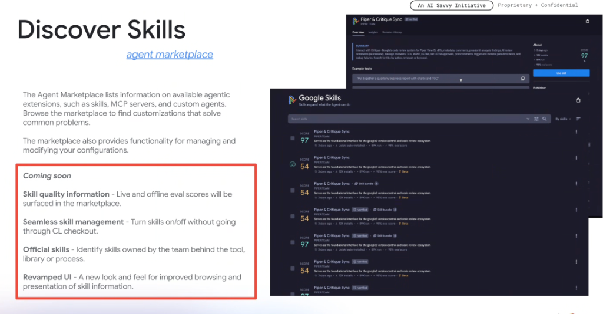
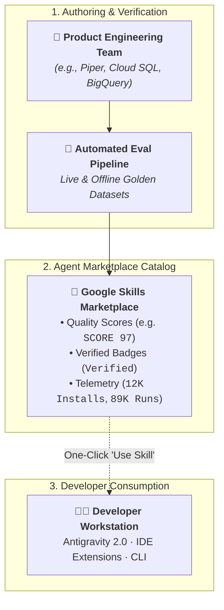
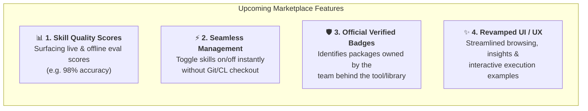

# Discovering Skills: The Agent Marketplace & Governance Ecosystem

## Overview

The **Agent Marketplace** is Google's centralized ecosystem for discovering, managing, and governing agentic extensions across the company. Part of the **AI Savvy Initiative**, the marketplace provides a unified registry for **Skills**, **MCP Servers**, and **Custom Subagents**.

Rather than searching through fragmented Git repositories or guessing which skill is reliable, developers can discover verified, high-scoring skills with transparent evaluation telemetry.

---

## The Marketplace Publishing & Discovery Lifecycle

---

## Core Capabilities of the Agent Marketplace

### 1. Unified Extension Catalog
* Houses all three major agent extensibility layers in one interface:
  * **Skills**: Reusable JIT instructions, workflows, and scripts (`SKILL.md`).
  * **MCP Servers**: Standardized external tool connectors and API bridges.
  * **Custom Agents**: Purpose-built autonomous subagents with predefined roles and system prompts.

### 2. Deep Skill Inspection View
* Each skill entry provides:
  * **Overview & Summary**: Clear description of domain capability.
  * **Example Tasks**: Few-shot sample prompts demonstrating how to invoke the skill.
  * **Insights & Telemetry**: Historic run counts, install volume, and error rates.
  * **Revision History**: Semantic versioning and changelog tracking.

---

## 4 Major Platform Innovations ("Coming Soon")

The highlighted roadmap introduces four critical enterprise management capabilities:

### 1. Skill Quality Information (Live & Offline Eval Scores)
* Surfaces empirical quality ratings (e.g. `SCORE 97` vs `SCORE 54`) directly on the skill card.
* Displays benchmark pass rates (`98% eval score`) and real-world usage volume (`89K runs`).
* Eliminates guesswork, allowing engineers to pick high-performing, proven skills.

### 2. Seamless Skill Management
* Enables instant, zero-friction toggling of skills on and off.
* Removes the legacy requirement of running manual Git checkouts, symlinking folders, or submitting configuration CLs just to activate a tool.

### 3. Official & Verified Skills
* Distinguishes community-contributed experimental skills from officially supported enterprise packages.
* Displays verified badges for skills authored directly by product teams (e.g., *Piper Team*, *Buganizer Team*, *DeepMind*).

### 4. Revamped UI
* Modernized browsing interface with category filtering, telemetry graphs, and interactive test prompts.

---

## Marketplace Metadata & Quality Rubric

| Metadata Field | Visual Indicator | Engineering Meaning |
| :--- | :--- | :--- |
| **Quality Score** | `SCORE 97` (Green) / `54` (Yellow) | Composite rating based on test coverage, rubric evals, and runtime stability. |
| **Verification Badge** | `Verified` Checkmark | Confirms official ownership and maintenance by the tool's core engineering team. |
| **Release Stage** | `Beta` / `Stable` | Indicates whether the skill is experimental or approved for production workflows. |
| **Usage Metrics** | `12K installs`, `89K runs` | Real-world adoption and frequency of live invocation across Google. |
| **Evaluation Accuracy** | `98% eval score` | Percentage of golden dataset test cases passed during regression testing. |
