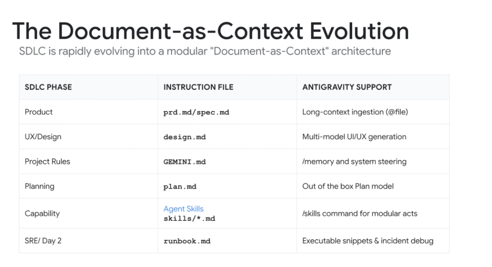
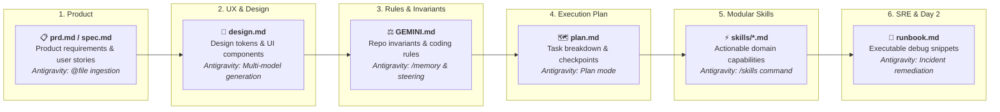

# SDLC Transformation: The Document-as-Context Evolution

## Overview

The modern Software Development Life Cycle (SDLC) is undergoing a structural paradigm shift:

> **"The SDLC is rapidly evolving into a modular 'Document-as-Context' architecture."**

Instead of scattering product requirements, architecture rules, and operational playbooks across disconnected portals (Jira, Google Docs, Slack threads, Confluence), every phase of the engineering lifecycle is formalized as a version-controlled **Markdown document** that directly serves as working context and execution guidance for **Google Antigravity** agents.

---

## The End-to-End Document-as-Context Lifecycle

---

## Detailed SDLC Phase Breakdown

### 1. Product Phase $\longrightarrow$ `prd.md` / `spec.md`
* **Instruction File**: `prd.md` or `spec.md`
* **Antigravity Feature**: Long-Context Ingestion via `@file` mentions.
* **Function**: Ingests comprehensive product requirements, acceptance criteria, user personas, and boundary conditions without truncation.

---

### 2. UX / Design Phase $\longrightarrow$ `design.md`
* **Instruction File**: `design.md`
* **Antigravity Feature**: Multi-Modal UI/UX Generation (Stitch / Vision models).
* **Function**: Defines design system tokens, typography scales, responsive layout grids, and component specs for automated UI synthesis.

---

### 3. Project Rules Phase $\longrightarrow$ `GEMINI.md` / `AGENTS.md`
* **Instruction File**: `GEMINI.md` (or `AGENTS.md`)
* **Antigravity Feature**: `/memory` bank and persistent system steering.
* **Function**: Enforces non-negotiable architectural boundaries, style guides, banned packages, and mandatory verification protocols across all conversation turns.

---

### 4. Planning Phase $\longrightarrow$ `plan.md`
* **Instruction File**: `plan.md` (or `PLAN.md`)
* **Antigravity Feature**: Out-of-the-box **Plan Model** & Planner Subagent.
* **Function**: Decomposes the specification into discrete, testable implementation steps with clear dependency ordering and checkable milestones.

---

### 5. Capability Phase $\longrightarrow$ `skills/*.md` (`SKILL.md`)
* **Instruction File**: `skills/*.md` (e.g. `skills/blaze/SKILL.md`, `skills/spanner/SKILL.md`)
* **Antigravity Feature**: `/skills` command for modular action execution.
* **Function**: Encapsulates specific tool recipes, CLI syntax, and domain logic using **Progressive Disclosure** (hydrated JIT).

---

### 6. SRE / Day 2 Ops Phase $\longrightarrow$ `runbook.md`
* **Instruction File**: `runbook.md`
* **Antigravity Feature**: Executable code snippets & live incident debugging.
* **Function**: Provides agents with deterministic troubleshooting trees, health-check queries, rollback scripts, and log analysis playbooks.

---

## Document-as-Context Reference Matrix

| SDLC Phase | Instruction File | Antigravity Native Support | Operational Impact |
| :--- | :--- | :--- | :--- |
| **Product** | `prd.md` / `spec.md` | Long-context ingestion (`@file`) | Eliminates ambiguity; establishes verifiable acceptance criteria |
| **UX/Design** | `design.md` | Multi-model UI/UX generation | High-fidelity frontend components adhering to design systems |
| **Project Rules** | `GEMINI.md` | `/memory` and system steering | Prevents architectural drift and enforces repository invariants |
| **Planning** | `plan.md` | Out-of-the-box Plan model | Structured, trackable execution roadmaps with zero dropped steps |
| **Capability** | `skills/*.md` | `/skills` command for modular acts | Reusable JIT knowledge without polluting global prompt context |
| **SRE / Day 2** | `runbook.md` | Executable snippets & incident debug | Fast, deterministic MTTR during outages and automated rollbacks |
