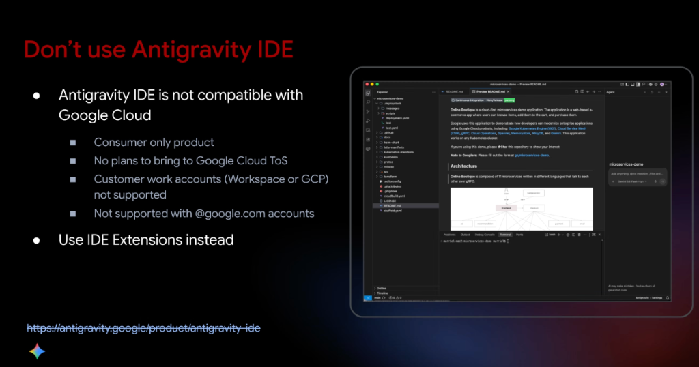
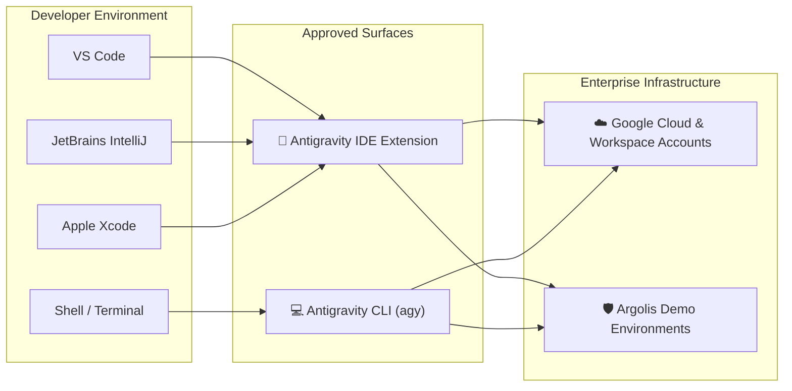

# Policy & Compliance: Don't Use Antigravity IDE (Use IDE Extensions Instead)



## Overview

> [!CAUTION]
> **Strict Policy Directive**: Do **NOT** download or use the standalone **Antigravity IDE** application for Google Cloud, enterprise customer engagements, or corporate engineering. It is a consumer-only product and is **incompatible with Google Cloud**.
> 
> **Approved Path**: Use **Antigravity IDE Extensions** (VS Code, IntelliJ, Xcode, Visual Studio) or the **Antigravity CLI / Hub 2.0**.

---

## Why Antigravity IDE Is Incompatible with Enterprise & Google Cloud

```mermaid
graph TD
    subgraph ❌ Prohibited: Standalone Antigravity IDE
        IDE["🚫 <b>Standalone Antigravity IDE Application</b><br/><i>(antigravity.google/product/antigravity_ide)</i>"]
        IDE --> C1["❌ Consumer-Only Product"]
        IDE --> C2["❌ No Google Cloud Terms of Service (ToS)"]
        IDE --> C3["❌ Customer Work Accounts Unsupported<br/><i>(No Workspace / GCP Identity)</i>"]
        IDE --> C4["❌ Not Supported with @google.com Accounts"]
    end

    subgraph ✅ Approved: Enterprise-Grade Surfaces
        Ext["🧩 <b>Antigravity IDE Extensions</b><br/><i>(VS Code, IntelliJ, Xcode, Visual Studio)</i>"]
        CLI["💻 <b>Antigravity CLI (agy) & Hub 2.0</b><br/><i>(Enterprise & Argolis Compliant)</i>"]
    end
```

---

## The 4 Core Compliance Incompatibilities

### 1. Consumer-Only Product
* The standalone Antigravity IDE executable was designed and licensed strictly as an experimental consumer-tier coding application.
* It lacks enterprise multi-tenant isolation, enterprise data governance, and customer administrative controls.

### 2. No Plans to Bring to Google Cloud Terms of Service (ToS)
* Standalone Antigravity IDE operates under standard consumer terms, not the legally binding **Google Cloud Terms of Service (ToS)**.
* Does not provide HIPAA/BAA compliance, SOC2 certifications, data-at-rest encryption guarantees, or enterprise IP indemnification.

### 3. Customer Work Accounts Not Supported
* Enterprise customer work accounts (Google Workspace accounts and Google Cloud Identity corporate credentials) cannot authenticate or provision licenses in the standalone IDE.
* Attempting to use personal consumer accounts for enterprise customer code violates data confidentiality rules.

### 4. Not Supported with `@google.com` Accounts
* Google employees and Customer Engineers (CEs) cannot log in using internal `@google.com` corporate accounts.
* Bypasses internal security and corporate data handling boundaries.

---

## The Compliant Solution: Use IDE Extensions & CLI

Rather than replacing your entire development environment with a consumer IDE, the Antigravity team delivers the full agent harness through approved enterprise surfaces:



---

## Surface Compliance Matrix

| Dimension | Standalone Antigravity IDE | Antigravity IDE Extensions | Antigravity CLI (`agy`) |
| :--- | :--- | :--- | :--- |
| **Compliance Status** | ❌ **PROHIBITED for Enterprise / GCP** | ✅ **APPROVED** | ✅ **APPROVED** |
| **Account Compatibility** | Personal consumer accounts only | Workspace, GCP Identity, `@google.com` | Workspace, GCP Identity, `@google.com` |
| **Terms of Service** | Consumer ToS | Google Cloud / Enterprise ToS | Google Cloud / Enterprise ToS |
| **Editor Choice** | Forced into standalone Electron fork | Your choice (VS Code, IntelliJ, Xcode) | Terminal of choice (macOS, Linux) |
| **Customer Data Safety** | Non-compliant (Risk of data leakage) | Fully compliant within enterprise perimeter | Fully compliant within enterprise perimeter |
