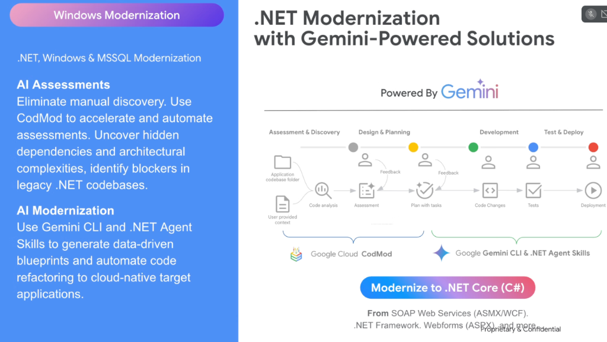

# Enterprise Windows Modernization: .NET Modernization with Gemini



## Overview

Enterprises running legacy Windows workloads are constrained by expensive Windows Server OS licensing, rigid IIS web servers, and outdated technologies like **SOAP Web Services (ASMX/WCF)**, **ASP.NET WebForms (ASPX)**, and monolithic **.NET Framework 3.5/4.x**.

Google Cloud provides an integrated, AI-driven modernization pipeline powered by **Google Cloud CodMod** and **Gemini CLI + .NET Agent Skills** to refactor legacy codebases into modern **.NET Core / .NET 8** running on lightweight Linux containers (**Cloud Run** and **GKE**).

---

## The 4-Phase .NET Modernization Workflow

```mermaid
graph LR
    subgraph 🔍 Powered by Google Cloud CodMod
        P1["1. 📊 <b>Assessment & Discovery</b><br/>• Codebase analysis & user context<br/>• Identify hidden dependencies & blockers<br/>• <i>Human Feedback Gate</i>"]
        
        P2["2. 🗺️ <b>Design & Planning</b><br/>• Generate data-driven blueprints<br/>• Plan with decomposed tasks<br/>• <i>Architect Feedback Gate</i>"]
    end

    subgraph ⚡ Powered by Gemini CLI & .NET Agent Skills
        P3["3. 💻 <b>Development</b><br/>• Autonomous code refactoring<br/>• WCF -> gRPC / Minimal APIs<br/>• ASPX -> Blazor / React"]
        
        P4["4. 🚀 <b>Test & Deploy</b><br/>• Automated xUnit/NUnit generation<br/>• Linux containerization (Docker)<br/>• Deploy to Cloud Run & GKE"]
    end

    P1 ==> P2 ==> P3 ==> P4
```

---

## Detailed Breakdown of the 4 Modernization Phases

### 1. Assessment & Discovery (CodMod)
* **Input**: Application codebase folder + user-provided architecture context.
* **Mechanism**: **Google Cloud CodMod** scans the codebase to map project dependencies, detect Windows-specific GAC dependencies, flag deprecated APIs, and evaluate framework compatibility.
* **Feedback Loop**: Engineers review the assessment report to confirm scope and clarify architectural priorities.

---

### 2. Design & Planning (CodMod)
* **Mechanism**: CodMod synthesizes a granular, ordered execution plan (`plan.md`).
* **Output**: Decomposed task lists with concrete code modification steps, target dependency mappings (e.g. NuGet package replacements), and risk ratings.
* **Feedback Loop**: Tech leads approve the modernization blueprint before any code edits occur.

---

### 3. Development & Automated Code Changes (Gemini CLI + Agent Skills)
* **Mechanism**: **Gemini CLI** and specialized **.NET Agent Skills** execute autonomous code refactoring:
  * Upgrades `.csproj` project files to modern SDK-style formats.
  * Refactors legacy **WCF / ASMX** services into high-performance **gRPC** or **ASP.NET Core Minimal APIs**.
  * Modernizes legacy data access code (ADO.NET / EF6) to **EF Core** or Dapper.
  * Replaces legacy ASP.NET WebForms with modern API-backed frontends.

---

### 4. Test & Deployment (Gemini CLI + Agent Skills)
* **Mechanism**:
  * Automatically synthesizes comprehensive **xUnit / NUnit** test suites to verify business logic equivalence.
  * Builds lightweight OCI container images targeting Alpine/Debian Linux base images.
  * Deploys containerized services to **Google Cloud Run** or **GKE**, eliminating Windows Server license dependencies entirely.

---

## Target Modernization Mappings

| Legacy Technology | Target Modernized State | Primary Cloud Benefit |
| :--- | :--- | :--- |
| **.NET Framework 3.5 / 4.x** | **.NET 8 (C# 12)** on Linux | Cross-platform execution; 3x throughput improvements |
| **Windows Server VMs / IIS** | **Linux Containers (Cloud Run / GKE)** | Zero Windows OS license fees; instant auto-scaling |
| **WCF / SOAP (ASMX)** | **gRPC / ASP.NET Core REST APIs** | Low-latency binary serialization; cloud-native standards |
| **ASP.NET WebForms (ASPX)** | **REST APIs + Modern SPA / Blazor** | Clean separation of frontend and backend concerns |
| **MS SQL Server (On-Prem)** | **Cloud SQL for SQL Server / AlloyDB** | Managed automated backups, high availability, and scaling |
