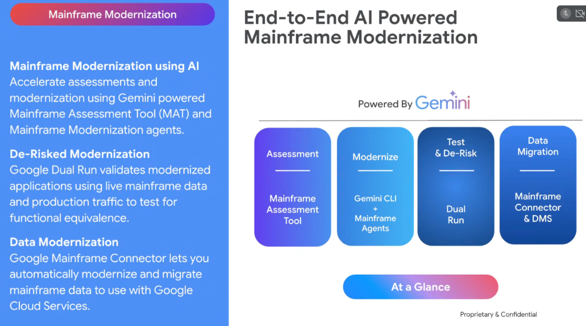
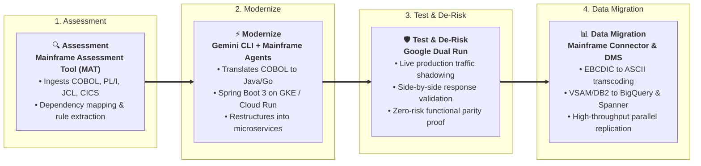

# Enterprise Mainframe Modernization: End-to-End AI-Powered Architecture



## Overview

Enterprise mainframes (IBM z/OS, Unisys) process mission-critical banking, insurance, and supply chain workloads. However, enterprises face severe headwinds: soaring MIPS licensing costs, an aging workforce of COBOL/Assembler developers, and inability to integrate with modern AI agents.

Google Cloud provides a deterministic, **End-to-End AI-Powered Mainframe Modernization** solution powered by **Gemini** across 4 integrated lifecycle stages:

```text
ASSESSMENT  ──────>  MODERNIZE  ──────>  TEST & DE-RISK  ──────>  DATA MIGRATION
 (MAT)          (Gemini CLI/Agents)       (Dual Run)        (Connector & DMS)
```

---

## The 4-Stage AI-Powered Mainframe Modernization Lifecycle



---

## Detailed Breakdown of the 4 Stages

### 1. Assessment $\longrightarrow$ Mainframe Assessment Tool (MAT)
* **Core Technology**: Gemini-powered **Mainframe Assessment Tool (MAT)**.
* **Function**:
  * Ingests millions of lines of legacy COBOL, PL/I, Assembler, BMS screen maps, and JCL batch scripts.
  * Generates dependency call graphs, identifies dead code, and extracts core business logic from procedural transaction spaghetti.
  * Outputs a structured modernization roadmap and cloud-readiness complexity score.

---

### 2. Modernize $\longrightarrow$ Gemini CLI + Mainframe Agents
* **Core Technology**: **Gemini CLI** + Specialized **Mainframe Modernization Agents** (Antigravity harness).
* **Function**:
  * Consumes MAT dependency graphs and business rules to compile procedural COBOL into modern, object-oriented **Java 21** (Spring Boot 3 / Quarkus) or **Go** microservices.
  * Replaces CICS transaction screens with clean RESTful and gRPC API contracts.
  * Packages microservices as lightweight OCI containers for **GKE** and **Cloud Run**.

---

### 3. Test & De-Risk $\longrightarrow$ Google Dual Run
* **Core Technology**: **Google Dual Run** (Zero-Risk Validation Platform).
* **Function**:
  * Clones and shadows live incoming production mainframe transactions to both the legacy mainframe and the new modernized Google Cloud services simultaneously.
  * Automatically compares response payloads, database state changes, and numerical outputs byte-for-byte.
  * Proves 100% functional equivalence on real-world edge cases before executing cutover, eliminating the risk of a "big bang" failure.

---

### 4. Data Migration $\longrightarrow$ Mainframe Connector & DMS
* **Core Technology**: **Google Mainframe Connector** + **Database Migration Service (DMS)**.
* **Function**:
  * High-speed bidirectional streaming connector that operates directly on the mainframe (or via zIIP engines).
  * Automatically transcodes EBCDIC datasets, packed decimals, and VSAM/QSAM files into standard ASCII/JSON/Parquet.
  * Streams mainframe data directly into **BigQuery**, **Cloud Storage**, and **Cloud Spanner** for enterprise AI analytics and operational workloads.

---

## Mainframe Modernization Reference Matrix

| Lifecycle Stage | Google Cloud Technology | Operational Input | Target Output | Primary Value Delivered |
| :--- | :--- | :--- | :--- | :--- |
| **1. Assessment** | Mainframe Assessment Tool (MAT) | COBOL, PL/I, JCL, BMS files | Dependency graphs & rule catalog | Uncovers undocumented logic & calculates precise migration ROI |
| **2. Modernize** | Gemini CLI & Mainframe Agents | Extracted rules & schemas | Java 21 / Go microservices | Eliminates legacy syntax; generates idiomatic cloud code |
| **3. Test & De-Risk** | Google Dual Run | Live production traffic | Side-by-side parity validation logs | Eliminates cutover risk; proves functional equivalence |
| **4. Data Migration**| Mainframe Connector & DMS | VSAM, QSAM, DB2 z/OS | BigQuery, AlloyDB, Spanner | Unlocks mainframe data for real-time AI context ($M$) |
