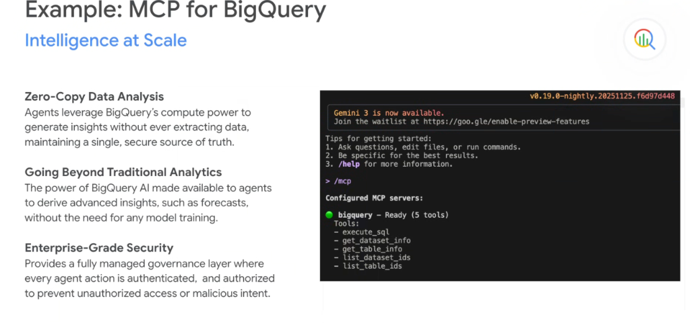
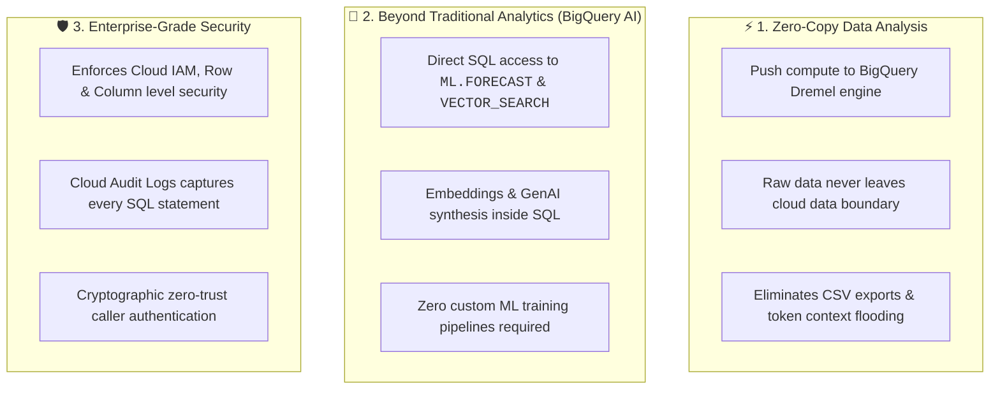
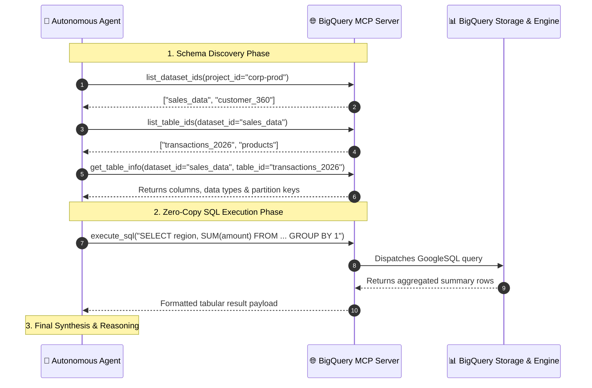

# Example: MCP for BigQuery — Intelligence at Scale & Zero-Copy Analytics



## Overview

The **BigQuery MCP Server** exemplifies Google's managed Model Context Protocol strategy: empowering autonomous agents with petabyte-scale analytical intelligence while strictly enforcing **Zero-Copy Data Architecture** and enterprise-grade governance.

Rather than downloading large datasets into local agent memory, agents use MCP to push compute directly to BigQuery's distributed SQL engine.

---

## The 3 Core Pillars of BigQuery MCP



---

## Terminal Experience & Tool Discovery (`/mcp`)

When inspecting configured MCP servers in Antigravity or Gemini CLI via `> /mcp`, the BigQuery server exposes 5 foundational tools:

```text
> /mcp

Configured MCP servers:
🟢 bigquery - Ready (5 tools)
   Tools:
   - execute_sql
   - get_dataset_info
   - get_table_info
   - list_dataset_ids
   - list_table_ids
```

---

## The 5 Core BigQuery MCP Tools



---

## Detailed Tool Reference

### 1. `list_dataset_ids`
* **Purpose**: Enumerates all BigQuery datasets available to the authenticated principal in a given project.
* **Context Efficiency**: Returns lightweight string identifiers without dumping large metadata blocks.

### 2. `list_table_ids`
* **Purpose**: Lists all tables, views, and materialized views within a specified dataset.

### 3. `get_dataset_info`
* **Purpose**: Retrieves dataset-level metadata including geographic location, creation timestamp, and description.

### 4. `get_table_info`
* **Purpose**: Fetches comprehensive table metadata including schema definitions, column descriptions, clustering fields, and partitioning schemes.
* **Why It Matters**: Enables the agent to write precise, syntax-compliant GoogleSQL without guessing column names or data types.

### 5. `execute_sql`
* **Purpose**: Dispatches GoogleSQL queries to BigQuery and returns query job results.
* **Key Capabilities**: Supports analytical queries, aggregations, window functions, and BigQuery AI functions (`ML.GENERATE_TEXT`, `VECTOR_SEARCH`).

---

## Architectural Comparison: Traditional Extraction vs. MCP BigQuery

| Dimension | ❌ Traditional CSV / API Extraction | ✅ BigQuery MCP Server (Zero-Copy) |
| :--- | :--- | :--- |
| **Data Movement** | Raw records downloaded to local disk | Compute pushed to data; zero raw extraction |
| **Token Consumption** | Floods context window with thousands of raw rows | Only aggregated final results enter context |
| **Security Boundary** | High risk of data leakage / local exposure | Protected by Cloud IAM, VPC-SC & Audit Logs |
| **Compute Scale** | Constrained by local CPU / RAM limits | Scales across thousands of BigQuery Dremel slots |
| **AI Integration** | Requires separate ML services & custom code | Built-in BigQuery ML / AI SQL functions |
