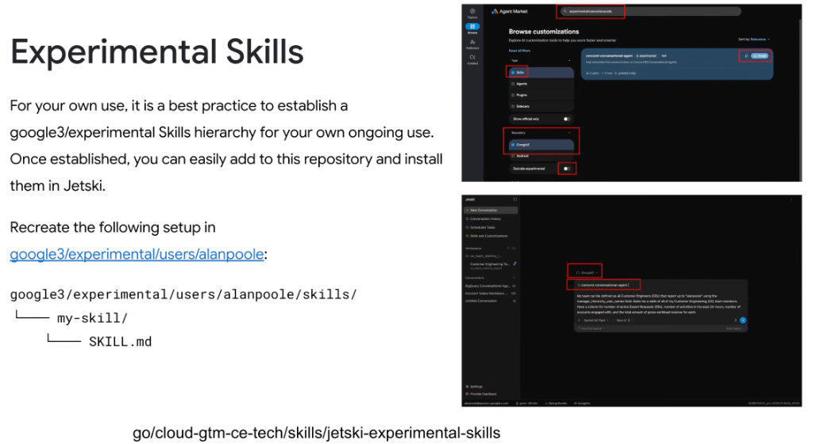
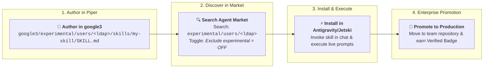
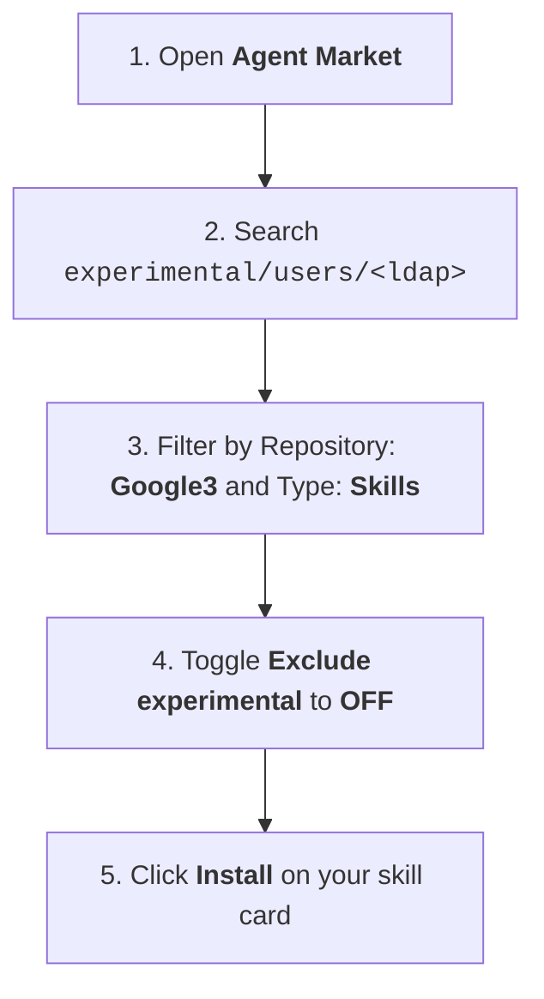

# Authoring & Deploying Experimental Skills in Google3



## Overview

For personal workflows, rapid prototyping, and specialized team automation, the recommended best practice is to establish an **experimental Skills hierarchy** under your personal Piper user directory: `google3/experimental/users/<ldap>/skills/`.

Once created, skills committed to this path can be discovered in the **Agent Market** and installed directly into **Antigravity / Jetski** (`go/cloud-gtm-ce-tech/skills/jetski-experimental-skills`).

---

## The Experimental Skills Development Workflow



---

## 1. Establishing Your Google3 Skills Directory

Create your personal skill repository hierarchy in your CitC client or Piper workspace:

```text
google3/experimental/users/alanpoole/skills/
├── concord-conversational-agent/
│   └── SKILL.md
└── customer-metrics-reporter/
    ├── SKILL.md
    └── scripts/
        └── aggregate_metrics.py
```

### Directory Rules
* Each subdirectory under `skills/` represents a single, independent skill package.
* Must contain a root `SKILL.md` with standard YAML frontmatter (`name`, `description`) and detailed Markdown instructions.

---

## 2. Discovering & Installing in Agent Market

To install your experimental skill into your local Antigravity/Jetski runtime:



1. **Search**: Enter `experimental/users/<ldap>` in the top search bar.
2. **Set Filters**:
   * **Type**: `Skills`
   * **Repository**: `Google3`
   * **Exclude experimental**: **Turn OFF** (default is ON to hide unvetted personal skills).
3. **Install**: Click the blue **Install** button to link the skill to your agent profile.

---

## 3. Real-World Execution in Antigravity / Jetski

Once installed, invoke the skill directly in your workspace prompts:

```text
My team can be defined as all Customer Engineers (CEs) that report up to 'alanpoole' using the manager_hierarchy_user_names field. 

Build me a table of all of my Customer Engineering (CE) team members. Have a column for:
- Number of active Expert Requests (ERs)
- Number of activities in the past 24-hours
- Number of accounts engaged with
- Total amount of gross workload revenue for each
```

The agent references your experimental skill instructions, translates the intent into internal Concord BQ queries, and formats the output table accurately.

---

## The Skill Promotion Lifecycle

| Stage | Repository Location | Target Audience | Verification Level |
| :--- | :--- | :--- | :--- |
| **Experimental** | `google3/experimental/users/<ldap>/skills/` | Author / Individual CE | Unvetted sandbox, rapid iteration |
| **Team Shared** | `go/cloud-gtm-ce-tech/skills/...` | CE organization / Practice team | Team peer review |
| **Official Enterprise** | `cs/learning/gemini/agents/skills/...` | All Google engineers | Automated eval suite + `Verified` badge |
