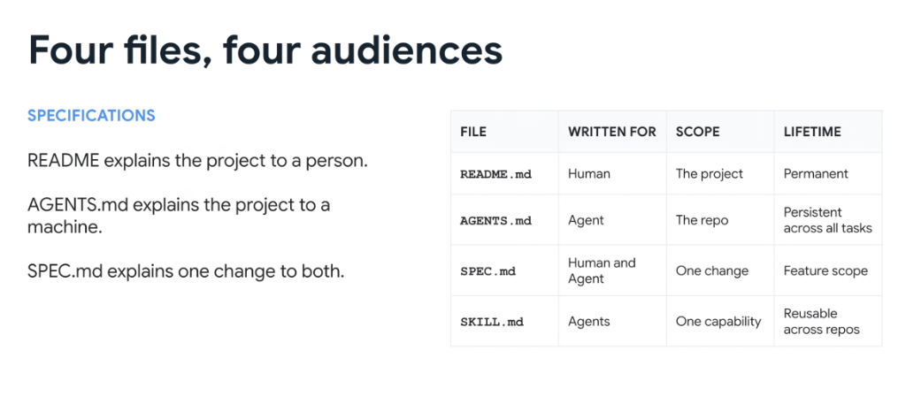

# Specification Matrix: Four Files, Four Audiences



## Overview

In modern AI-assisted engineering repositories, documentation is no longer a monolithic text dump. It is structured into **four distinct specification files tailored for four distinct audiences, scopes, and lifecycles**:

> * **`README.md` explains the project to a person.**
> * **`AGENTS.md` explains the project to a machine.**
> * **`SPEC.md` explains one change to both.**
> * **`SKILL.md` explains one capability to agents across repos.**

---

## The Four Audiences Architecture Quadrant

```mermaid
graph TD
    subgraph 👤 Human-Centric
        R["📖 <b>README.md</b><br/>• Written for: <b>Human</b><br/>• Scope: <b>The Project</b><br/>• Lifetime: <b>Permanent</b><br/>• Context: Vision, setup & high-level architecture"]
    end

    subgraph 🤖 Machine-Centric
        A["⚙️ <b>AGENTS.md</b><br/>• Written for: <b>Agent</b><br/>• Scope: <b>The Repo</b><br/>• Lifetime: <b>Persistent across all tasks</b><br/>• Context: Invariants, test commands & rules"]
        
        SK["⚡ <b>SKILL.md</b><br/>• Written for: <b>Agents</b><br/>• Scope: <b>One Capability</b><br/>• Lifetime: <b>Reusable across repos</b><br/>• Context: Tool recipes & API schemas"]
    end

    subgraph 🤝 Hybrid (Human + Machine)
        S["📐 <b>SPEC.md</b><br/>• Written for: <b>Human & Agent</b><br/>• Scope: <b>One Change</b><br/>• Lifetime: <b>Feature Scope</b><br/>• Context: Exact requirements & acceptance evals"]
    end

    R --- S
    S --- A
    A --- SK
```

---

## Detailed Breakdown of the 4 Files

### 1. `README.md` (Project Onboarding for Humans)
* **Written For**: Human Developers, Tech Leads, Open-Source Contributors.
* **Scope**: The entire repository / project.
* **Lifetime**: Permanent across the repository's lifecycle.
* **Core Purpose**: Explains the *why* and *what* of the project in natural, accessible prose. Contains architecture diagrams, installation instructions, developer onboarding steps, and license information.

---

### 2. `AGENTS.md` (Operational Invariants for Machines)
* **Written For**: Autonomous AI Agents (Antigravity, Jetski, CLI).
* **Scope**: The entire repository / workspace.
* **Lifetime**: Persistent across all tasks and conversation turns in this codebase.
* **Core Purpose**: Acts as the immutable "physics" of the repository. Specifies non-negotiable rules: read-before-edit protocols, mandatory test verification commands (`verify.py`, `pytest`), style conventions, and prohibited dependencies.

---

### 3. `SPEC.md` (Feature Contract for Human & Agent)
* **Written For**: Collaborative alignment between Human Engineer and AI Agent.
* **Scope**: A single, focused change (feature, refactoring milestone, or bug remediation).
* **Lifetime**: Ephemeral / Feature-scoped (lives for the duration of the feature branch or CL; archived or deleted after merge).
* **Core Purpose**: Defines the exact problem statement, schema changes, component contracts, implementation task checklists, and machine-verifiable acceptance criteria.

---

### 4. `SKILL.md` (Modular Reusable Capability for Agents)
* **Written For**: AI Agents across multiple different repositories and workspaces.
* **Scope**: A single, specialized domain capability (e.g. `spanner`, `bigquery`, `blaze`, `critique-review`).
* **Lifetime**: Permanent and reusable across multiple repos and teams.
* **Core Purpose**: Encapsulates specific CLI binary paths, MCP tool invocations, parameter schemas, and progressive disclosure links for just-in-time (JIT) hydration.

---

## The Four Files Reference Matrix

| File | Written For | Target Scope | Persistence Lifetime | Primary Content |
| :--- | :--- | :--- | :--- | :--- |
| **`README.md`** | **Human** | The project | **Permanent** | Vision, architecture overview, setup guides, and project FAQs |
| **`AGENTS.md`** | **Agent** | The repo | **Persistent** (all tasks) | Invariants, test commands (`verify.py`), style rules, and constraints |
| **`SPEC.md`** | **Human & Agent** | One change | **Feature scope** (ephemeral) | Precise requirements, API contracts, acceptance criteria, and TDD plan |
| **`SKILL.md`** | **Agents** | One capability | **Reusable** (across repos) | YAML frontmatter metadata, CLI tool recipes, and JIT action guides |

---

## Common Anti-Patterns to Avoid

1. ❌ **Polluting `README.md` with Machine Prompts**: Never dump AI rules into `README.md`; keep it clean and readable for human developers.
2. ❌ **Turning `AGENTS.md` into a Feature Spec**: Keep `AGENTS.md` strictly for persistent repository invariants; put change-specific tasks in `SPEC.md`.
3. ❌ **Monolithic Repo Skills**: Don't hardcode repository-specific logic into a global `SKILL.md` intended for cross-repo reuse.
