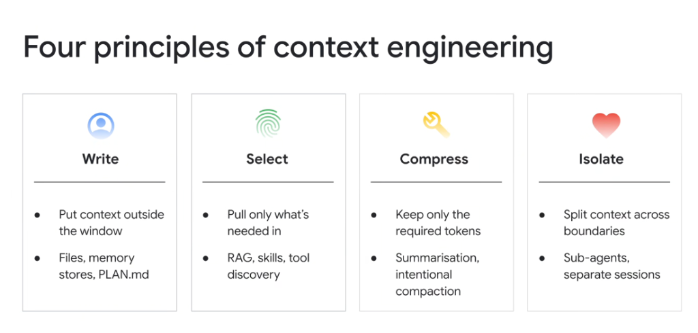
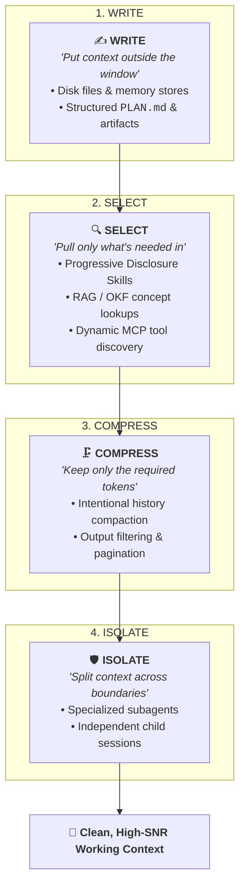

# The 4 Core Principles of Context Engineering: Write, Select, Compress, Isolate

## Overview

Modern Context Engineering transforms conversational LLMs into deterministic, production-grade systems by applying **four foundational architectural principles**: **Write**, **Select**, **Compress**, and **Isolate**.

These four principles govern how working memory is persisted, retrieved, distilled, and partitioned across the entire agent lifecycle.

---

## The 4 Principles Architecture Map

---

## Deep Breakdown of the 4 Principles

### 1. WRITE: "Put Context Outside the Window"
* **The Core Rule**: Never rely on the raw chat transcript as your system's primary database.
* **How It Works**: Offload long-term state, architectural roadmaps, and execution progress to external persistent files on disk.
* **Key Artifacts**:
  * `PLAN.md` / `task_list.md`: Living task checklists and implementation specifications.
  * Local filesystem artifacts (`.gemini/jetski/brain/...`).
  * External databases (Firestore, Spanner, SQLite memory banks).
* **Engineering Benefit**: Infinite persistence horizon; state survives session restarts, model updates, and multi-day projects.

---

### 2. SELECT: "Pull Only What's Needed In"
* **The Core Rule**: Never preload all tools, runbooks, and schemas into root prompts.
* **How It Works**: Dynamically hydrate specific domain knowledge and tool schemas *only* when the active sub-goal demands them.
* **Key Mechanisms**:
  * **Progressive Disclosure Skills**: Ingests ~30 tokens of metadata at startup; hydrates full `SKILL.md` playbooks upon activation.
  * **Open Knowledge Format (OKF) & RAG**: Path-addressed concept retrieval (`tables/orders.md`).
  * **Model Context Protocol (MCP)**: On-demand tool schema discovery via `tools/list`.
* **Engineering Benefit**: Maximizes Signal-to-Noise Ratio (SNR), eliminates model tool confusion, and minimizes prompt prefill latency.

---

### 3. COMPRESS: "Keep Only the Required Tokens"
* **The Core Rule**: Never let raw, unfiltered terminal logs and multi-turn conversational ramblings accumulate unchecked.
* **How It Works**: Actively distill execution histories into compact, semantic milestones.
* **Key Mechanisms**:
  * **Intentional History Compaction**: Generating periodic checkpoint summaries of completed sub-tasks.
  * **Strict Output Limits**: Constraining CLI tools (`-max_results=50`, `grep`, `jq`) before echoing stdout into context.
* **Engineering Benefit**: Prevents **Context Rot**, preserves 50%+ free token headroom, and stabilizes long-running reasoning trajectories.

---

### 4. ISOLATE: "Split Context Across Boundaries"
* **The Core Rule**: Never force a single agent context window to perform architecture design, low-level coding, security auditing, and test verification all at once.
* **How It Works**: Decompose complex workflows across specialized autonomous subagents, each possessing a pristine, isolated context window.
* **Key Mechanisms**:
  * **Subagent Swarms**: `architect` (planning) $\rightarrow$ `implementer` (TDD code) $\rightarrow$ `reviewer` (critique) $\rightarrow$ `verifier` (QA).
  * **Branch Workspaces & Child Sessions**: Isolated sandboxes preventing memory pollution.
* **Engineering Benefit**: Prevents cross-task contamination, enables parallel agent dispatching, and isolates failure blast radiuses.

---

## The 4-Pillar Context Engineering Matrix

| Principle | Primary Objective | Key Mechanisms & Artifacts | Primary Anti-Pattern Prevented |
| :--- | :--- | :--- | :--- |
| **WRITE** | Externalize State | `PLAN.md`, Disk Artifacts, Memory Stores | Ephemeral State Loss & Memory Amnesia |
| **SELECT** | High-Fidelity JIT Retrieval | Progressive Disclosure Skills, OKF, MCP | Tool Confusion & Token Bloat |
| **COMPRESS** | Maximize Token Density | Checkpoint Summarization, Output Filtering | Context Rot & Attention Degradation |
| **ISOLATE** | Decompose Cognitive Load | Subagent Swarms (`architect`, `reviewer`) | Monolithic Prompt Contamination |
