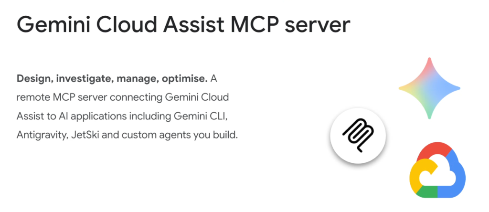
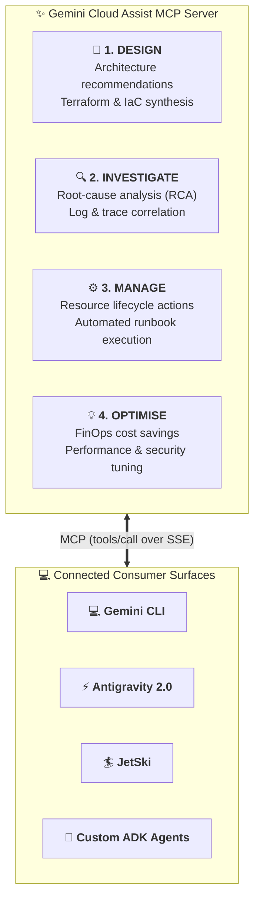
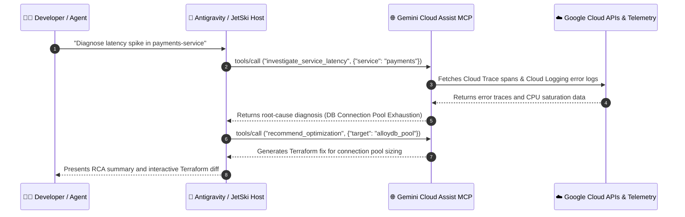

# Gemini Cloud Assist MCP Server: Architecture, Operations & Cross-Surface Integration

## Overview

**Gemini Cloud Assist** is Google Cloud's AI-powered operational companion for enterprise architecture, troubleshooting, and infrastructure optimization.

The **Gemini Cloud Assist MCP Server** is a remote, managed MCP server that bridges Gemini Cloud Assist's contextual reasoning capabilities directly into AI developer surfaces—including **Gemini CLI**, **Google Antigravity**, **JetSki**, and **custom enterprise agents**.

---

## The 4 Operational Pillars

---

## Deep Dive into the 4 Operational Pillars

### 1. Design (Cloud Architecture & IaC Synthesis)
* **Architecture Validation**: Evaluates proposed system architectures against the **Google Cloud Architecture Framework** (reliability, security, cost, performance, operational excellence).
* **Automated IaC Generation**: Generates production-ready Terraform modules (`main.tf`, `variables.tf`), Kubernetes manifests, and Cloud Run service specifications.
* **Topology Mapping**: Designs resilient multi-region network topographies, VPC peering, and Private Service Access (PSA) configurations.

---

### 2. Investigate (Incident Triage & Root Cause Analysis)
* **Log & Trace Correlation**: Queries **Cloud Logging** and **Cloud Trace** to trace distributed latency bottlenecks and error cascades across microservices.
* **Automated Diagnostic Runbooks**: Analyzes stack traces, OOM kill events, and VPC firewall drops to produce actionable remediation steps for SREs.
* **Alert Summarization**: Ingests complex Cloud Monitoring alert notifications and synthesizes plain-language incident briefs.

---

### 3. Manage (Infrastructure Lifecycle & Operations)
* **Declarative Provisioning**: Executes infrastructure updates, node pool maintenance, and database replica scaling via standardized MCP tool envelopes.
* **IAM Policy Remediation**: Generates and applies least-privilege IAM bindings and Service Account permissions.
* **Service Lifecycle Governance**: Orchestrates zero-downtime rolling deployments and traffic migration across Cloud Run revisions and GKE clusters.

---

### 4. Optimise (FinOps, Performance & Security)
* **FinOps Cost Optimization**: Surfaces unattached Persistent Disks, over-provisioned GCE VM sizing, and BigQuery query inefficiencies with concrete dollar-savings projections.
* **Performance Tuning**: Recommends database indexing strategies for Cloud SQL/AlloyDB and autoscaling parameter tuning for GKE.
* **Security Hardening**: Maps Security Command Center (SCC) vulnerability findings to automated patch scripts and VPC Service Controls perimeters.

---

## Cross-Surface Architecture & Consumption

---

## Operational Capabilities Matrix

| Pillar | Core Functions | Connected Google Cloud Subsystems |
| :--- | :--- | :--- |
| **Design** | Topology drafting, Terraform generation | Architecture Center, Cloud Deployment Manager, Terraform IaC |
| **Investigate** | Anomaly detection, trace correlation, RCA | Cloud Logging, Cloud Monitoring, Cloud Trace, Error Reporting |
| **Manage** | Scaling, rolling updates, runbook execution | Resource Manager, Compute Engine, GKE, Cloud Run |
| **Optimise** | FinOps rightsizing, vulnerability fixing | Active Assist Recommenders, SCC, BigQuery Insights |
