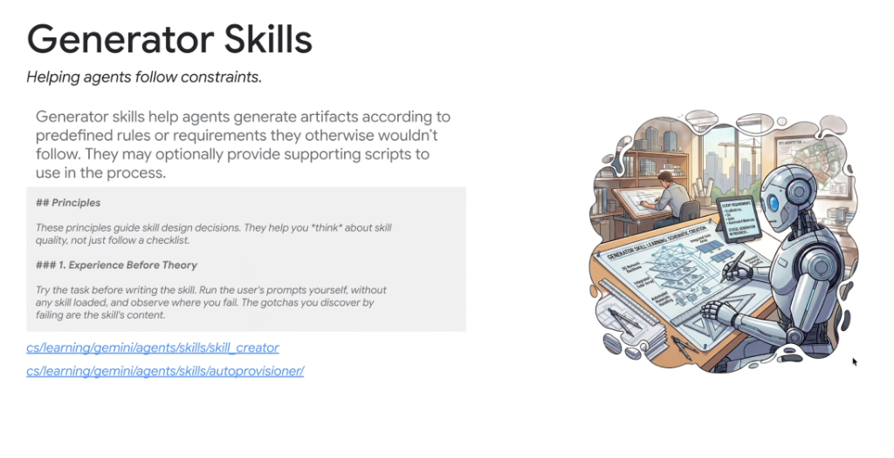
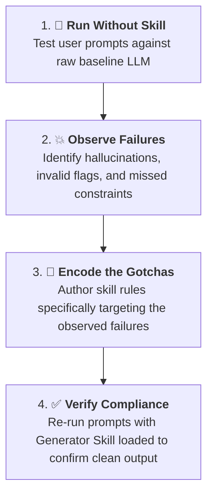
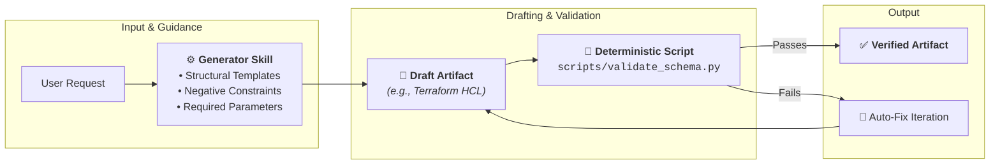

# Skill Pattern Deep Dive: Generator Skills



## Overview

**Generator Skills** steer and constrain an agent's creative and coding output, ensuring generated artifacts (code, infrastructure configs, schemas, documentation) strictly comply with predefined rules, formats, and quality standards.

> **"Generator skills help agents generate artifacts according to predefined rules or requirements they otherwise wouldn't follow. They may optionally provide supporting scripts to use in the process."**

By default, LLMs tend to generate generic boilerplate that violates proprietary styling, misses required security parameters, or relies on deprecated APIs. Generator skills encode the exact templates, anti-patterns, and validation scripts necessary to guarantee production-ready artifacts.

---

## The Core Philosophy: "Experience Before Theory"



### Golden Principle: Experience Before Theory
> *"Try the task before writing the skill. Run the user's prompts yourself, without any skill loaded, and observe where you fail. The gotchas you discover by failing are the skill's content."*

Writing a skill from abstract theory leads to verbose, generic instructions. Effective generator skills are forged empirically from real failure modes.

---

## Generator Skill Execution Pipeline



---

## Key Capabilities of Generator Skills

### 1. Template & Skeleton Injection
* Provides battle-tested structural skeletons for complex files (e.g., Google Cloud Terraform modules, Protobuf contracts, API specifications).
* Ensures required headers, copyright notices, and boilerplate metadata are always included.

### 2. Strict Negative Constraints (Anti-Patterns)
* Explicitly warns the agent against common generative traps:
  * *"Do not use deprecated `v1beta1` APIs; always use `v1`."*
  * *"Never hardcode Google Cloud service account keys; use Workload Identity."*

### 3. Integrated Deterministic Script Validation (`scripts/`)
* Packages executable validation scripts that run locally to verify the artifact before presenting it to the user (e.g., JSON schema validation, Terraform syntax linting).

---

## Canonical Internal Examples

### 1. `skill_creator`
* **Location**: `cs/learning/gemini/agents/skills/skill_creator`
* **Role**: A meta-generator skill that guides agents in scaffolding and authoring brand-new, specification-compliant skills (enforcing YAML frontmatter, directory structures, and markdown formatting).

### 2. `autoprovisioner`
* **Location**: `cs/learning/gemini/agents/skills/autoprovisioner/`
* **Role**: Generates infrastructure provisioning code (Cloud Run services, Spanner databases, IAM bindings) that conforms to Google Cloud enterprise landing zone standards.

---

## Anatomy of a Production Generator Skill

```markdown
---
name: terraform-generator
description: Generates Google Cloud Terraform IaC modules adhering to enterprise security standards. Use when writing Terraform, defining cloud infrastructure, or provisioning GCP resources.
---

# Terraform Infrastructure Generator

## Core Generation Principles
1. Always define remote GCS state backends.
2. Enforce CMEK encryption keys on all Cloud Storage and Spanner resources.
3. Never output plaintext IAM secret tokens.

## Output Skeleton
```hcl
terraform {
  required_version = ">= 1.5.0"
  required_providers {
    google = {
      source  = "hashicorp/google"
      version = "~> 5.0"
    }
  }
}
```

## Validation Script
After drafting HCL files, execute the validation script:
```bash
python3 scripts/validate_hcl.py --target-file=main.tf
```
```

---

## Best Practices for Authoring Generator Skills

| Best Practice | Rationale |
| :--- | :--- |
| **Experience Before Theory** | Ground the skill in actual empirical failures rather than hypothetical rules. |
| **Provide Concrete Skeletons** | Showing structural code templates is far more effective than abstract descriptions. |
| **Embed Deterministic Scripts** | Use scripts to catch syntax errors immediately rather than relying purely on LLM self-checks. |
| **Document Common Gotchas** | Highlight edge cases and subtle API changes that models consistently get wrong. |
