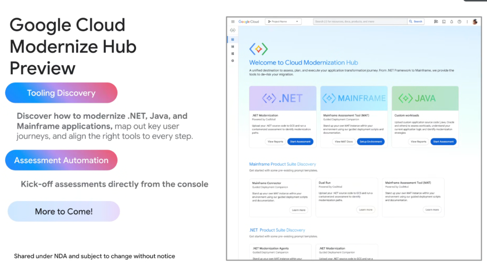

# Google Cloud Modernize Hub: Unified Application Transformation Console



## Overview

The **Google Cloud Modernization Hub** is a centralized, console-native destination designed to assess, plan, and execute end-to-end enterprise application transformations:

> **"A unified destination to assess, plan, and execute your application transformation journey. From .NET Framework to Mainframe, we provide the tools to de-risk your migration."**

Modernize Hub bridges the gap between high-level cloud migration planning and concrete, automated code refactoring by integrating assessment tooling, automated reports, and agentic execution directly into the Google Cloud Console.

---

## Modernize Hub Architecture & Workflow

```mermaid
graph TD
    subgraph 🖥️ Cloud Modernization Hub Console
        H["🌟 <b>Welcome to Cloud Modernization Hub</b><br/>Unified discovery, assessment & execution portal"]
    end

    subgraph 📦 Three Core Workload Assessment Engines
        W1["🪟 <b>.NET Modernization</b><br/>(Powered by CodMod)<br/>• GCS code upload<br/>• Containerized assessment<br/>• Target: .NET 8 on Linux"]
        
        W2["🏛️ <b>Mainframe Assessment (MAT)</b><br/>(Guided Deployment)<br/>• VPC-native MAT setup<br/>• COBOL & JCL parser<br/>• Target: Java/Go microservices"]
        
        W3["☕ <b>Java & Custom Workloads</b><br/>(AI Logic Analysis)<br/>• Java EE & PL/SQL analysis<br/>• Dependency mapping<br/>• Target: Spring Boot 3 & GKE"]
    end

    subgraph 🛠️ Integrated Discovery Suites
        S1["Mainframe Connector · Dual Run · MAT"]
        S2[".NET Modernization Agents · CodMod Companion"]
    end

    H ==> W1 & W2 & W3
    W1 & W2 & W3 ==> S1 & S2
    S1 & S2 ==> Out["📊 <b>Automated Migration Roadmaps & Agentic Skills Execution</b>"]
```

---

## Core Pillars of Modernize Hub

### 1. Tooling Discovery
* Guides enterprise architects and developers across .NET, Java, and Mainframe application estates.
* Maps key customer modernization journeys and aligns the appropriate Google Cloud tool, agent, or service to every phase.

---

### 2. Assessment Automation
* Initiates comprehensive portfolio assessments directly from the Google Cloud Console.
* Eliminates complex manual assessment setups through containerized, automated background evaluation pipelines.

---

### 3. Dedicated Workload Portals

| Workload Track | Engine / Technology | Ingestion & Assessment Flow | Primary Actions |
| :--- | :--- | :--- | :--- |
| **.NET** | Powered by **CodMod** | Upload `.NET` source to GCS; run containerized assessment for Linux containerization | `View Reports`, `Start Assessment` |
| **Mainframe** | **Mainframe Assessment Tool (MAT)** | Stand up VPC-isolated MAT instances via guided deployment scripts | `View MAT Docs`, `Setup Environment` |
| **Java & Custom** | AI Custom Workload Engine | Upload Java EE, Oracle PL/SQL, and multi-language repositories for automated logic extraction | `View Reports`, `Start Assessment` |

---

## Product Suite Discovery Catalog

Modernize Hub organizes modular discovery catalogs with pre-configured prompt templates, deployment scripts, and documentation:

### Mainframe Product Suite Discovery
* **Mainframe Connector**: High-speed, secure data streaming from mainframe datasets to BigQuery and GCS.
* **Dual Run (Powered by CodMod)**: Side-by-side production traffic shadowing to validate data and functional equivalence with zero downtime risk.
* **Mainframe Assessment Tool (MAT)**: Deep structural scanning of legacy COBOL/JCL application trees.

### .NET Product Suite Discovery
* **.NET Modernization Agents**: Gemini-driven autonomous agents that refactor WCF to gRPC/REST and migrate project files to .NET 8.
* **.NET Deployment Companion**: Containerization guides for deploying modernized workloads onto **Cloud Run** and **GKE**.

---

## Enterprise Value & Security
* **VPC Isolation**: Ingests and processes sensitive proprietary source code within customer-controlled Cloud Storage buckets and private VPC boundaries.
* **Progressive Disclosure Integration**: Directly links assessment findings into **Antigravity Skills** to execute automated refactoring and verification loops.
