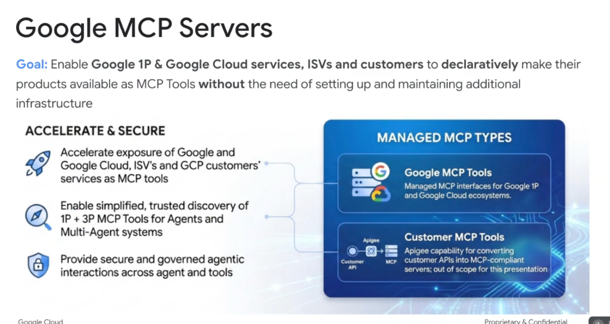
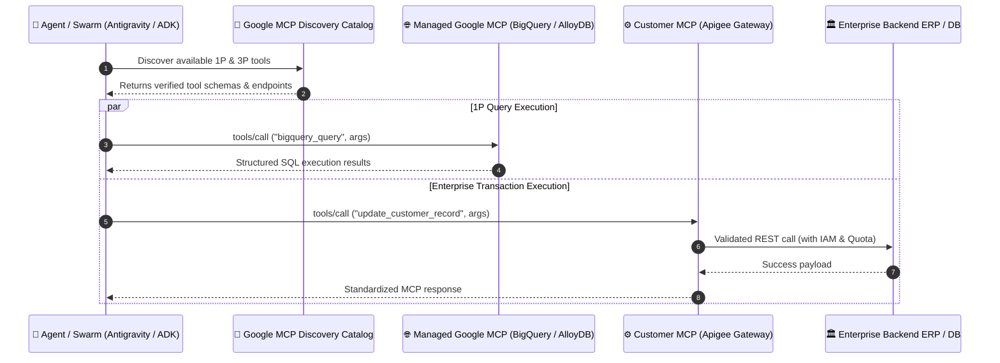

# Google Managed MCP Servers: Enterprise Cloud Ecosystem & Apigee Integration



## Overview

Deploying and maintaining bespoke tool servers across hundreds of enterprise APIs creates severe operational friction. **Google Managed MCP Servers** solve this by enabling **Google 1P**, **Google Cloud services**, **ISVs**, and **enterprise customers** to **declaratively** make their APIs available as Model Context Protocol (MCP) tools **without the need to set up or maintain additional server infrastructure**.

Google's managed MCP ecosystem provides a unified, governed bridge between foundation models and enterprise backend services.

---

## The "Accelerate & Secure" Strategy

```mermaid
graph TD
    subgraph 🎯 Accelerate & Secure Objectives
        O1["🚀 <b>Accelerate Exposure</b><br/>Instantly expose 1P, Cloud, ISV & customer services as MCP tools"]
        O2["🧭 <b>Trusted Discovery</b><br/>Simplified, secure catalog for Agents & Multi-Agent systems"]
        O3["🔒 <b>Enterprise Governance</b><br/>Policy enforcement, IAM auth & audit trails across all tool calls"]
    end

    subgraph 🏢 Managed MCP Types
        T1["🌐 <b>Google MCP Tools</b><br/>Managed interfaces for Google 1P & Google Cloud ecosystems<br/><i>(BigQuery, Cloud Run, Spanner, Drive, Gmail)</i>"]
        T2["⚙️ <b>Customer MCP Tools (via Apigee)</b><br/>Automated conversion of customer APIs to MCP-compliant servers<br/><i>(Rate limiting, threat protection, token mediation)</i>"]
    end

    O1 & O2 & O3 ==> T1 & T2
```

---

## The Two Managed MCP Types

### 1. Google MCP Tools (1P & Google Cloud Ecosystem)
* **Definition**: Fully managed, production-grade MCP server interfaces operated and maintained directly by Google.
* **Coverage**:
  * **Google 1P Ecosystem**: Google Workspace (Docs, Sheets, Slides, Drive), Gmail, Google Chat, Search, and Maps.
  * **Google Cloud Ecosystem**: BigQuery, AlloyDB, Cloud SQL, Spanner, Cloud Run, Vertex AI, and Cloud Storage.
* **Key Benefits**:
  * Zero infrastructure provisioning—developers connect directly to Google-managed endpoints.
  * Built-in authentication leveraging Google Cloud Application Default Credentials (ADC) and OAuth 2.0.
  * Continuous maintenance and automatic API version synchronization.

---

### 2. Customer MCP Tools (Powered by Apigee)
* **Definition**: Enterprise API transformation capability utilizing **Google Cloud Apigee** to convert existing customer REST and gRPC services into MCP-compliant tool servers.
* **Architecture**:

```text
┌────────────────┐      ┌─────────────────────────┐      ┌─────────────────────┐
│  Customer API  │ ───> │  Apigee API Management  │ ───> │  MCP-Compliant Tool │
│  (REST / gRPC) │      │  (Auth, Policies, Quota)│      │  Server Endpoint    │
└────────────────┘      └─────────────────────────┘      └─────────────────────┘
```

* **Core Capabilities**:
  * **Automated OpenAPI to MCP Translation**: Parses OpenAPI/Swagger specs to generate MCP `tools/list` JSON schemas automatically.
  * **Policy Enforcement**: Injects enterprise security policies, mTLS, OAuth token translation, and DDoS/threat protection.
  * **Traffic Management**: Applies rate limiting, burst control, and usage analytics to prevent runaway agent loops from overwhelming legacy backend systems.

---

## Ecosystem Architectural Flow



---

## Managed MCP Types Comparison Matrix

| Dimension | 🌐 Google MCP Tools | ⚙️ Customer MCP Tools (Apigee) |
| :--- | :--- | :--- |
| **Provider** | Google Cloud & Google 1P | Enterprise Customers & ISVs |
| **Underlying Engine** | Google native services (BigQuery, Workspace) | Apigee API Management Gateway |
| **Infrastructure Management**| Fully serverless & zero-ops | Managed by Apigee proxy layer |
| **Schema Generation** | Pre-built & maintained by Google | Auto-generated from OpenAPI / Swagger / gRPC |
| **Security & Auth** | Cloud IAM, ADC, Workspace OAuth | Apigee Policies, API Keys, mTLS, OAuth 2.0 |
| **Primary Target** | Data analytics, cloud ops, productivity | Proprietary ERPs, CRM systems, custom microservices |
