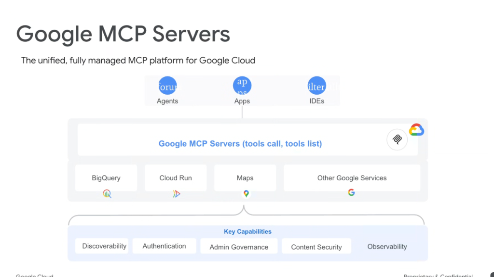

# Google MCP Servers: The Unified, Fully Managed Platform for Google Cloud



## Overview

The **Google MCP Servers Platform** is Google Cloud's unified, fully managed infrastructure layer designed to connect **Agents**, **Applications**, and **Developer IDEs** to Google 1P and Google Cloud services over the standardized **Model Context Protocol (MCP)** (`tools/list`, `tools/call`).

The platform eliminates bespoke SDK glue code while providing enterprise-grade security, identity, and governance across all agent-tool transactions.

---

## 3-Tier Unified Platform Architecture

```mermaid
graph TD
    subgraph 👥 1. Consumer Surfaces
        A1["🤖 <b>Agents</b><br/>(Antigravity, ADK, Multi-Agent Swarms)"]
        A2["📱 <b>Apps</b><br/>(Enterprise Web & Mobile frontends)"]
        A3["💻 <b>IDEs</b><br/>(VS Code, IntelliJ, Cloud Workstations)"]
    end

    subgraph ☁️ 2. Google MCP Servers Runtime Layer
        MCP_Core["🌐 <b>Google MCP Platform (`tools/list`, `tools/call`)</b>"]
        
        subgraph Services["🛠️ Managed Google Services & APIs"]
            S1["📊 <b>BigQuery</b>"]
            S2["🚀 <b>Cloud Run</b>"]
            S3["🗺️ <b>Maps</b>"]
            S4["🔷 <b>Other Google Services</b><br/><i>(AlloyDB, Spanner, Drive, Vertex AI)</i>"]
        end
        
        MCP_Core --- S1 & S2 & S3 & S4
    end

    subgraph 🛡️ 3. Foundational Enterprise Capabilities
        C1["🧭 <b>Discoverability</b><br/>Centralized catalog & schema versioning"]
        C2["🔑 <b>Authentication</b><br/>Cloud IAM, ADC & Workload Identity"]
        C3["📋 <b>Admin Governance</b><br/>Organization policies & quota controls"]
        C4["🔒 <b>Content Security</b><br/>DLP scanning & VPC-SC isolation"]
        C5["📈 <b>Observability</b><br/>Cloud Trace, Audit Logs & Metrics"]
    end

    A1 & A2 & A3 ==> MCP_Core
    MCP_Core ==> C1 & C2 & C3 & C4 & C5
```

---

## The 5 Foundational Platform Capabilities

### 1. Discoverability
* **Centralized Tool Catalog**: Agents dynamically query available 1P and 3P tools without hardcoded URLs.
* **Semantic Schema Search**: Foundation models discover relevant tools JIT (Just-In-Time) based on natural language task descriptions.
* **API Version Management**: Transparent versioning ensures seamless backward compatibility during service updates.

---

### 2. Authentication
* **Zero-Trust Identity**: Integrates natively with Google Cloud **Application Default Credentials (ADC)** and **Workload Identity Federation**.
* **Scoped Token Delegation**: Agents operate under strictly scoped IAM roles, preventing privilege escalation.
* **Seamless OAuth 2.0 Integration**: Built-in credential negotiation for Google 1P Workspace APIs (Drive, Gmail, Calendar).

---

### 3. Admin Governance
* **Organizational Policy Enforcement**: Platform admins enforce enterprise-wide allowlists/blocklists for specific MCP servers and tools.
* **Role-Based Access Control (RBAC)**: Fine-grained permissions dictating which developer groups or agent runtimes can invoke sensitive tools.
* **Quota & Rate Limiting**: Global traffic shaping prevents rogue agent loops from exhausting API budgets.

---

### 4. Content Security
* **Data Loss Prevention (Cloud DLP)**: Real-time inspection and redaction of PII, credentials, and sensitive payload tokens before tool execution.
* **VPC Service Controls (VPC-SC)**: Guarantees tool network traffic remains strictly within isolated cloud security perimeters.
* **Prompt Injection Firewalls**: Validates and sanitizes dynamic tool arguments against adversarial injection attacks.

---

### 5. Observability
* **End-to-End Tracing (Cloud Trace)**: Distributed trace context propagation across agent reasoning loops, MCP JSON-RPC calls, and backend APIs.
* **Tamper-Proof Auditing (Cloud Audit Logs)**: Comprehensive logging of every `tools/call` invocation (caller identity, timestamp, arguments, response status).
* **BigQuery Agent Analytics**: Long-term operational telemetry for analyzing latency distributions, tool failure rates, and token cost economics.

---

## Key Platform Capabilities Matrix

| Foundational Pillar | Primary Function | Underlying Google Cloud Infrastructure |
| :--- | :--- | :--- |
| **Discoverability** | JIT tool search & schema catalog | Agent Registry & Artifact Registry |
| **Authentication** | IAM credential negotiation & token minting | Cloud IAM & Workload Identity |
| **Admin Governance** | Organization policies & rate quotas | Google Cloud Resource Manager & Quota API |
| **Content Security**| PII redaction & perimeter boundary | Cloud DLP & VPC Service Controls |
| **Observability** | Distributed telemetry & audit trails | Cloud Trace, Cloud Logging & BigQuery |
