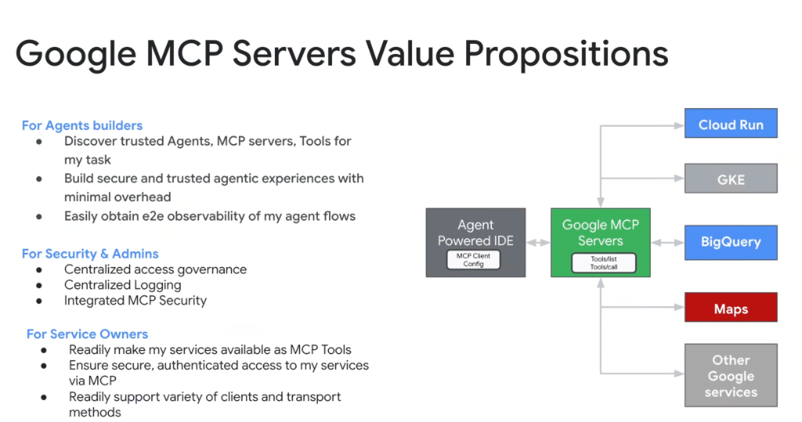
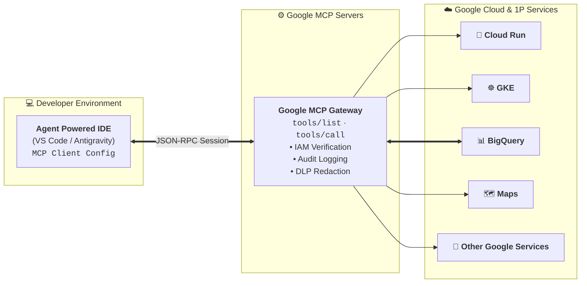

# Google MCP Servers: Value Propositions across Agent Builders, Security Admins & Service Owners



## Overview

Deploying agentic systems at enterprise scale requires balancing developer velocity, platform security, and service owner governance.

**Google MCP Servers** deliver a unified, multi-stakeholder value framework tailored specifically for **Agent Builders**, **Security & Platform Admins**, and **Service Owners**.

---

## The 3-Persona Value Matrix

```mermaid
graph TD
    subgraph 👥 1. Agent Builders (Developers)
        B1["🧭 <b>Discover Trusted Tools</b><br/>JIT search across 1P & 3P MCP servers"]
        B2["⚡ <b>Minimal Overhead</b><br/>Build secure agent experiences without auth plumbing"]
        B3["📈 <b>E2E Observability</b><br/>End-to-end tracing of agent flows via Cloud Trace"]
    end

    subgraph 🛡️ 2. Security & Platform Admins
        A1["📋 <b>Centralized Governance</b><br/>Org-wide allowlists & fine-grained IAM RBAC"]
        A2["📜 <b>Centralized Logging</b><br/>Tamper-proof Cloud Audit Logs for all tool calls"]
        A3["🔒 <b>Integrated MCP Security</b><br/>DLP scanning & VPC Service Controls"]
    end

    subgraph ⚙️ 3. Service & API Owners
        S1["🚀 <b>Rapid Tool Exposure</b><br/>Declaratively expose services as MCP tools"]
        S2["🔑 <b>Authenticated Access</b><br/>Enforce enterprise identity & rate quotas automatically"]
        S3["🌐 <b>Multi-Transport Support</b><br/>Serve IDEs, CLI & cloud agents over stdio/SSE"]
    end
```

---

## Architectural Interaction Workflow



---

## Deep Dive into the 3 Stakeholder Value Propositions

### 1. For Agent Builders (Developers & AI Engineers)
* **Discover Trusted Tools & Agents**: Rapidly find verified 1P Google services (BigQuery, AlloyDB, Workspace) and third-party tools via semantic search without digging through disparate API documentation.
* **Build Secure Experiences with Minimal Overhead**: Configure agent tools with a simple `mcp_config.json` block in the IDE; zero bespoke authentication or transport plumbing required.
* **End-to-End Observability**: Gain instant visibility into agent reasoning loops, tool latency, parameter passing, and error diagnostics directly inside developer tools.

---

### 2. For Security & Platform Admins (SecOps & Compliance)
* **Centralized Access Governance**: Control which agent runtimes and developer groups have permission to call specific backend tools via Google Cloud IAM policies.
* **Centralized Audit Logging**: Every `tools/call` invocation generates an immutable audit entry in **Cloud Audit Logs**, capturing timestamp, principal identity, input parameters, and execution status.
* **Integrated Enterprise Security**: Enforce **Cloud DLP** for real-time redaction of sensitive credentials/PII and **VPC Service Controls** to ensure tool traffic never leaves private cloud perimeters.

---

### 3. For Service & API Owners (Backend & Infrastructure Teams)
* **Effortless Tool Exposure**: Expose microservices, databases, and APIs as MCP tools declaratively without writing or maintaining custom agent client libraries.
* **Guaranteed Authenticated Access**: Inherit Google Cloud's identity stack (Application Default Credentials, OAuth 2.0, Workload Identity) without modifying service code.
* **Universal Client & Transport Support**: A single MCP server endpoint seamlessly serves IDE extensions, CLI agents, autonomous background workers, and multi-agent swarms across `stdio`, `SSE`, and HTTP transports.

---

## Stakeholder Value Summary Matrix

| Dimension | 🤖 Agent Builders | 🛡️ Security & Admins | ⚙️ Service Owners |
| :--- | :--- | :--- | :--- |
| **Primary Goal** | Fast iteration & trusted tool access | Zero-trust compliance & auditability | Scalable, secure API monetization |
| **Configuration** | Declarative `mcp_config.json` | Organization Policy & IAM bindings | OpenAPI / gRPC manifest declaration |
| **Observability** | Real-time debugging & trace views | Centralized Cloud Audit Logs & SIEM | Request volume, error rate & latency metrics |
| **Security Layer**| Inherited transparent authentication| Cloud DLP, VPC-SC & perimeter locks | Automatic token validation & rate limits |
