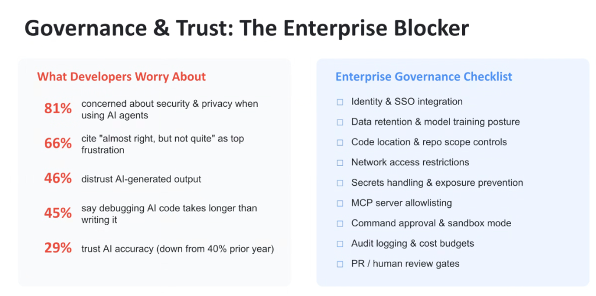
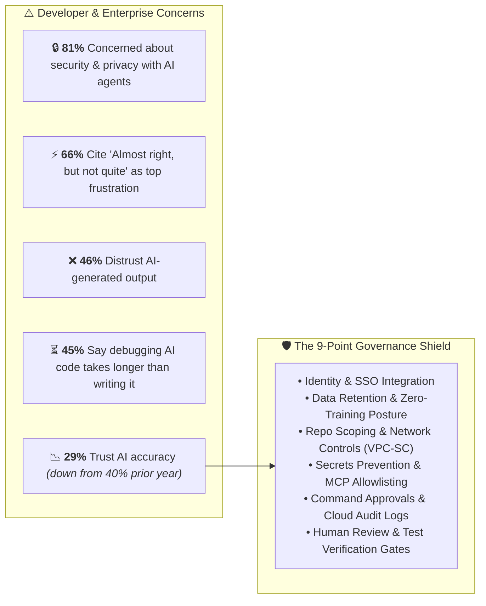

# Governance & Trust: The Enterprise Blocker & The 9-Point Checklist

## Overview

While developer demand for AI tools is universal, enterprise procurement and production scaling are frequently halted by an acute **Governance and Trust Deficit**.

Security leaders, platform architects, and developers share deep concerns regarding code security, privacy, and output accuracy. Overcoming these blockers requires moving beyond raw conversational prompting to establish a rigorous, verifiable **9-Point Enterprise Governance Framework**.

---

## The Trust Deficit: What Developers Worry About

---

## Detailed Analysis of Developer Anxieties

1. **Security & Privacy Risks (81%)**:
   - Concerns regarding proprietary code exfiltration, third-party model training, and unmonitored tool executions.
2. **The "Almost Right, But Not Quite" Tax (66%)**:
   - Code that appears syntactically flawless on the surface but contains subtle race conditions, off-by-one errors, or incorrect SDK methods.
3. **Cognitive Debugging Overhead (45%)**:
   - Finding and remediating hallucinations without a deterministic verification harness takes longer than writing code from scratch.
4. **Collapsing Trust in Accuracy (29%, down from 40%)**:
   - Highlighting developer disillusionment with unstructured "vibe coding" and the urgent need for specification-driven workflows.

---

## The 9-Point Enterprise Governance Checklist

```mermaid
graph TD
    subgraph Checklist["📋 The 9-Point Enterprise Governance Architecture"]
        direction TB
        
        K1["1. 🔑 <b>Identity &amp; SSO:</b> Syncless WIF + Cloud Identity SAML/OIDC"]
        K2["2. 🛡️ <b>Data Posture:</b> Zero customer data retention &amp; zero model training"]
        K3["3. 📁 <b>Repo Scoping:</b> Worktree sandboxing &amp; path-based access boundaries"]
        K4["4. 🌐 <b>Network Security:</b> VPC Service Controls (VPC-SC) &amp; Private Google Access"]
        K5["5. 🗝️ <b>Secrets Prevention:</b> Inline token scanning &amp; Secret Manager masking"]
        K6["6. ⬢ <b>MCP Allowlisting:</b> Governed MCP registry &amp; Dual-Gate Cloud IAM"]
        K7["7. ⚙️ <b>Command Sandboxing:</b> Human-in-the-loop prompt gates &amp; read-only flags"]
        K8["8. 📊 <b>Audit &amp; Telemetry:</b> Cloud Audit Logs &amp; token budget rate limiting"]
        K9["9. 🧪 <b>Review Gates:</b> Critique / PR integration &amp; verification-before-completion"]
    end
```

---

## Enterprise Checklist vs. Google Implementation Matrix

| Governance Requirement | Risk Addressed | Google Cloud & Antigravity Solution |
| :--- | :--- | :--- |
| **1. Identity & SSO Integration** | Shadow credentials, unauthorized access | **Workforce Identity Federation (WIF)** + Cloud Identity SAML/OIDC. |
| **2. Data Retention Posture** | IP leakage into public foundation models | **Google Enterprise ToS**: Zero data retention, zero training on customer code. |
| **3. Code & Repo Scope Controls**| Agents modifying unauthorized directories | **Git Worktrees** + workspace isolation + `.geminiignore` fencing. |
| **4. Network Access Restrictions**| Data exfiltration to public endpoints | **VPC Service Controls (VPC-SC)** + Private Google Access. |
| **5. Secrets Handling & Prevention**| Leaking API keys / DB passwords | **Inline secret scanning** + Secret Manager / Cloud KMS integration. |
| **6. MCP Server Allowlisting** | Rogue tool injection, unauthenticated APIs | **Google Managed MCP Servers** + `roles/mcp.toolUser` IAM gate. |
| **7. Command Approval & Sandbox** | Destructive shell commands / file deletion | **Granular permission modals** + CEL Deny Policies (`tool.isReadOnly == false`). |
| **8. Audit Logging & Cost Budgets**| Unmonitored usage, runaway token bills | **Cloud Audit Logs** + BigQuery export + Project quota caps. |
| **9. PR & Human Review Gates** | Merging unverified hallucinations | **Critique / GitHub PR reviews** + `verification-before-completion` tests. |
