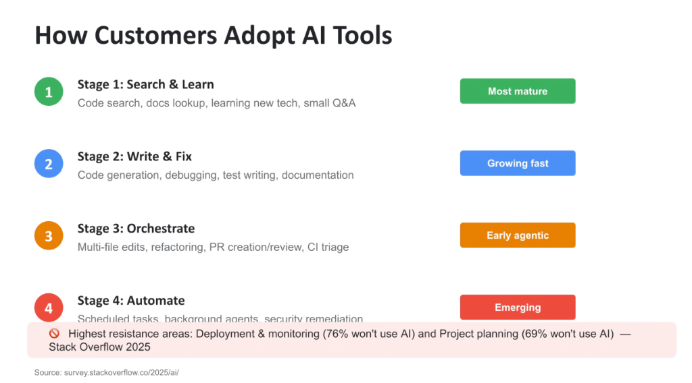
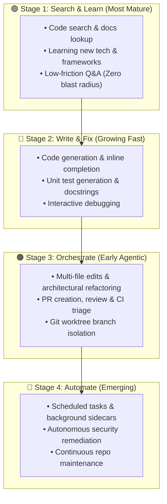

# The 4 Stages of AI Tool Adoption: From Search to Autonomous Automation



## Overview

Enterprise organizations do not adopt AI tools overnight; rather, engineering teams progress through a predictable **4-Stage Maturity Curve**:

1. **Stage 1: Search & Learn** (*Most Mature*)
2. **Stage 2: Write & Fix** (*Growing Fast*)
3. **Stage 3: Orchestrate** (*Early Agentic*)
4. **Stage 4: Automate** (*Emerging Enterprise Frontier*)

Understanding where a customer sits on this curve is critical for Customer Engineers to position the appropriate capabilities—from simple IDE code assistance to autonomous multi-subagent orchestration and scheduled background sidecars.

---

## The AI Tool Adoption Maturity Curve



---

## Detailed Breakdown of the 4 Adoption Stages

### Stage 1: Search & Learn (*Most Mature — Zero Blast Radius*)
* **Core Activities**: Semantic code search across monorepos, internal documentation discovery (g3docs), querying API reference manuals, and onboarding to unfamiliar codebases.
* **Adoption Profile**: Universally adopted and culturally accepted across nearly 100% of engineering organizations because it carries zero mutation risk.
* **Representative Tools**: Sourcegraph Cody, NotebookLM, Google Search Grounding, Gemini CLI documentation lookup.

---

### Stage 2: Write & Fix (*Growing Fast — In-Editor Productivity*)
* **Core Activities**: Generating boilerplate code, authoring unit test suites, converting language idioms, syntax debugging, and drafting docstrings.
* **Adoption Profile**: Standard baseline in modern developer environments. Operates primarily with strict human-in-the-loop validation where the developer reviews each suggestion before acceptance.
* **Representative Tools**: GitHub Copilot inline suggestions, Antigravity IDE extension, Cursor inline edits.

---

### Stage 3: Orchestrate (*Early Agentic — Multi-File Systems Engineering*)
* **Core Activities**: Autonomous multi-file refactoring, executing end-to-end task plans (`PLAN.md`), drafting PRs with changelists, fixing broken CI test suites, and running compiler feedback loops.
* **Adoption Profile**: Transition from passive assistants to active agentic peers. Requires dedicated workspace isolation (git worktrees) and rigorous testing pipelines (`verification-before-completion`).
* **Representative Tools**: Google Antigravity, Claude Code, OpenAI Codex, Cursor Composer.

---

### Stage 4: Automate (*Emerging Frontier — Background Engineering*)
* **Core Activities**: Headless scheduled tasks, background repo hygiene daemons, automated dependency upgrades, and autonomous security vulnerability remediation (e.g. Wiz Red Agent $\rightarrow$ Wiz Code pull requests).
* **Adoption Profile**: The highest-leverage enterprise frontier. Shifts developer interaction from real-time synchronous chatting to asynchronous ticket dispatch and morning review briefings.
* **Representative Tools**: Google Antigravity Scheduled Tasks & Sidecars (`agentapi`), Wiz automated remediation.

---

## The High-Resistance Boundaries (Where Developers Push Back)

According to empirical data from the **Stack Overflow 2025 Developer Survey**, developer trust drops precipitously when AI moves into high-blast-radius or high-context domains:

```text
🛑 Highest Resistance Areas:
  1. Deployment & Infrastructure Monitoring: 76% of developers REFUSE to use AI
     • Rationale: Fear of unverified production outages, silent config drift, and unrecoverable infrastructure mutations.
  2. Project Planning & Roadmapping: 69% of developers REFUSE to use AI
     • Rationale: Human organizational alignment, budget trade-offs, and strategic context cannot be hallucinated.
```

---

## How Google Bridges the Gap into Stage 4

To overcome developer resistance and advance customers from Stage 2/3 into Stage 4:
1. **Specification-Driven Development (SDD)**: Enforce human review of declarative specs (`SPEC.md`) before agents write code.
2. **Deterministic Verification Invariants**: Require green compiler, test, and critique outputs before any PR is created.
3. **Dual-Gate Cloud IAM & Model Armor**: Guarantee that autonomous background agents cannot execute unauthorized cloud mutations or leak data.

---

## 4-Stage Adoption & Maturity Matrix

| Stage | Maturity Level | Primary Workloads | Blast Radius | Key Developer Tools |
| :--- | :--- | :--- | :--- | :--- |
| **1. Search & Learn** | **Most Mature** | Code search, docs lookup, Q&A | None (Read-only) | NotebookLM, Cody, Search Grounding |
| **2. Write & Fix** | **Growing Fast** | Autocomplete, debugging, test writing | Minimal (File-scoped) | Copilot, Antigravity IDE, Cursor |
| **3. Orchestrate** | **Early Agentic**| Multi-file refactor, PRs, CI triage | Moderate (Branch-scoped) | **Antigravity, Claude Code, Codex** |
| **4. Automate** | **Emerging** | Scheduled tasks, security auto-fix | High (Repo-scoped) | **Antigravity Sidecars, Wiz AI-APP** |
