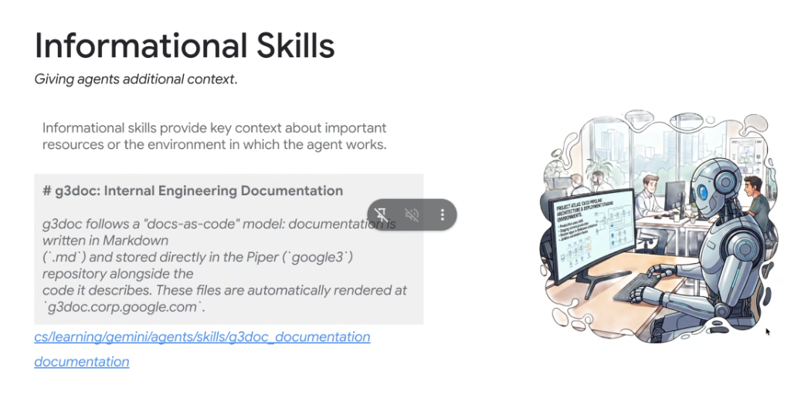
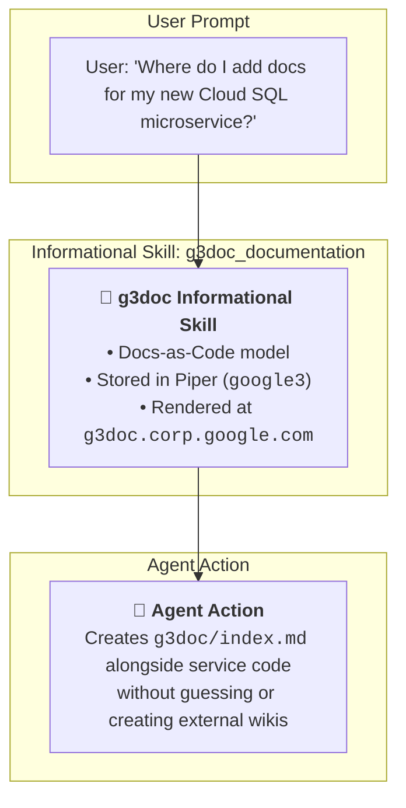

# Skill Pattern Deep Dive: Informational Skills



## Overview

**Informational Skills** are passive, contextual grounding packages designed to give an AI agent foundational knowledge about internal resources, repository conventions, organizational workflows, or runtime environments.

> **"Informational skills provide key context about important resources or the environment in which the agent works."**

Unlike action-oriented skills that trigger terminal tools or code compilers, Informational Skills serve as the agent's **domain compass**, preventing hallucinations and eliminating incorrect assumptions about proprietary infrastructure.

---

## Architectural Role in Agent Reasoning



---

## Key Characteristics of Informational Skills

1. **Passive Grounding (No Mandatory Tool Invocation)**:
   * Primarily composed of structured Markdown instructions (`SKILL.md`) and supplementary reference manuals (`references/`).
   * Rarely requires executable scripts (`scripts/`), making it lightweight and safe.

2. **Docs-as-Code & Domain Terminology Resolution**:
   * Bridges external LLM training data with private internal engineering conventions.
   * Maps internal toolnames, path structures, and team ownership.

3. **Semantic Environmental Mapping**:
   * Informs the agent about remote workstation constraints (e.g., Cloudtop gLinux perimeters, SSH requirements, sandbox limitations).

---

## Canonical Example: `g3doc_documentation` Skill

Located in the internal skill repository at `cs/learning/gemini/agents/skills/g3doc_documentation`:

```markdown
---
name: g3doc-documentation
description: Explains internal engineering documentation architecture, g3doc structure, and docs-as-code conventions. Use when creating, locating, or updating internal documentation.
---

# g3doc: Internal Engineering Documentation

## Overview
g3doc follows a "docs-as-code" model: documentation is written in Markdown (`.md`) and stored directly in the Piper (`google3`) repository alongside the code it describes. These files are automatically rendered at `g3doc.corp.google.com`.

## When to Use This Skill
Use when the user asks about writing design docs, updating system documentation, or locating project runbooks.

## Directory Rules
* Documentation files must reside in a `g3doc/` directory adjacent to the package's `BUILD` file.
* The main entry point must always be named `index.md`.
```

---

## Common Informational Skill Archetypes

| Skill Archetype | Example Skill Name | Context Provided |
| :--- | :--- | :--- |
| **Monorepo Conventions** | `g3doc_documentation` | Docs-as-code layout, Piper path rules, Markdown rendering |
| **Workstation & Environment** | `cloudtop-environment` | SSH multiplexing, gLinux tooling, `/google/bin` paths |
| **Architecture Topology** | `spanner-fleet-topology` | Database instance IDs, regional sharding, replication setups |
| **Policy & Compliance** | `code-sharing-policy` | Internal vs. External IP classification, open-source rules |
| **Team SOPs & Oncall** | `incident-escalation` | PagerDuty rotation contacts, outage severity levels (P0–P4) |

---

## Best Practices for Authoring Informational Skills

* **Keep It Modular & Concise**: Focus on one specific domain or subsystem; do not create an unmaintainable single wiki file.
* **Use Path & Code References**: Provide concrete relative paths, URL patterns, or CLI targets rather than abstract generalizations.
* **Maintain Freshness**: Regularly sync Informational Skills with the latest internal tool releases and repository renames.
