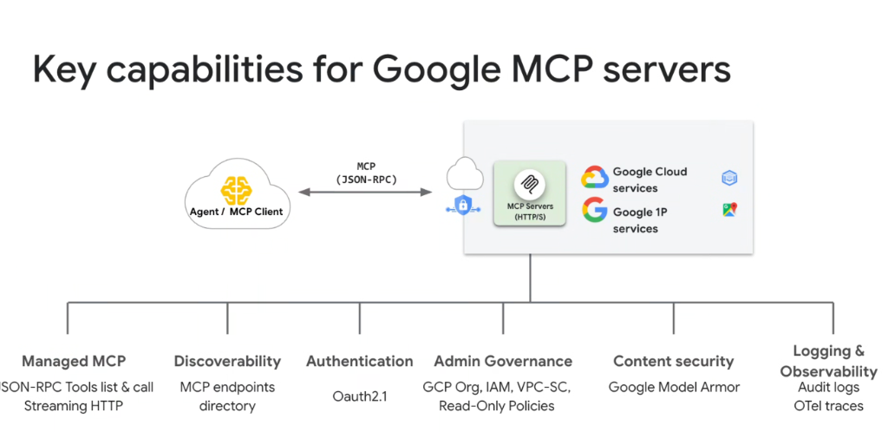
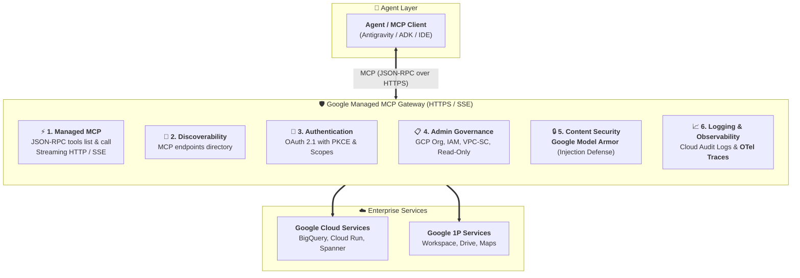

# Key Capabilities & Security Architecture for Google MCP Servers

## Overview

Deploying autonomous agents in mission-critical enterprise environments requires a robust, zero-trust infrastructure layer. **Google MCP Servers** implement a 6-pillar capability architecture that guarantees high-performance tool execution, identity federation, perimeter governance, and advanced AI content protection.

---

## The 6-Pillar Architectural Framework

---

## Detailed Breakdown of the 6 Key Capabilities

### 1. Managed MCP Protocol & Transport
* **JSON-RPC Tools Specification**: Implements canonical `tools/list` and `tools/call` schemas with zero client-side glue code.
* **Streaming HTTP / SSE**: Uses **Server-Sent Events (SSE)** over HTTPS to deliver streaming responses, reducing latency and eliminating polling overhead.

---

### 2. Discoverability (MCP Endpoints Directory)
* **Centralized Endpoints Directory**: A governed registry of all available Google 1P and Google Cloud MCP server endpoints.
* **Dynamic Semantic Resolution**: Allows agents to locate, inspect, and bind to relevant tool endpoints at runtime without hardcoded connection strings.

---

### 3. Authentication (OAuth 2.1)
* **Modern OAuth 2.1 Standards**: Enforces mandatory **PKCE (Proof Key for Code Exchange)**, deprecates legacy implicit grant flows, and restricts token lifetimes.
* **Granular Tool Scoping**: Issues tightly bounded OAuth tokens allowing execution of specific tool actions rather than granting broad service access.

---

### 4. Admin Governance
* **Google Cloud Organization Policies**: Enterprise administrators define hierarchical guardrails restricting unauthorized external MCP servers.
* **VPC Service Controls (VPC-SC)**: Establishes cryptographic network perimeters ensuring tool data never transits public internet boundaries.
* **Read-Only Policies**: Allows administrators to toggle strict read-only modes (e.g. allowing `SELECT` in BigQuery while blocking `INSERT`/`DROP`), preventing destructive actions by autonomous agents.

---

### 5. Content Security (Google Model Armor)
* **Specialized LLM Threat Defense**: Integrates Google's purpose-built AI safety and security shield:
  * **Prompt Injection Defense**: Detects and neutralizes malicious indirect prompt injections embedded inside tool inputs or retrieved data.
  * **Jailbreak Prevention**: Blocks adversarial prompt structures designed to bypass model constraints.
  * **Sensitive Data Redaction**: Real-time inspection and masking of credentials, API keys, and PII before transmission.

---

### 6. Logging & Observability (Audit Logs & OTel Traces)
* **OpenTelemetry (OTel) Distributed Tracing**: Emits standard W3C trace context across agent reasoning steps, MCP JSON-RPC payloads, and backend service calls for full execution visibility.
* **Immutable Cloud Audit Logs**: Automatically writes non-repudiable audit records for every tool execution (capturing caller identity, timestamp, tool parameters, and response status).

---

## Technical Capability Reference Matrix

| Capability Pillar | Underlying Technology | Primary Security & Operational Value |
| :--- | :--- | :--- |
| **Managed MCP** | JSON-RPC 2.0 + HTTP/SSE | Zero-ops infrastructure; high-throughput streaming |
| **Discoverability** | MCP Endpoints Directory | Dynamic schema resolution & JIT tool binding |
| **Authentication** | OAuth 2.1 + Cloud IAM | Zero-trust token delegation with PKCE security |
| **Admin Governance** | VPC-SC & GCP Org Policies | Perimeter isolation & enforceable read-only constraints |
| **Content Security** | **Google Model Armor** | Real-time prompt injection & data leakage protection |
| **Observability** | Cloud Audit Logs & **OTel** | Standardized distributed tracing & compliance auditing |
